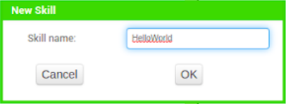
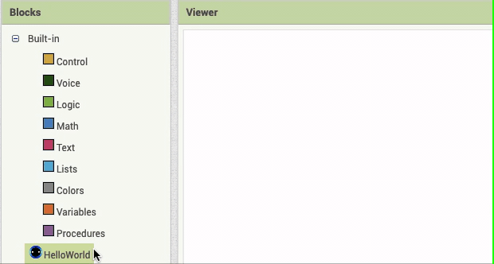
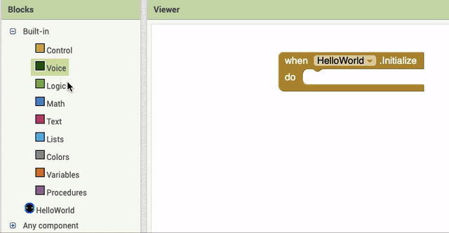
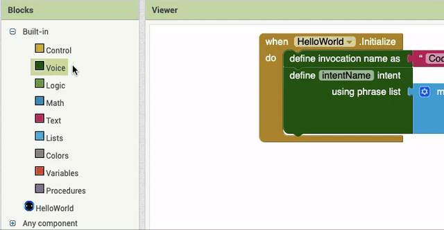
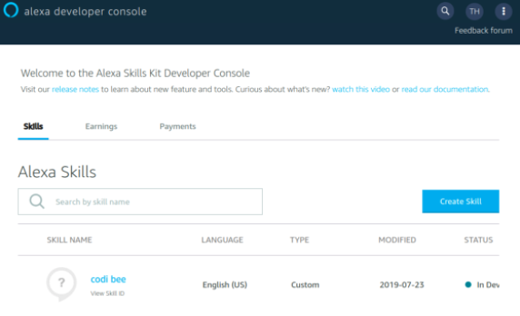
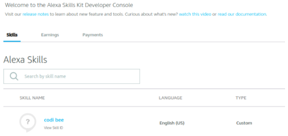

# Connect Your App

# Hello World: A Simple Alexa Skill App

## Introduction

This is the first tutorial to introduce you to making your own Skills that you can use with Alexa! 

<hint markdown="block" title="What is an Alexa Skill?">

An Alexa Skill is a **voice-based application** for Amazon Alexa-enabled devices, such as Amazon Echo Dots or Alexa-enabled smartphones. 
Don't worry about developing and testing Alexa Skills if you don't have your own Alexa-enabled device. We'll show you how to use the Amazon Developer page to test your skills using a virtual Alexa that can be run on any device! 

</hint>

For this skill, we will teach our Alexa to say "Hello world" when we ask it to, using several different phrases we might say to get Alexa to accomplish the same task - saying hello. 

## Create an Amazon Developper Account 

If you haven’t already, follow the instructions in the *Creating an Amazon Developer Account* to create a <u>free</u> **Amazon Developer Account**. 
This will allow you to save any Alexa Skills to your account and use your skills on any Alexa-enabled devices that you have linked to your Amazon account.

## Add a Skill

In the Designer Toolbar at the top of the screen, you will see a button labeled **“Add Skill …”**. If you don’t see this button, you may be on the wrong MIT App Inventor page. Make sure you’re using [alexa.appinventor.mit.edu](https://alexa.appinventor.mit.edu/) and not appinventor.mit.edu.

{:.enlargeImage}

Click on the **Add Skill** button and enter the name of your skill. For this demonstration, we will name this skill *“HelloWorld”*.

{:.enlargeImage}

## Login to Your Amazon Account 

You will now be taken to a new Designer Page for the Conversational AI Interface. 
Under the image of the Amazon Echo Dot, there should be a button labeled **Login to Amazon**. 
Click that button and enter your Amazon Developer Account information into the external pop-up. 

{:.enlargeImage}

*If this window does not appear, check if your browser has blocked a pop up and allow the pop-up.* 

## Open the Blocks Editor

After you’ve successfully signed in, switch to the **Blocks Editor** by clicking the **Blocks** button in the top right.

{:.enlargeImage}

Notice that in the menu on the right, there is a new built-in drawer labeled **Voice**.

{:.enlargeImage}

There’s also a component below it with the same name as your skill. This is your **Skill Component**. 

{:.enlargeImage}

## Add the Initialize Block

Click on the **Skill Component** at the bottom of the menu. This will open a blocks drawer. Drag the **Initialize Block** onto the workspace.

{:.enlargeImage}

Everything inside this block will tell Alexa the structure of the Alexa Skill and all of the phrases it should be listening for. 

## Add the Invocation Name

The first thing we want to teach our skill to listen out for is its **Invocation Name**.

<hint markdown="block" title="What is an Invocation Name?">

Just like how every mobile app needs to have a name, so does our custom Alexa Skill. An Invocation Name is just the name of the Skill that we are making, and is used to “invoke” our skill. The structure of any command you tell Alexa is:

 “Alexa, tell  (Invocation Name) to  ...” 

The invocation name is what will help Alexa tell which Skill it needs to use, so make sure that every skill you make has a unique name.
For example, if we decided to make the Invocation name of a custom skill “Codi bee” we would say:

 “Alexa, tell  Codi bee to  do something” 

Note: The invocation name needs to be at least two (2) words long, but avoid making it a full sentence, since you will be saying the name a lot.

</hint>

For this demonstration, let’s name this skill “Codi Bee”, which is MIT App Inventor’s mascot. This means when we want to call our skill, we will say:

 “Alexa, tell  Codi bee to  do something” 

To define this invocation name, open the **Voice** blocks drawer. The top most block is the **define invocation name** block. Drag the **define invocation name** block inside the **when initialize** block.

{:.enlargeImage}

Now get a Text block from the **Text** drawer and add it to the invocation name.

{:.enlargeImage}

Don’t mind the error for now. It’s just a warning saying that the invocation name should not be empty. Inside the text block, enter your invocation name. *Remember, two or more words, but not a full sentence!* For this tutorial, we will make this invocation name “Codi Bee.”

{:.enlargeImage}

## Define a Custom Intent

Now we need to add a custom **Intent** to our app.

<hint markdown="block" title="What is an Intent?">

 You can think of an **Intent** as a “command” that you want to teach Alexa. It could be a Stop Intent, a SayHelloWorld Intent, or any intent you can really think that you will need in any Skill. 

</hint>

Let’s teach our app to listen for the “SayHelloWorld” intent. To define this intent, open the **Voice** drawer again and scroll down to the block that says **Define intentName Intent**. Drag this **Define Intent** block under the invocation name.

{:.enlargeImage}

For this intent, we’ll rename the intent to be “SayHelloWorld”. You can give this intent any name that makes sense to you, as long as it is a meaningful name. 

{:.enlargeImage}

Don’t mind the error for now. It’s just a warning saying that the phrase list has to have at least one sentence. We’ll fix that in the next step!

## Add a List of Utterances

As you might have noticed, we need to give the intent block a list of **utterances**.

<hint markdown="block" title="What are Utterances?">

Let’s say your parent wants you to do the dishes. They might say “Clean the dishes.” Or, maybe they’ll say “*Do* the dishes.” Maybe they’ll just say “Wash the dirty plates.” All these sentences all have the same *intent*: you need to do the dishes.

Just like this example, when talking to Alexa, there might be a lot of ways to say something to trigger an intent. Each of these phrases that all mean the same thing is called an **utterance**. 

</hint>

In these text blocks, we will write a few sentences which Alexa will understand to mean “SayHelloWorld”. One sentence could be “Say hi and another sentence could be “Say hello", or "Say hello world".

{:.enlargeImage}

(If you are familiar with the List block, you can make this list bigger by clicking the blue icon at the top left of the block and add as many phrases as you want.)

Remember that the structure of any command you tell Alexa when you want to trigger a skill is: 

 “Alexa, tell  (Invocation Name) to  (Utterance)” 

We already set the invocation name as Codi Bee, and now we've added the intent phrases, “Say hi”, “Say hello”, and "Say hello world". Here is a full example of what Alexa might hear when we want to trigger our new Skill:

 “Alexa, tell  Codi bee to  say hello.” 

## Update the Amazon Code

Now, we have finished telling Alexa the *structure* of our new Skill, also called the **Interaction Model**. This interaction model is made of the **Invocation Name** (Codi Bee), the name of all the **intents** your skill needs to know, and all the **phrases** that will trigger each intent. Your blocks so far should look something like this.

{:.enlargeImage}

Now, we need to send this *interaction model* to Amazon. Let’s go back to the Designer page in the top right. 

{:.enlargeImage}

Below the picture of the Amazon Echo Dot, there is a button labeled **Send Updates**. (If you only see a button that says **Login to Amazon**, you need to do that first). Click this button.

{:.enlargeImage}

You should get a pop-up at the top of your browser that says “Skill updated successfully on Amazon”. Click OK to continue.

{:.enlargeImage}

## Define the Endpoint Function

Now that we have defined the Interaction Model and updated Alexa, we need to define the "brain" of the Alexa skill. Our skill can now recognize whenever we want it to “SayHelloWorld,” but it doesn’t know what to do or how to handle it. To make the response, we need to define the **Endpoint Function**, the brain of our Skill. To begin, let’s navigate back to the Blocks view.

{:.enlargeImage}

Open the **Voice** drawer and scroll down until you see the **when SayHelloWorld intent spoken** block. Drag this block below the When Skill Initialize block (not inside).

{:.enlargeImage}

This block will determine what Alexa will do and say. You can add if statements and a lot of things you could do in normal App Inventor Procedures. For now, we simply want to get Alexa to say Hello World. To do this, we need to find the **Say** block in the **Voice** drawer. Add the **Say** block to the inside of the when intent spoken block. 

{:.enlargeImage}

Next, attach a text block to the **Say** block and type inside the text block, ”Hello World.”

{:.enlargeImage}

And now we’ve finished defining the Endpoint function. If you decide to add more intents, like a SayGoodbye intent, you need to add a new **when intent spoken** block for each intent.

<hint markdown="block" title="Tip on the Say block">

When playing around with your Endpoint function, you may be tempted to add more Say blocks to an intent. But be careful! Alexa will only say whatever is in the *last* Say block of any intent.

</hint>

## Generate the Endpoint Function

Now, go back to the Designer view. 

{:.enlargeImage}

We want to send our new **Endpoint Function** to Amazon. Click the button labeled **Send Updates**. 

{:.enlargeImage}

You should get a pop-up at the top of your browser that says “Skill updated successfully on Amazon”. Click OK to continue

{:.enlargeImage}

## Go to the Alexa Developer Console

Now that we’ve finished creating our first custom Alexa Skill, it’s time for us to test our new Alexa Skill. In the future, testing your custom Alexa Skill will be done all within MIT App Inventor. For now, we will need to use the Alexa Developer Console to simulate Alexa. To get to the Alexa Developer Console, navigate to [this link](https://developer.amazon.com/alexa/console/ask). 

Login to your Developer Account if you get prompted to. 

{:.enlargeImage}

Once you’ve logged in, you will reach the Alexa Developer Console. The Alexa Developer Console should look something like the page below.

{:.enlargeImage}

## Select the Skill with the Right Name

On the developer console, you will see a list of all of the Alexa Skills you’ve made so far. The most recent skill should be the same name as the invocation name you set for your skill. For this tutorial, the skill is called “codi bee.” (Notice that the name of the Skill is in all lower case now even though the invocation name was not all lower case to begin with). 

{:.enlargeImage}

Click on the name of your custom Alexa Skill. This will take you to the Build tab for your skill.

{:.enlargeImage}

## Click on the Testing Tab

In the top menu bar, you should see a tab labeled **Test**. Click on the **Test** tab to enter the simulation screen. 

{:.enlargeImage}

Now, you should be in the Test screen for your custom Alexa Skill. The screen should look something like the following.

{:.enlargeImage}

Notice that at the top of the screen is a drop down menu. Select the drop down menu and select Development in order to enable your skill for testing. 

{:.enlargeImage}

Now that your skill is enabled for development, any Alexa-enabled devices that are already linked with your Amazon account can be used to test your new Alexa skill. Simply say “Alexa, tell Codi bee to say hello.”

## Enter the Test Utterances

If you don’t have an Alexa-enabled device on hand, the Alexa Developer Console allows you to simulate an Alexa using your custom Alexa skill online. Simply type in the console, “Tell codi bee to say hello.” (You can omit the Alexa at the beginning of the phrase).

{:.enlargeImage}

## Finish!

Congratulations! You’ve made your first custom Alexa Skill! Feel free to extend this app by adding new intents and new ways for Alexa to respond to each intent.