# Introduction

In this unit, you will create an app to make your own music by composing and synthesizing musical sounds generated by various instruments.

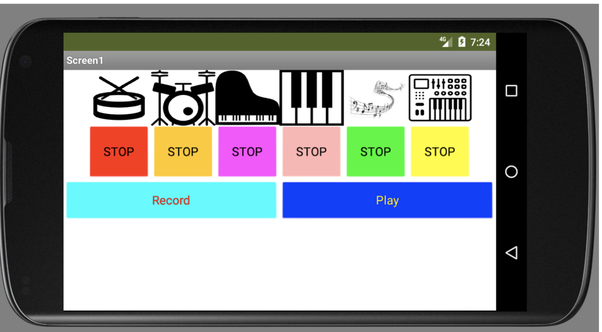{:.enlargeImage}

This tutorial will give you some general hints to help you make the app, but you will be challenged with designing and making the app yourself.

# Setup your computer

# Music Maker

## Introduction

In this app, you can build upon the skills you learned in <strong>My Piano</strong> to build your own music maker. You can lay down some beats, overlay instruments, and be creative musically!

Look at the Media panel, which is below the Components panel, to see that several images and sounds have been included in the template project.

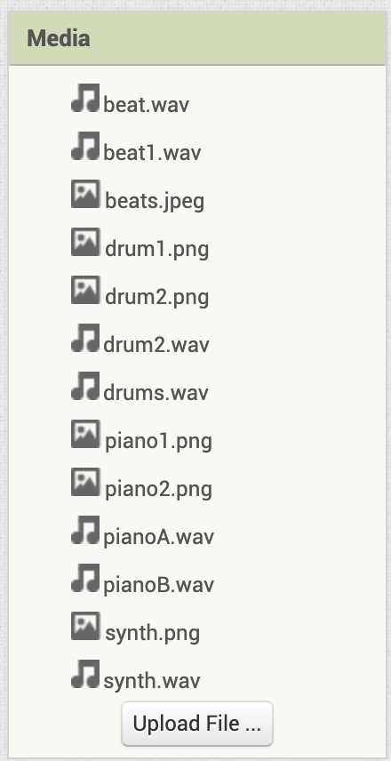{:.enlargeImage}

These assets have been included so you can focus more on designing and coding your music maker app.

Also, a sample of a few different layouts have been started in the Viewer.

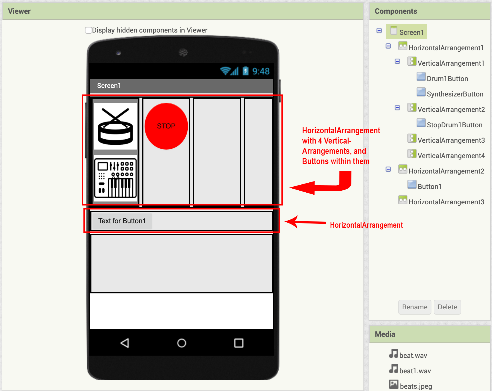{:.enlargeImage}

These are included so you can get some ideas for how you might arrange the buttons to play and stop your music.

## Change the User Interface

The first step is to set your app’s orientation. Did you design your app to be used in a vertical position, or horizontal? Click on <strong>Screen1</strong> in the <strong>Components</strong> pane, and then change its <i>ScreenOrientation</i> property to either Portrait (vertical) or Landscape (horizontal). 

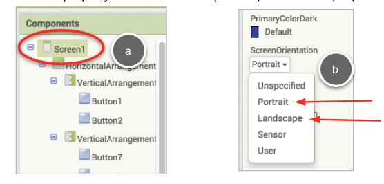{:.enlargeImage}

Look at the template layout to see how the  HorizontalArrangement and  VerticalArrangement components can change the layout.

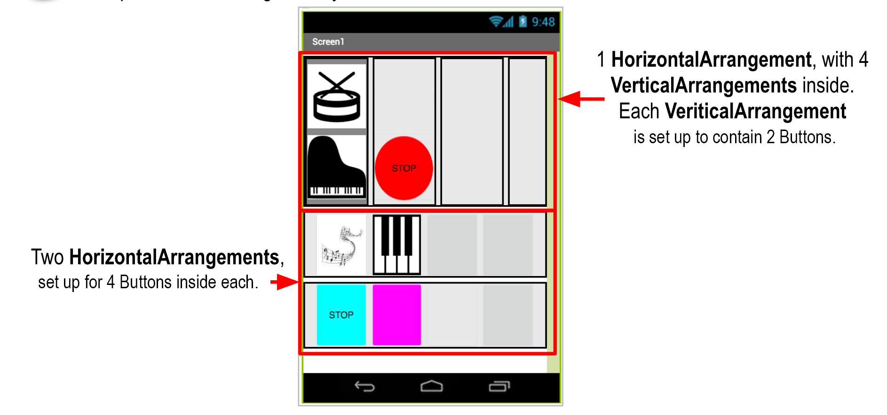{:.enlargeImage}

You can decide which type of layout you want for your app. You can arrange buttons horizontally, vertically, or a combination of both.

## How Layout Arrangements Work

 Buttons added to a  HorizontalArrangement appear next to each other. Note that this  HorizontalArrangement's <i>Height</i> is set to 50% of the Screen, and its <i>AlignVertical</i> property is set to Center. That is why the  Buttons appear horizontally in the middle of the arrangement.

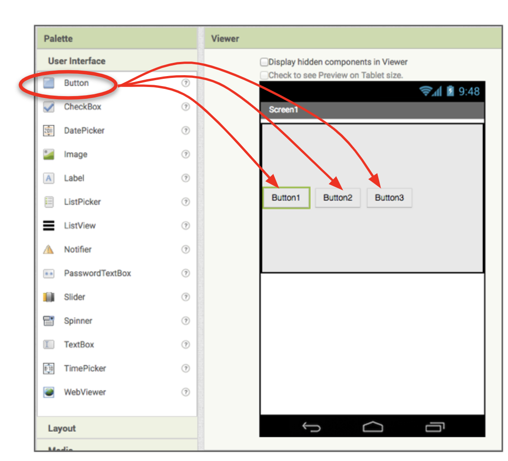{:.enlargeImage}

 Buttons added to a  VerticalArrangement appear below each other. This  VerticalArrangement's <i>Height</i> is set to 15% of the Screen. Its <i>AlignHorizontal</i> property is set to Left. That is why the  Buttons appear below each other on the left side of the arrangement.

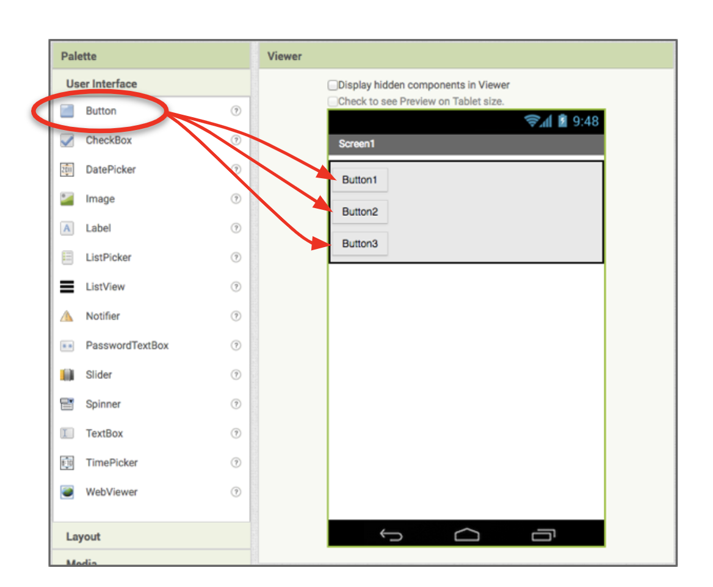{:.enlargeImage}

<strong>This is just a starting point. Pick the arrangement that you like best, and delete the other arrangements. Or delete them all, and start over! The design of your app is up to you.</strong>

## Add or Change Buttons

You've also been provided a few sample  Buttons. Again, feel free to use them, edit them, or delete them and add your own!

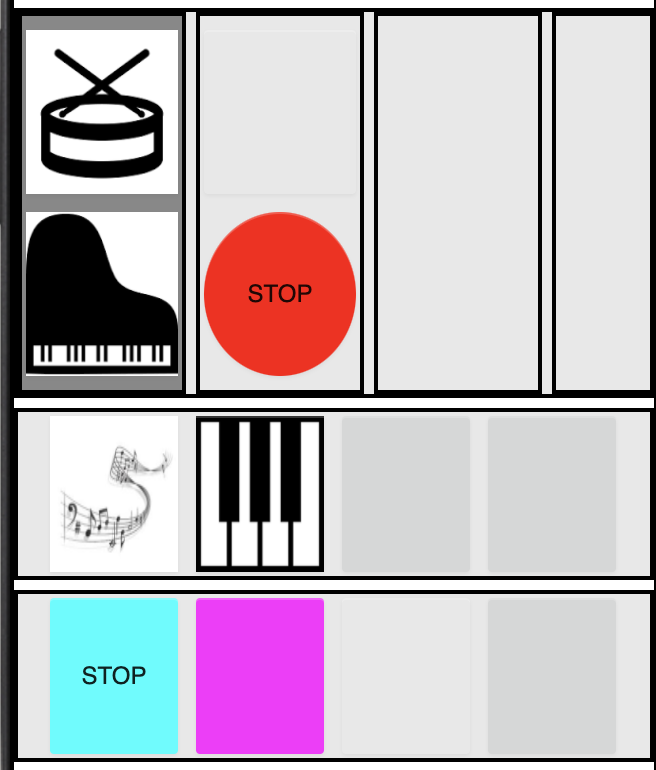{:.enlargeImage}

You've got some square buttons with images on them representing a musical instrument. You've also got some Stop buttons in different colors and shapes. These are just samples. You can use them, edit, or delete them. It's up to you!

You can change the <i>Width</i> and <i>Height</i> properties of both your  HorizontalArrangements and  VerticalArrangements as well as your  Buttons so that everything appears fully on the screen.

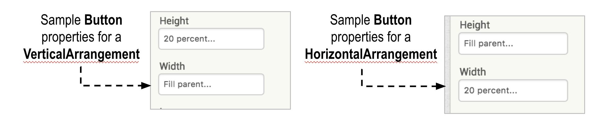{:.enlargeImage}

Note that Fill Parent means to fill the component in which the current component is contained. For a  Button, its parent would be the <strong>Arrangement</strong> in which it is contained. For a  HorizontalArrangement or  VerticalArrangement, its parent most likely will be <strong>Screen1</strong>.

The <i>Width</i> and <i>Height</i> can be set to an exact pixel value, or to a percentage. Using a percentage is recommended to ensure your components resize according to the size of the mobile device used.

Add more  Buttons so you have at least 4 instruments. Below are two examples of possible layouts.
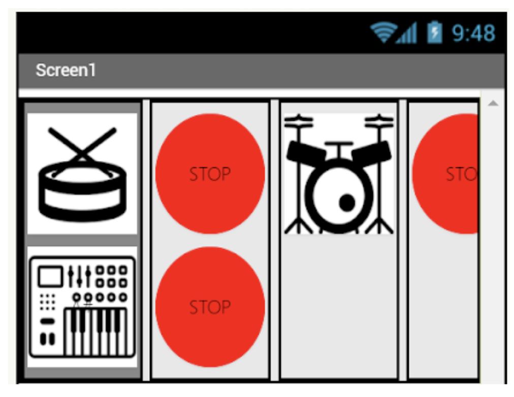{:.enlargeImage}
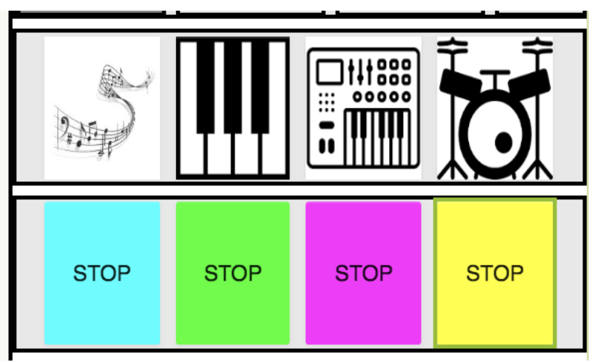{:.enlargeImage}

You will have many  Buttons in this app, so make sure to rename them using descriptive names to make the coding of your app more manageable.

## Change Button Properties

Change the  Buttons' properties to fit your style. Match the instrument image, or change the color or shape.

For example, perhaps start with a drum. Select <strong>Button1</strong> in the template, change its <i>Image</i> to “drum1.png” and rename it to <strong>“Drum1Button”</strong>. 
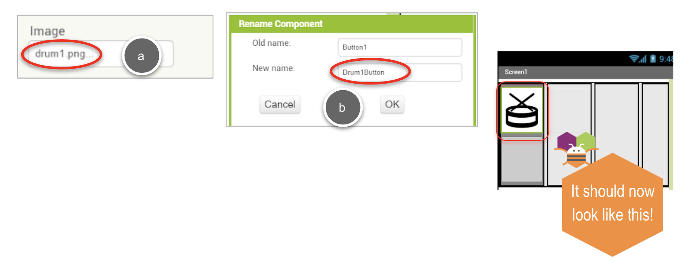{:.enlargeImage}

To make a Stop button for the drum, select <strong>Button2</strong> in the template, change its <i>BackgroundColor</i> to “Red”, <i>Text</i> to “STOP”, <i>Shape</i> to “oval” and rename it <strong>“StopDrum1Button”</strong>. 
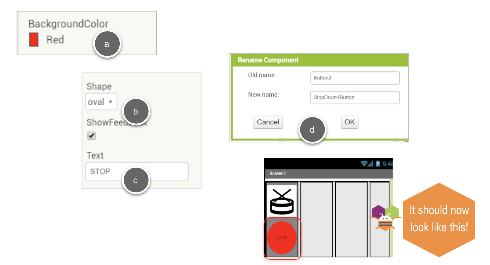{:.enlargeImage}

## Add Player Components

You need to add a separate  Player component for each instrument in your app. In the example below, two  Player components are added and renamed appropriately.

{:.enlargeImage}

Then set the <i>Loop</i> property for each  Player to checked so the music loops continuously. And set the <i>Source</i> property to matching instrument sound files from the Media assets.

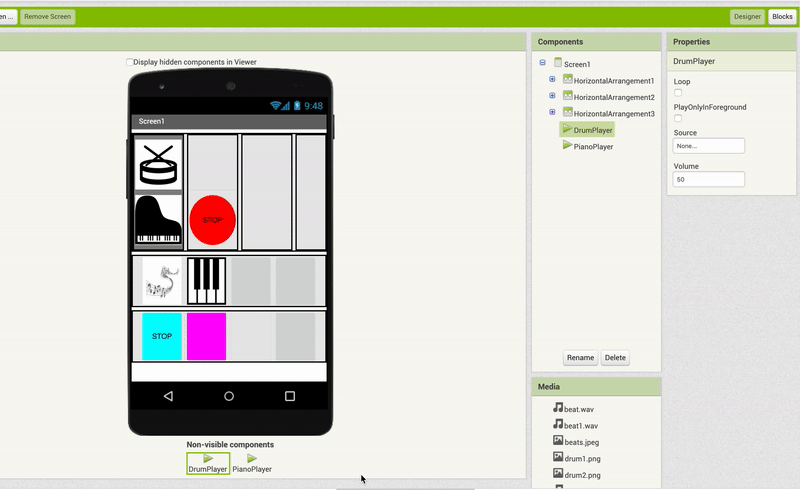{:.enlargeImage}

## Code the Blocks

Click the Blocks button and go to the Blocks Editor.

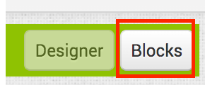{:.enlargeImage}

Code the your first  Button. Using the drums example, there could be a button named **Drum1Button**. Drag out a Button.Click event block for your drum button. For the matching  Player component, drag out a Player.Start block, and snap it into the Button.Click event block.

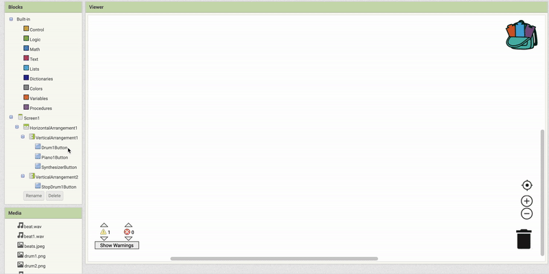{:.enlargeImage}

The  Button to stop the instrument sound uses the same idea. Drag out a Button.Click event block for the matching Stop Button for this instrument. Again, we’ll use the Drums as an example.

Drag out a matching Player.Stop block and snap it into the StopButton.Click event. This will make the  Player stop playing.

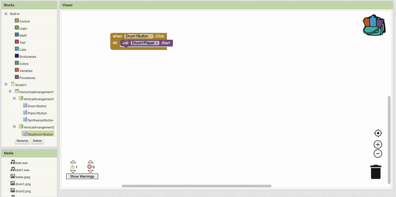{:.enlargeImage}

## Testing!

Now test starting and stopping that instrument with your two Buttons!

## Now do the rest

Now that you have one  Button set working, add code for your other instruments. Make sure you have a  Button to start the instrument, and one to stop it. Also, make sure you add a new  Player component for each instrument. Remember to name them appropriately!

# Expand your app

**Record and play back your music**
 Use the  SoundRecorder component to record music, and then add another  Player component to play the resulting sound.

**Add a Pause button for each instrument.**

**Instead of 2 Buttons, make one Button toggle play/stop.**
 For each instrument in your app, make one Button, and then have it toggle to either act as a "Start" button, or a "Stop" button, depending on whether or not the instrument is playing.

**Add more instruments**
 You've been given several instruments and images to get started, but you can either download or create your own instrument sounds to add to your music making app. Have fun!

