# Introduction
In this unit you will extend your knowledge of the MIT App Inventor platform, by making a  the <strong>My Piano </strong> app, that will play notes like a piano!

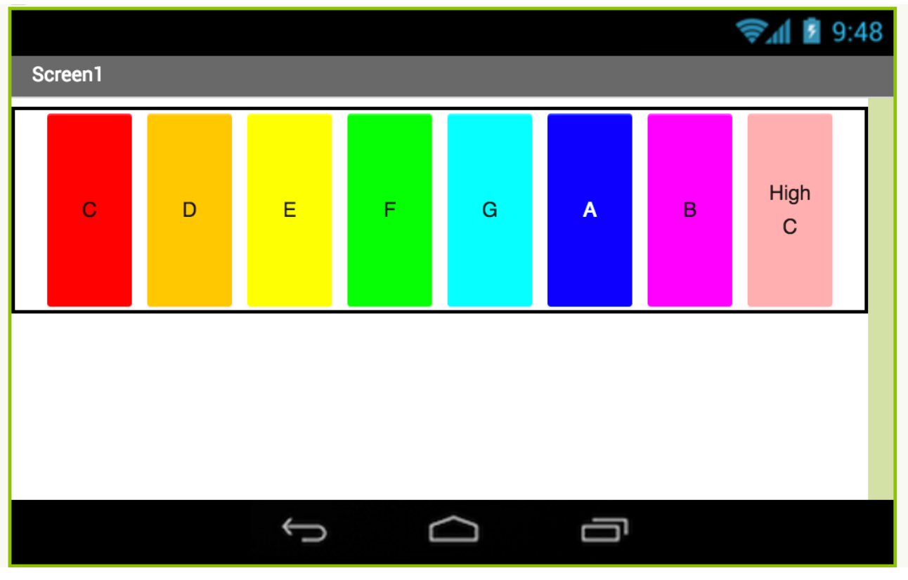{:.enlargeImage}

Here is how the app works:
* The app contains eight buttons, displayed next to each other, each depicting a piano key or note.
* When a button is pressed, the corresponding note plays, using a  Player component.

# Setup your computer

# My Piano

## Add Components

The goal is to have eight buttons, side by side. Each button, when pressed, will play a note.

Most components have already been added for your piano app. See the components below.

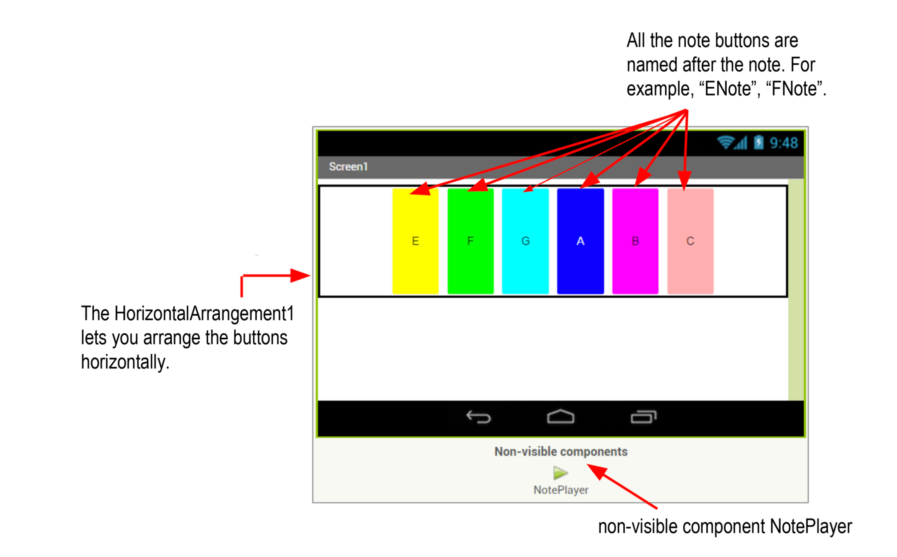{:.enlargeImage}

Drag two more buttons into <strong>HorizontalArrangement1</strong>.

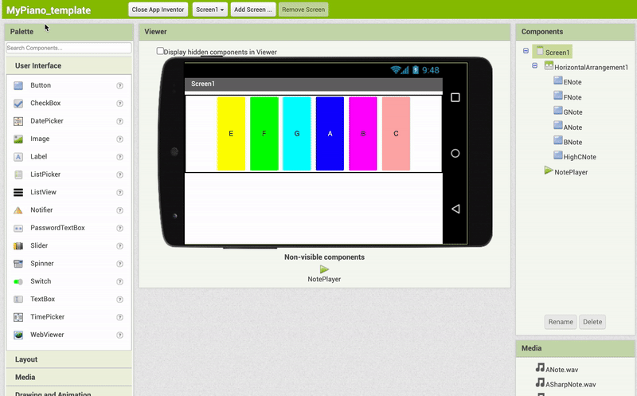{:.enlargeImage}

Rename <strong>Button1</strong> to <strong>CNote</strong> and <strong>Button2</strong> to <strong>DNote</strong>.

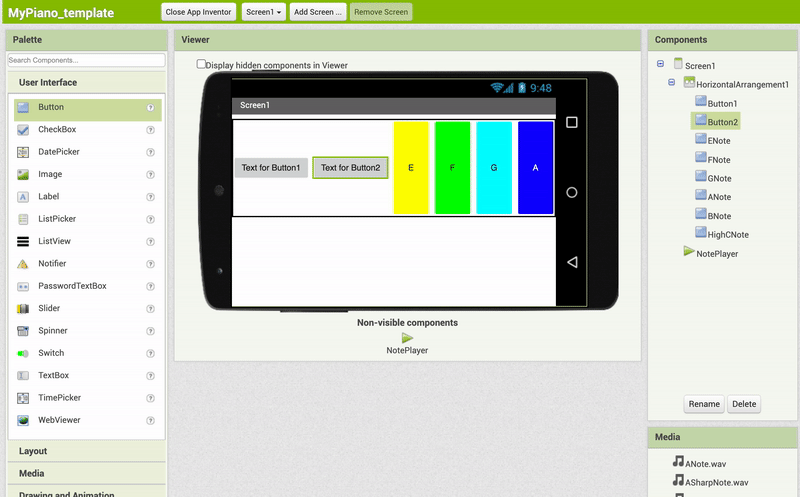{:.enlargeImage}

## Change Button Properties

Change the <i>Height</i> property of <strong>CNote</strong> and <strong>DNote</strong> to <strong>"Fill Parent"</strong> and change the <i>Width</i> property for both buttons to <strong>10 percent</strong>.

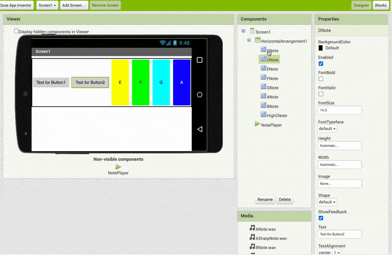{:.enlargeImage}

 Change the <i>BackgroundColor</i> property of <strong>CNote</strong> to <strong>Red</strong> to and change the <i>BackgroundColor</i> property of <strong>DNote</strong> to <strong>Orange</strong>.

 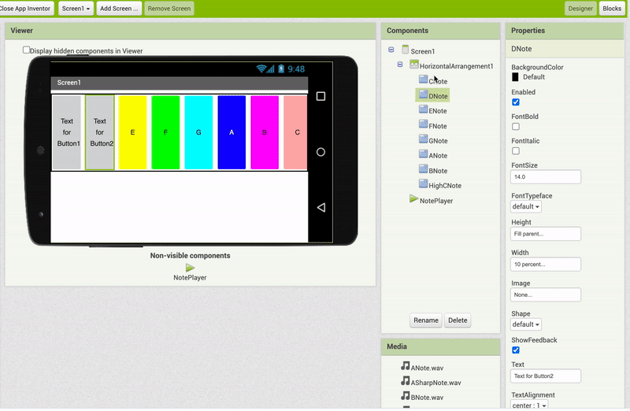{:.enlargeImage}

 Change the <i>Text</i> property of <strong>CNote</strong> to <strong>"C"</strong>and of <strong>DNote</strong> to <strong>"D"</strong>.

 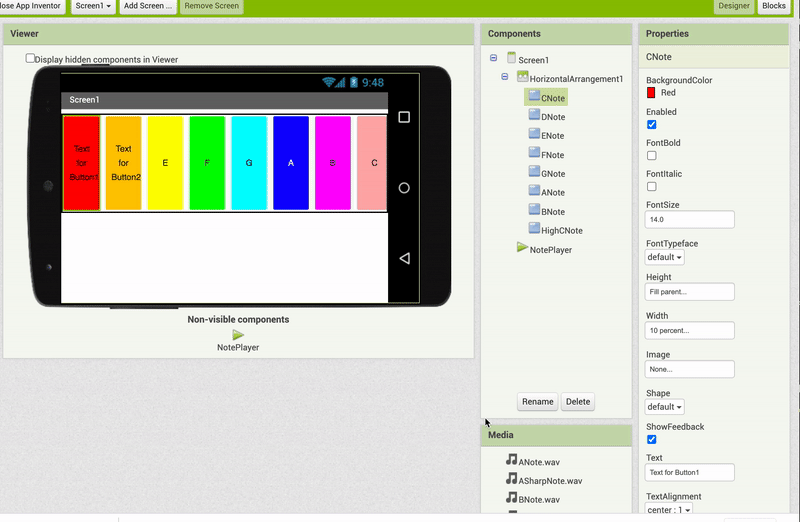{:.enlargeImage}

## Code the Buttons

Now it's time to code the buttons to make them play the notes! 

Click on the Blocks button in the upper right corner of the screen to switch to the <strong>Blocks Editor</strong>.

{:.enlargeImage}

Click on <strong>CNote</strong> and drag out a when CNote.Click block.

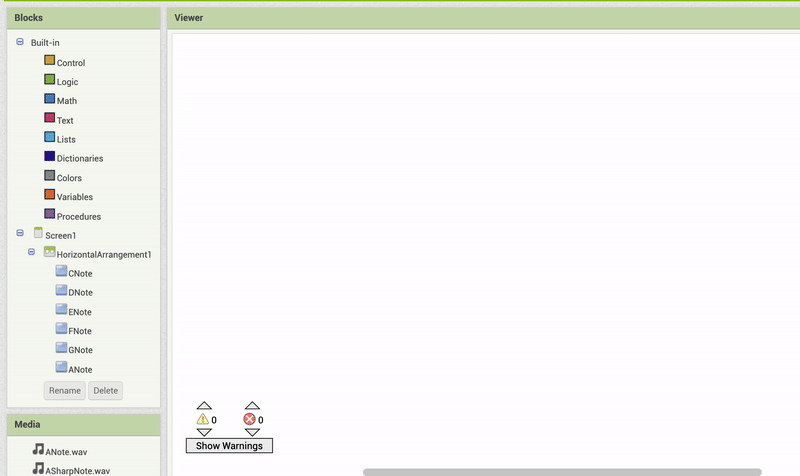{:.enlargeImage}

Click on <strong>NotePlayer</strong>, drag out a call NotePlayer.Start block and
snap it into the when CNote.Click block.

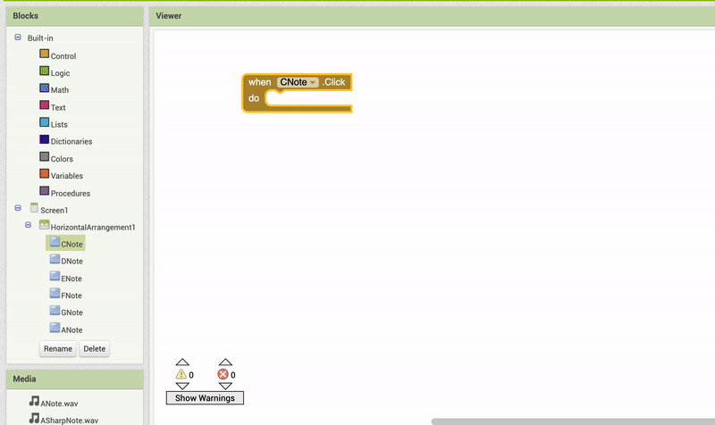{:.enlargeImage}

## Set the NotePlayer Source

Because we will use the same Player component to play all the different notes, when we press a note button, let’s set the Source to the proper.wav file.

Drag out a set NotePlayer.Source to block and snap it into when CNote.Click <i>before</i> call NotePlayer.Start. 

Then drag out a blank text string block from the <strong>Text</strong> drawer and snap it to the set NotePlayer.Source to block. Type “CNote.wav” into the blank text block.

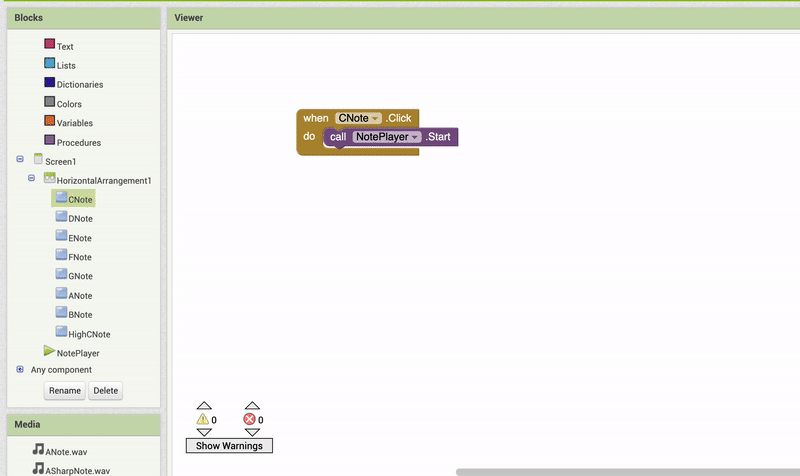{:.enlargeImage}

## Test your Piano App

Test your app with the MIT AI2 Companion app. 

First, start the AI2 Companion on your mobile device.

{:.enlargeImage}

Then under the <strong>Connect</strong> menu, choose <strong>AI Companion</strong>.

{:.enlargeImage}
          
Then on the Companion app, press the blue button and scan the QR code.

{:.enlargeImage}
           
If you are using the <strong>Emulator</strong>, then choose <strong>Emulator</strong> under the <strong>Connect</strong> menu.

Press the C button to hear the CNote played.

## Code the DNote Button

Since the D button will work like the C button, let’s Duplicate the when CNote.Click block to use
again.

Right-click on when CNote.Click and choose "Duplicate" from the dropdown menu.

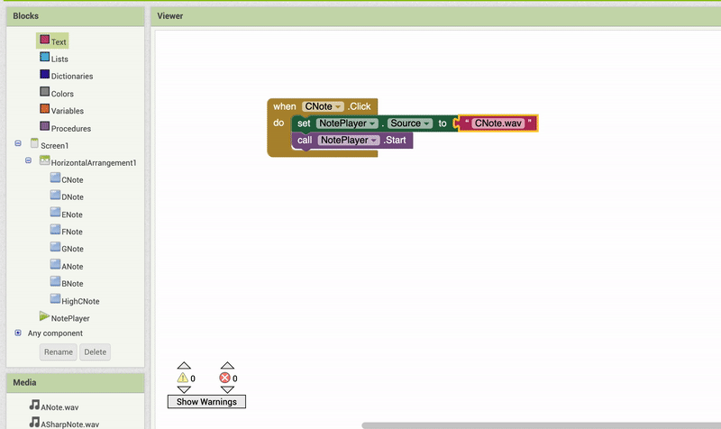{:.enlargeImage}

Change CNote.Click to DNote.Click by using the dropdown menu in the
duplicated block. Then change the text block from “CNote.wav” to “DNote.wav.

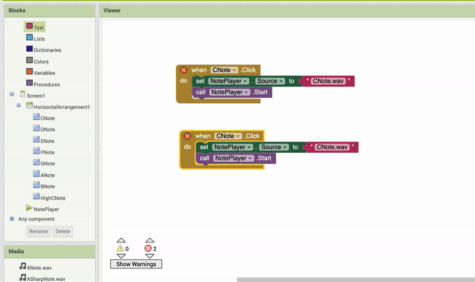{:.enlargeImage}

## Test Again

Test again with the MIT AI2 Companion app to see that both the CNote and DNote play correctly.

{:.enlargeImage}

## Code the Other Buttons

Can you code the remaining note buttons? Try it!

<hint markdown="block" title="Show me how">

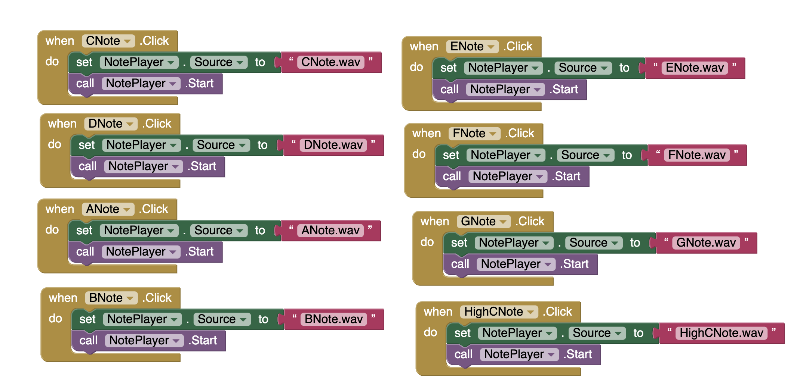{:.enlargeImage}

</hint>
 
And then test again with the MIT AI2 companion app to play all the notes in your completed piano app!
