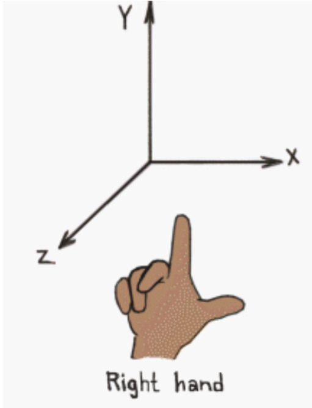
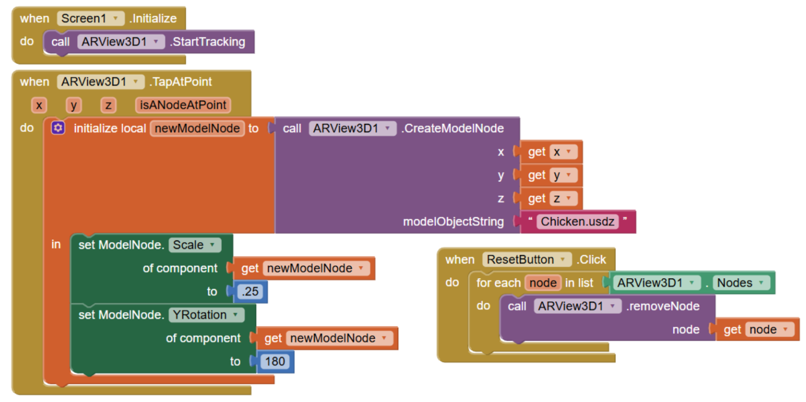

# Getting Started

Augmented reality, or AR for short, is a human-computer interaction where 3D computer graphics are placed into the physical world around the user through a device. In this case, the user will utilize their phone. The AR Chicken Placement App is the first part of the AR Chicken Bowling App and it teaches users how to place virtual objects in augmented reality using MIT App Inventor.

{:.enlargeImage}

# Setup

## Using the Neo Interface

For this tutorial, we will be using the App Inventor Neo Interface, which has a more modern look.

To switch to Neo Interface, go to your Projects space. On the top bar, click on "Settings", and select "User Interface Settings".

{:.enlargeImage}

Click on the "Neo" Interface, then click "OK".

{:.enlargeImage}

## Familiarizing Yourself With App Inventor Layout

The screen you are currently looking at is the "Design" Screen. On the left hand side of your screen (outlined in red) is the Palette, where there are drawers with components you can add to your app. In the center of the screen (outlined in green) is the Viewer, which is an empty phone screen where you will build the User Interface (UI) of your app. On the right side of the screen (outlined in blue) is the Properties window, you can edit specific aspects of each component you add to your app. Take a few minutes to explore the components within the drawers.

{:.enlargeImage}

# Building Your App

## Chicken Placement UI

Start by setting <em> AlignHorizontal </em> of Screen1 to "Center : 3".

{:.enlargeImage}

From the HorizontalArrangement drawer, drag and drop a <strong> HorizontalArrangement </strong> onto the screen.

{:.enlargeImage}

From the User Interface drawer, drag and drop a <strong> Button </strong> into <strong> HorizontalArrangement1 </strong>. By using a <strong> HorizontalArrangement </strong>, you can later add more components (and thus, functionalities), as we will do in the second part of this tutorial.

{:.enlargeImage}

Under the Screen1 panel, select <strong> Button1 </strong>, click "Rename", and rename it to <strong> ResetButton </strong>.

{:.enlargeImage}

Under Properties, set <em> BackgroundColor </em> to "Red". Set <em> FontSize </em> to "18". Set <em> Width </em> to "30 percent".

{:.enlargeImage}

Set <em> Text </em> to "Reset". Set <em> TextColor </em> to "Yellow".

{:.enlargeImage}

In the Augmented Reality drawer, drag and drop an <strong> ARView3D </strong> component beneath <strong> HorizontalArrangement1 </strong>.

{:.enlargeImage}

Set <em> Height </em> to "Fill parent". Set <em> Width </em> to "Fill parent". Check <em> EnableOcclusion </em>. By enabling occlusion, virtual objects, or nodes, placed in the <strong> ARView3D </strong> component will interact with objects in the real world, such as a node disappearing when its view is blocked behind a table.

{:.enlargeImage}

Before beginning to code the functionality of your app, note under the Media section there is a media file called "Chicken.usdz" that has been added for you. A USDZ file stores the virtual model of a 3D object.

{:.enlargeImage}

In the top right corner, select the "Blocks" button. This will take you to the Blocks screen where you will code the functionality of your app.

{:.enlargeImage}

## Chicken Placement Code

On the left side of your screen, under Screen1, drag and drop the "when Screen1.Initialize" block into your workspace.

{:.enlargeImage}

Under <strong> ARView3D1 </strong>, drag and drop a "call ARView3D1.StartTracking" block into the "when Screen1.Initialize" block.

{:.enlargeImage}

Under <strong> ARView3D1 </strong>, drag and drop a "when ARView3D1.TapAtPoint" block into your workspace.

{:.enlargeImage}

Under Variables, drag and drop an "intialize local name to" block into the "when ARView3D1.TapAtPoint" block.

{:.enlargeImage}

Click on "name" and rename the local variable to "newModelNode".

{:.enlargeImage}

Under <strong> ARView3D1 </strong>, drag and drop a "call ARView3D1.CreateModelNode" block into the "initialize local newModelNode to" socket. A ModelNode does not have a preset shape and users can upload different usdz files to use.

{:.enlargeImage}

Hover over "x" in the "when ARView3D1.TapAtPoint" block. Grab the "get x" block and drag and drop it into the "x" socket on the "call ARView3D1.CreateModelNode" block.

{:.enlargeImage}

Repeat this for "y" and "z" so that your code block now looks like this.

{:.enlargeImage}

Under Text, drag and drop an empty textbox into the "modelObjectString" socket on the "call ARView3D1.CreateModelNode" block.

{:.enlargeImage}

In the textbox, type "Chicken.usdz" to match the name of the file under media.

{:.enlargeImage}

Click the little plus sign next to "Any Components". Under Any ModelNode, drag and drop a "set ModelNode.Scale" block into the "in" section of the "initialize local newModelNode to" block.

{:.enlargeImage}

Hover over "newModelNode". Grab a "get newModelNode" block and drop it into the "of component" socket.

{:.enlargeImage}

Under Math, drag and drop a number block into the "to" socket and set the number to ".25". We want to scale chickens to 25% to create space for multiple chickens within <strong> ARView3D1 </strong>.

{:.enlargeImage}

In 3D space, there are 3 axes: x, y, z. You can imagine the x axis as the left-right direction, the y axis as the up-down direction, and the z axis as the forward-backward direction.

{:.enlargeImage}

Under Any ModelNode, drag and drop a "set ModelNode.YRotation" block beneath the "set ModelNode.Scale" block.

{:.enlargeImage}

Hover over "newModelNode". Grab a "get newModelNode" block and drop it into the "of component" socket.

{:.enlargeImage}

Under Math, drag and drop a number block into the "to" socket and set the number to "180". The chicken defaults to face away from the user. To have the chicken face the user, we want the chicken to be rotated 180 degrees along the y-axis.

{:.enlargeImage}

Under <strong> ResetButton </strong>, drag and drop a "when ResetButton.Click" block into your workspace.

{:.enlargeImage}

Under Control, drag and drop a "for each item in list" block into the "when ResetButton.Click" block.

{:.enlargeImage}

Click on "item" and rename it to "node". Your block should now look like this.

{:.enlargeImage}

Under <strong> ARView3D1 </strong>, drag and drop "ARView3D1.Nodes" into the "for each node in list" socket. "ARView3D1.Nodes" is a list representation of all nodes (chickens in this case) that exist within <strong> ARView3D1 </strong>.

{:.enlargeImage}

Under <strong> ARView3D1 </strong>, drag and drop a "call ARView3D1.removeNode" block into the "do" section.

{:.enlargeImage}

Hover over "node" in the "for each node in list" block. Grab the "get node" block and drag it into the "node" socket in the "call ARView3D1.removeNode" block.

{:.enlargeImage}

## Congratulations!

Congratulations, you have finished coding the functionality of your AR Chicken Placement App. Here is what your finished block code should look like.

{:.enlargeImage}
