# Getting Started

Augmented reality, or AR for short, is a human-computer interaction where 3D computer graphics are placed into the physical world around the user through a device. In this case, the user will utilize their phone. The AR Chicken Placement App is the first part of the AR Chicken Bowling App and it teaches users how to place virtual objects in augmented reality using MIT App Inventor.

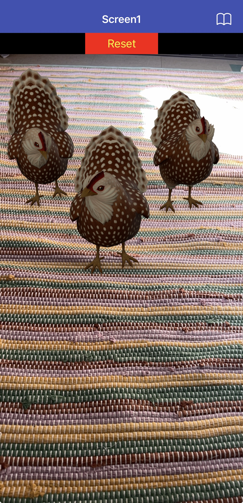

# Setup

## Using the Neo Interface

For this tutorial, we will be using the App Inventor Neo Interface, which has a more modern look.

To switch to Neo Interface, go to your Projects space. On the top bar, click on "Settings", and select "User Interface Settings".

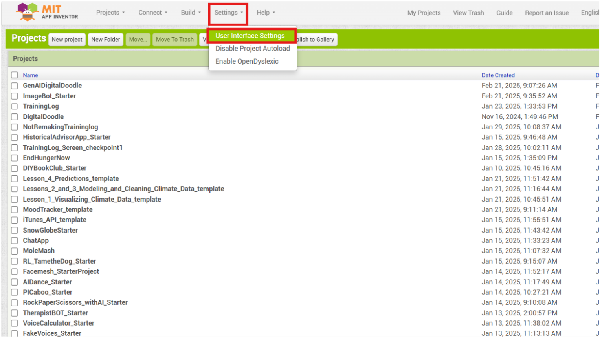{:.enlargeImage}

Click on the "Neo" Interface, then click "OK".

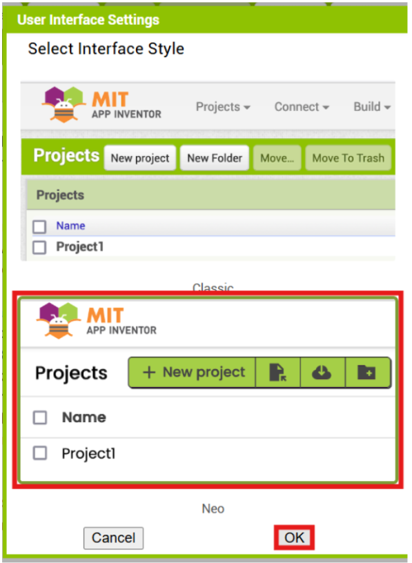{:.enlargeImage}

## Familiarizing Yourself With App Inventor Layout

The screen you are currently looking at is the "Design" Screen. On the left hand side of your screen (outlined in red) is the Palette, where there are drawers with components you can add to your app. In the center of the screen (outlined in green) is the Viewer, which is an empty phone screen where you will build the User Interface (UI) of your app. On the right side of the screen (outlined in blue) is the Properties window, you can edit specific aspects of each component you add to your app. Take a few minutes to explore the components within the drawers.

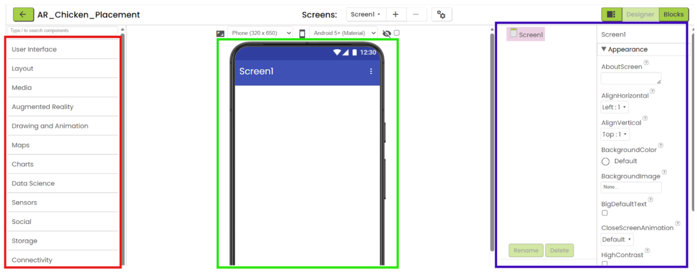{:.enlargeImage}

# Building Your Chicken Placement App

## Chicken Placement UI

Start by setting <em> AlignHorizontal </em> of Screen1 to "Center : 3".

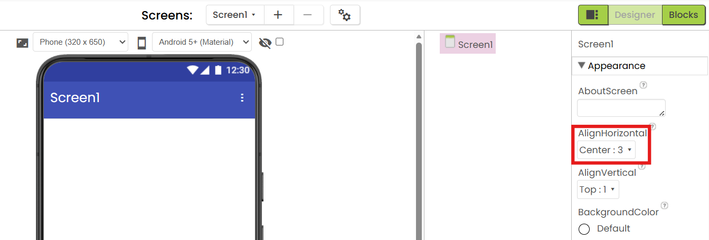{:.enlargeImage}

From the HorizontalArrangement drawer, drag and drop a <strong> HorizontalArrangement </strong> onto the screen.

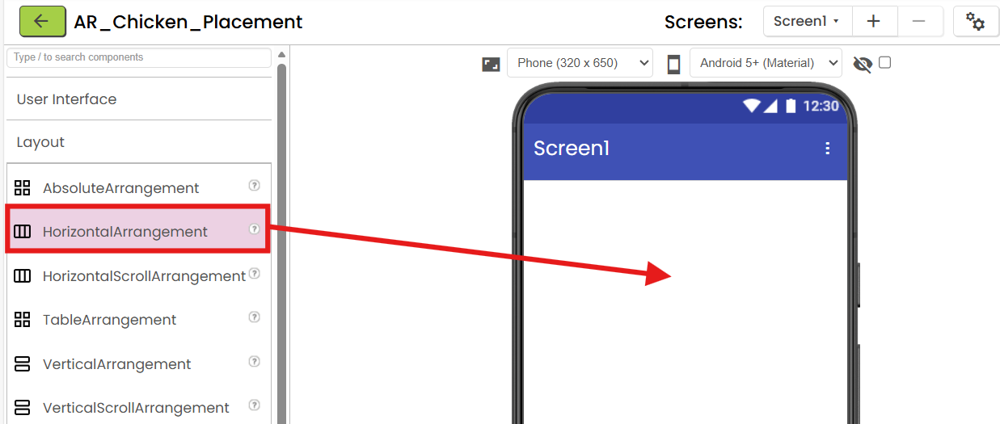{:.enlargeImage}

From the User Interface drawer, drag and drop a <strong> Button </strong> into <strong> HorizontalArrangement1 </strong>. By using a <strong> HorizontalArrangement </strong>, you can later add more components (and thus, functionalities), as we will do in the second part of this tutorial.

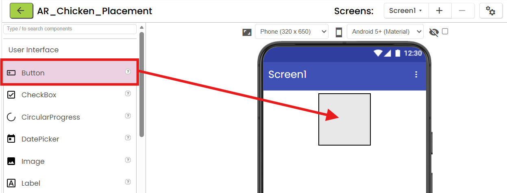{:.enlargeImage}

Under the Screen1 panel, select <strong> Button1 </strong>, click "Rename", and rename it to <strong> ResetButton </strong>.

{:.enlargeImage}

Under Properties, set <em> BackgroundColor </em> to "Red". Set <em> FontSize </em> to "18". Set <em> Width </em> to "30 percent".

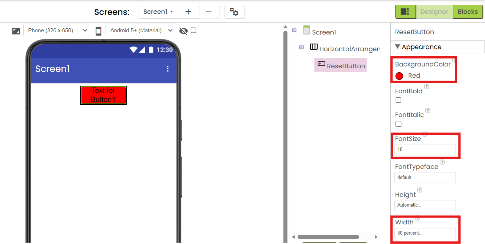{:.enlargeImage}

Set <em> Text </em> to "Reset". Set <em> TextColor </em> to "Yellow".

{:.enlargeImage}

In the Augmented Reality drawer, drag and drop an <strong> ARView3D </strong> component beneath <strong> HorizontalArrangement1 </strong>.

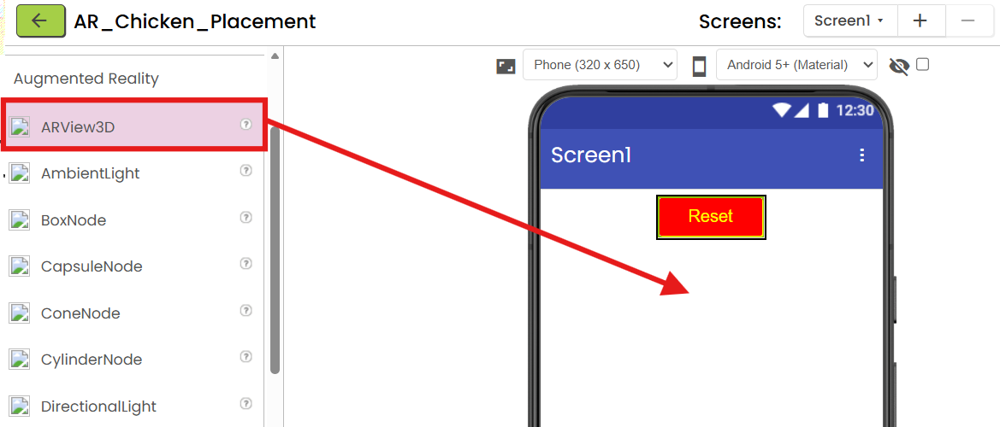{:.enlargeImage}

Set <em> Height </em> to "Fill parent". Set <em> Width </em> to "Fill parent". Check <em> EnableOcclusion </em>. By enabling occlusion, virtual objects, or nodes, placed in the <strong> ARView3D </strong> component will interact with objects in the real world, such as a node disappearing when its view is blocked behind a table.

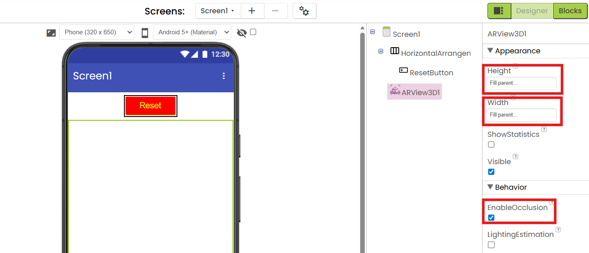{:.enlargeImage}

Before beginning to code the functionality of your app, note under the Media section there is a media file called "Chicken.usdz" that has been added for you. A USDZ file stores the virtual model of a 3D object.

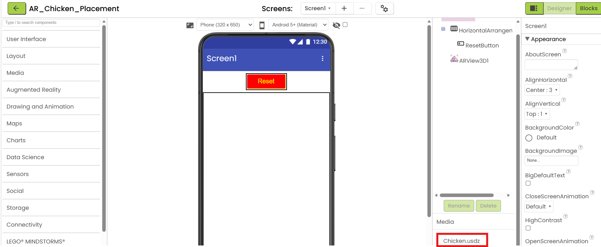{:.enlargeImage}

In the top right corner, select the "Blocks" button. This will take you to the Blocks screen where you will code the functionality of your app.

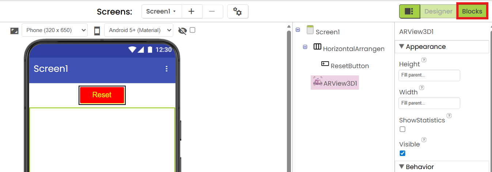{:.enlargeImage}

## Initialize Block

On the left side of your screen, under Screen1, drag and drop the "when Screen1.Initialize" block into your workspace.

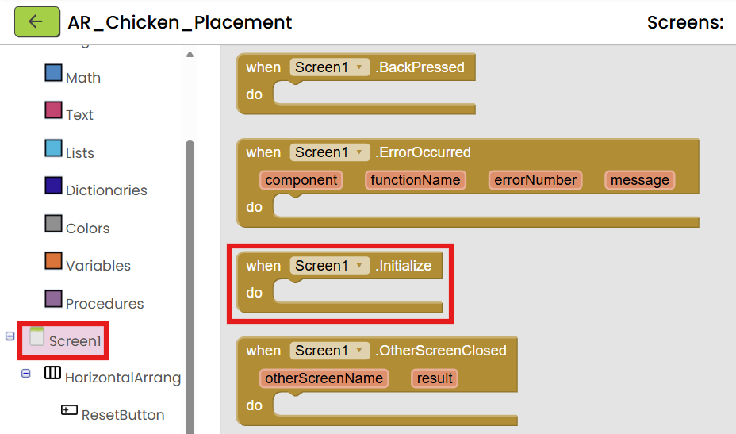{:.enlargeImage}

Under <strong> ARView3D1 </strong>, drag and drop a "call ARView3D1.StartTracking" block into the "when Screen1.Initialize" block.

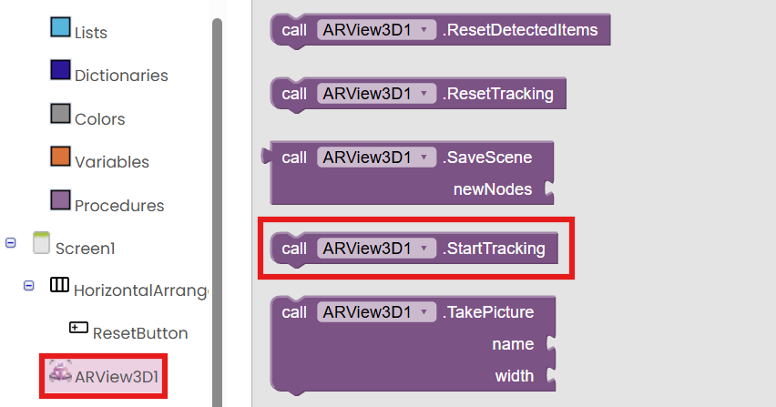{:.enlargeImage}

## Tap At Point Block

Under <strong> ARView3D1 </strong>, drag and drop a "when ARView3D1.TapAtPoint" block into your workspace.

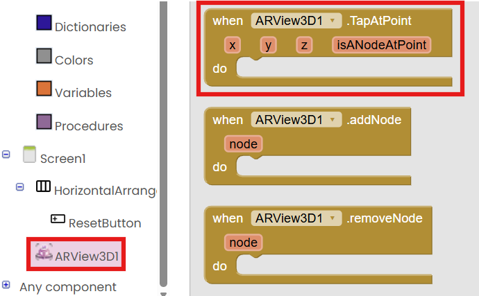{:.enlargeImage}

Under Variables, drag and drop an "intialize local name to" block into the "when ARView3D1.TapAtPoint" block.

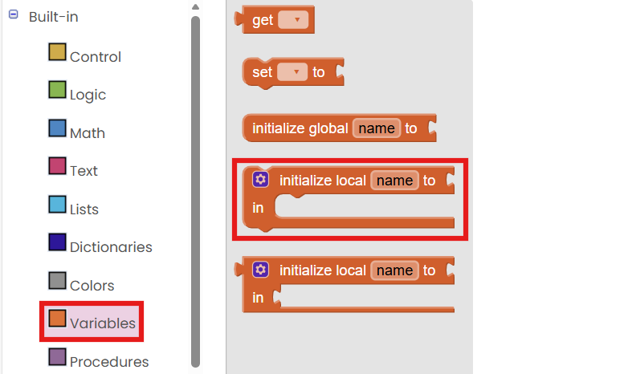{:.enlargeImage}

Click on "name" and rename the local variable to "newModelNode".

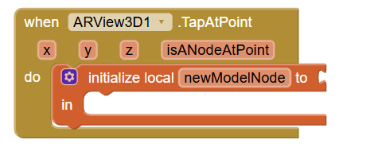{:.enlargeImage}

Under <strong> ARView3D1 </strong>, drag and drop a "call ARView3D1.CreateModelNode" block into the "initialize local newModelNode to" socket. A ModelNode does not have a preset shape and users can upload different usdz files to use.

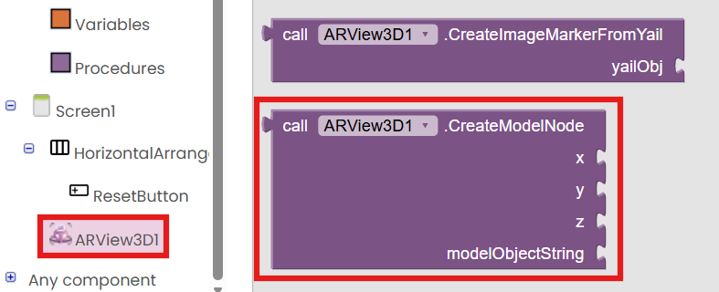{:.enlargeImage}

Hover over "x" in the "when ARView3D1.TapAtPoint" block. Grab the "get x" block and drag and drop it into the "x" socket on the "call ARView3D1.CreateModelNode" block.

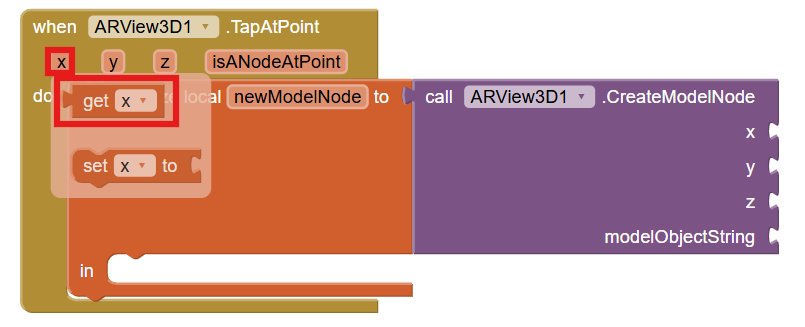{:.enlargeImage}

Repeat this for "y" and "z" so that your code block now looks like this.

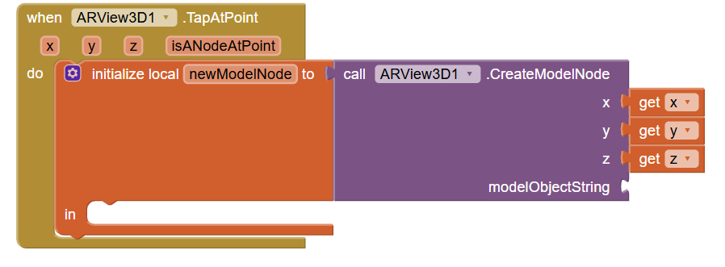{:.enlargeImage}

Under Text, drag and drop an empty textbox into the "modelObjectString" socket on the "call ARView3D1.CreateModelNode" block.

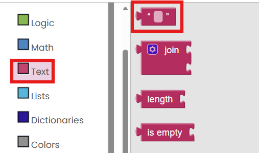{:.enlargeImage}

In the textbox, type "Chicken.usdz" to match the name of the file under media.

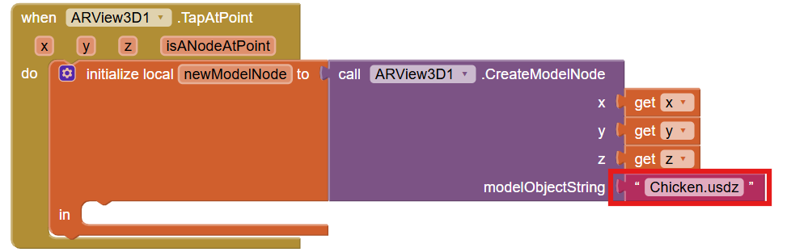{:.enlargeImage}

## ModelNode Scale

Click the little plus sign next to "Any Components". Under Any ModelNode, drag and drop a "set ModelNode.Scale" block into the "in" section of the "initialize local newModelNode to" block.

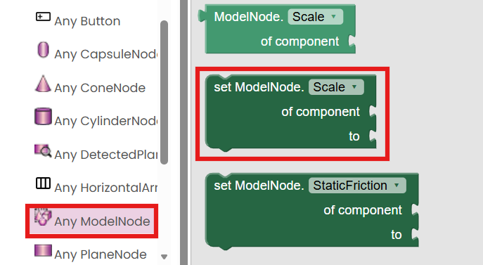{:.enlargeImage}

Hover over "newModelNode". Grab a "get newModelNode" block and drop it into the "of component" socket.

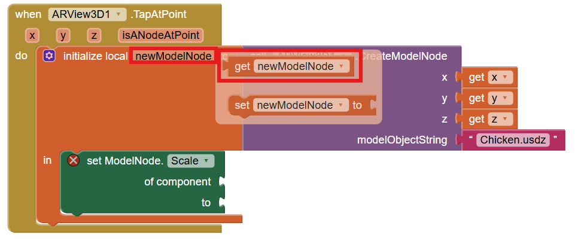{:.enlargeImage}

Under Math, drag and drop a number block into the "to" socket and set the number to ".25". We want to scale chickens to 25% to create space for multiple chickens within <strong> ARView3D1 </strong>.

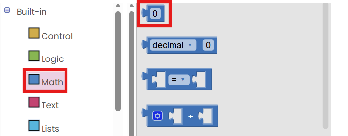{:.enlargeImage}

## ModelNode Rotation

In 3D space, there are 3 axes: x, y, z. You can imagine the x axis as the left-right direction, the y axis as the up-down direction, and the z axis as the forward-backward direction.

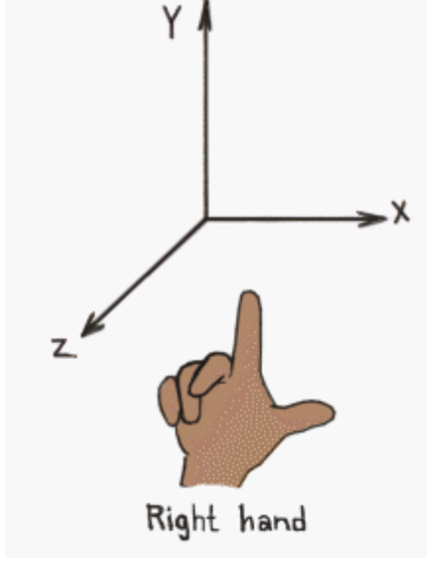{:.enlargeImage}

Under Any ModelNode, drag and drop a "set ModelNode.YRotation" block beneath the "set ModelNode.Scale" block.

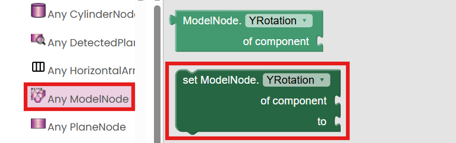{:.enlargeImage}

Hover over "newModelNode". Grab a "get newModelNode" block and drop it into the "of component" socket.

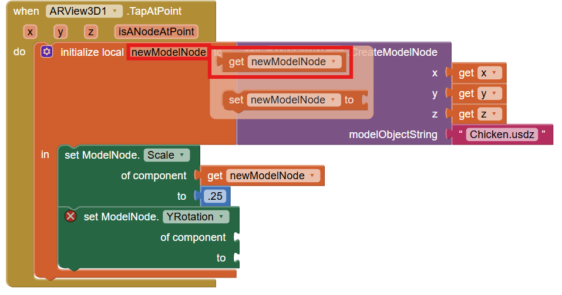{:.enlargeImage}

Under Math, drag and drop a number block into the "to" socket and set the number to "180". The chicken defaults to face away from the user. To have the chicken face the user, we want the chicken to be rotated 180 degrees along the y-axis.

{:.enlargeImage}

## Reset Button

Under <strong> ResetButton </strong>, drag and drop a "when ResetButton.Click" block into your workspace.

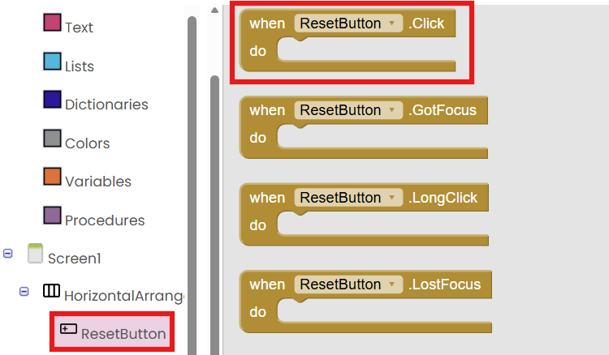{:.enlargeImage}

Under Control, drag and drop a "for each item in list" block into the "when ResetButton.Click" block.

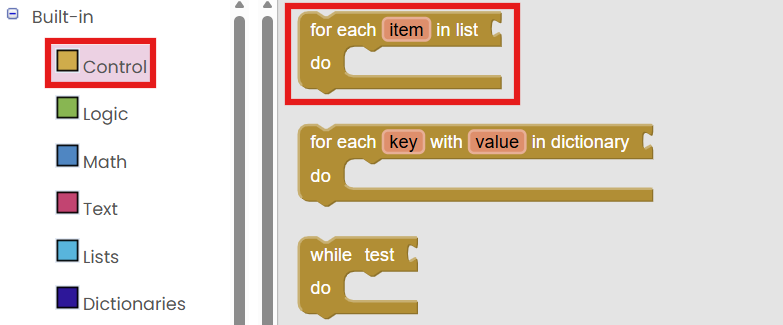{:.enlargeImage}

Click on "item" and rename it to "node". Your block should now look like this.

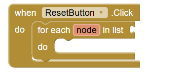{:.enlargeImage}

Under <strong> ARView3D1 </strong>, drag and drop "ARView3D1.Nodes" into the "for each node in list" socket. "ARView3D1.Nodes" is a list representation of all nodes (chickens in this case) that exist within <strong> ARView3D1 </strong>.

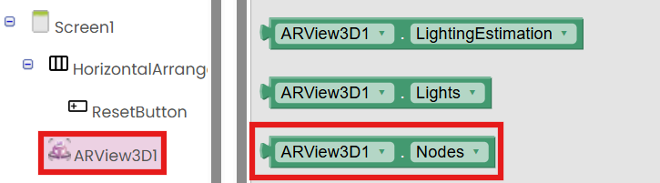{:.enlargeImage}

Under <strong> ARView3D1 </strong>, drag and drop a "call ARView3D1.removeNode" block into the "do" section.

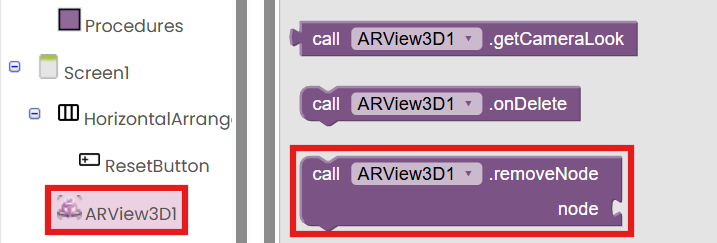{:.enlargeImage}

Hover over "node" in the "for each node in list" block. Grab the "get node" block and drag it into the "node" socket in the "call ARView3D1.removeNode" block.

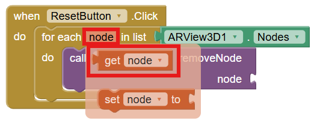{:.enlargeImage}

# Pairing Your Companion

Congratulations! You now have completed your AR Chicken Placement App, the first part of the AR Chicken Bowling App, and it is time to test it out! Make sure you have the App Inventor companion app downloaded on your mobile device. To connect your mobile device, click the “Connect” button in the top center, then select “AI Companion”.

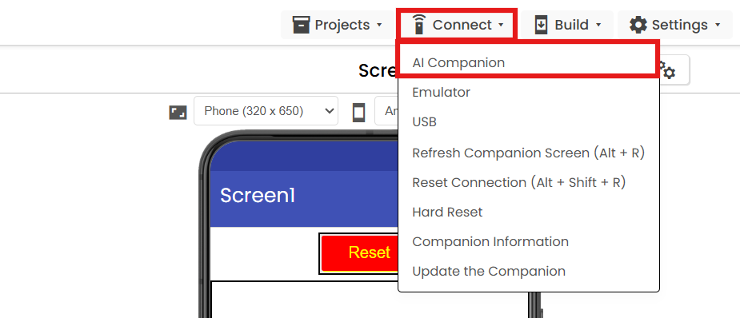{:.enlargeImage}

A QR code should appear on your screen.  Open the App Inventor app on your mobile device and click “scan QR code”. Your app should appear on your mobile device. Time to use your app! Take time to place as many chickens as you want. Move around and place chickens in different locations and view chickens from different places. If the app can not find clear planes to place chickens, you will receive an error message. If this occurs, try changing your location and moving closer to the location you want to place a chicken. If you want to start over and clear the chickens, you can use the ResetButton. When you are ready to expand your app, continue on to the AR Chicken Bowling tutorial.

# Getting Started With Chicken Bowling

The AR Chicken Bowling App is a continuation of the AR Chicken Placement App to help users continue to build their skills and confidence with augmented reality. The AR Chicken Bowling App allows users to place spheres and chickens on their screen and explore how these nodes can interact with one another.

# Building Your Chicken Bowling App

## Saving a Checkpoint

At the top of your screen, under Projects, click "Checkpoint". This will create a copy of your current app that you can access in your projects.

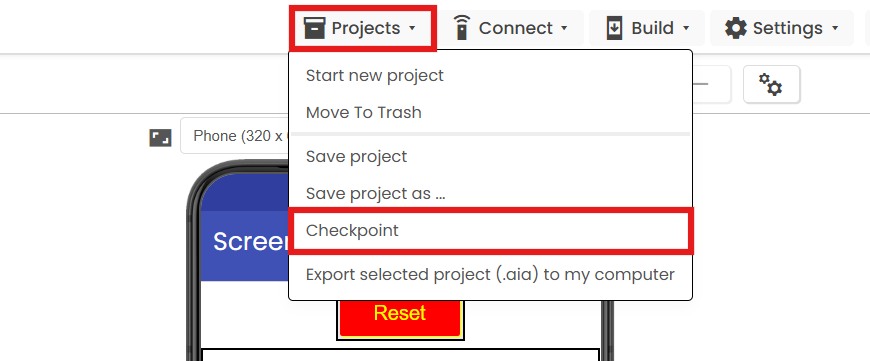{:.enlargeImage}

Click "OK" to save this version.

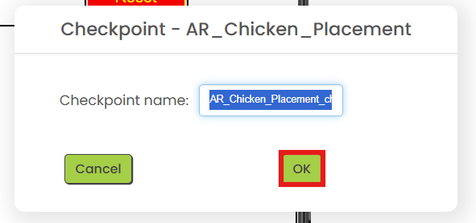{:.enlargeImage}

## Chicken Bowling UI

From the User Interface drawer, drag and drop a <strong> Label </strong> at the top of the screen.

{:.enlargeImage}

Under the Screen1 panel, select <strong> Label1 </strong>, click "Rename", and rename it to <strong> TitleLabel </strong>.

{:.enlargeImage}

Under Properties, set <em> FontSize </em> to "24". Set <em> Text </em> to "Chicken Bowling".

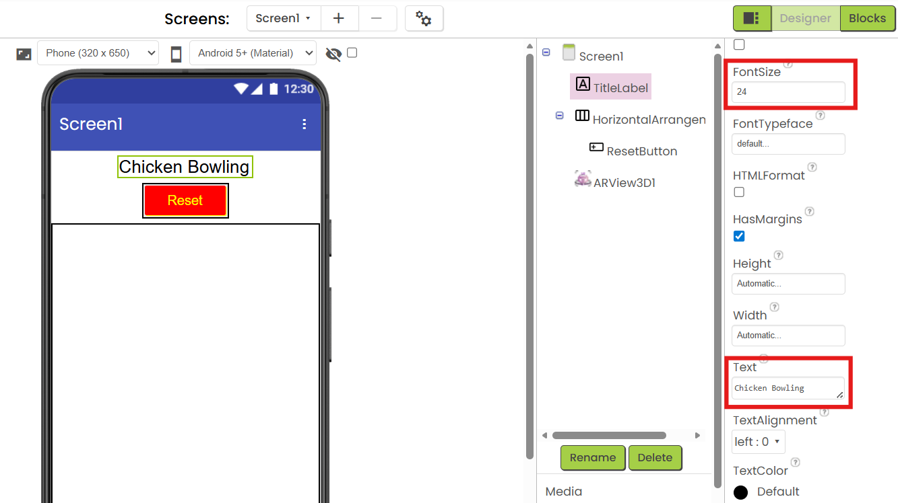{:.enlargeImage}

In the properties of <strong> HorizontalArrangement1 </strong>, set <em> AlignHorizontal </em> to "Center : 3". Set <em> AlignVertical </em> to "Center : 2". Set <em> BackgroundColor </em> to "Orange". Set <em> Height </em> to "10 percent".

{:.enlargeImage}

Drag and drop a <strong> Label </strong> into <strong> HorizontalArrangement1 </strong> to the left of <strong> ResetButton </strong>.

{:.enlargeImage}

Rename <strong> Label1 </strong> to <strong> SelectLabel </strong>.

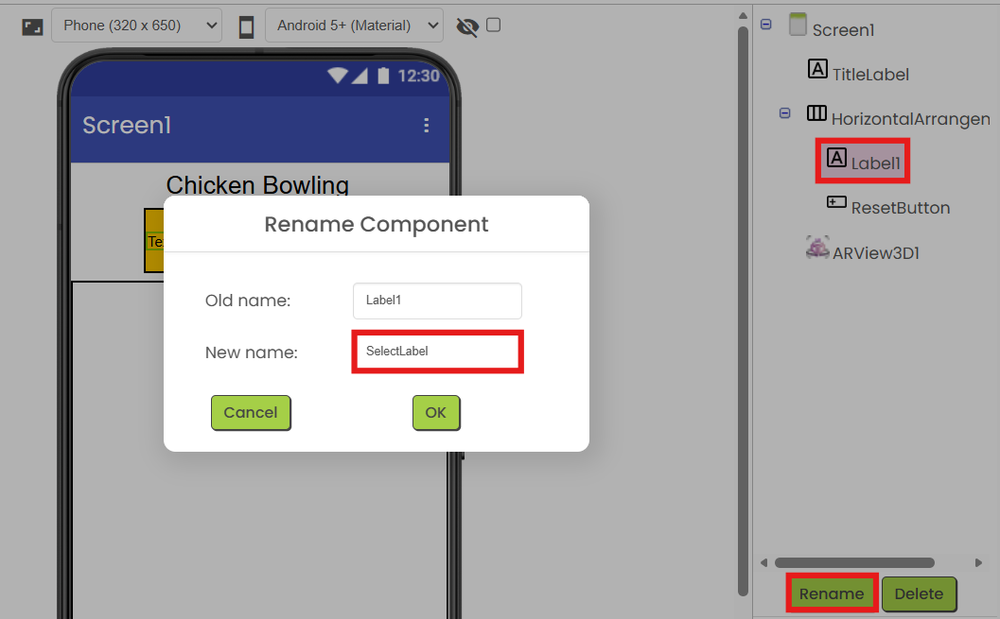{:.enlargeImage}

Under Properties, check <em> FontBold </em>. Set <em> Text </em> to "Select Object".

{:.enlargeImage}

Under Layout, drag and drop a <strong> HorizontalArrangement </strong> between <strong> SelectLabel </select> and <strong> ResetButton </strong>. This <strong> HorizontalArrangement </strong> is to create space between the <strong> SelectLabel </strong> and the <strong> ResetButton </strong>.

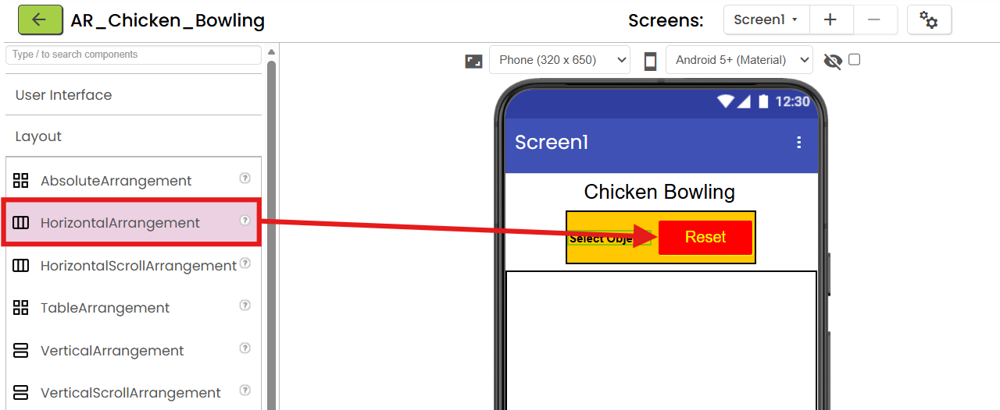{:.enlargeImage}

Set <em> Width </em> to "15 pixels".

{:.enlargeImage}

From the User Interface drawer, drag and drop a <strong> Spinner </strong> between <strong> HorizontalArrangement2 </strong> and <strong> ResetButton </strong>. A <strong> Spinner </strong> component shows a list of items. We will use this to select what kind of node to place in <strong> ARView3D </strong>.

{:.enlargeImage}

Under Properties, set <em> Prompt </em> to "Select Object". Set <em> ElementsFromString </em> to "Ball, Chicken". This is so that the user will be able to change between two different nodes: SphereNode, which will act as the ball in the bowling game, and ModelNode, which will use the Chicken.usdz model and act as bowling pins in the bowling game. Set <em> Selection </em> to "Ball".

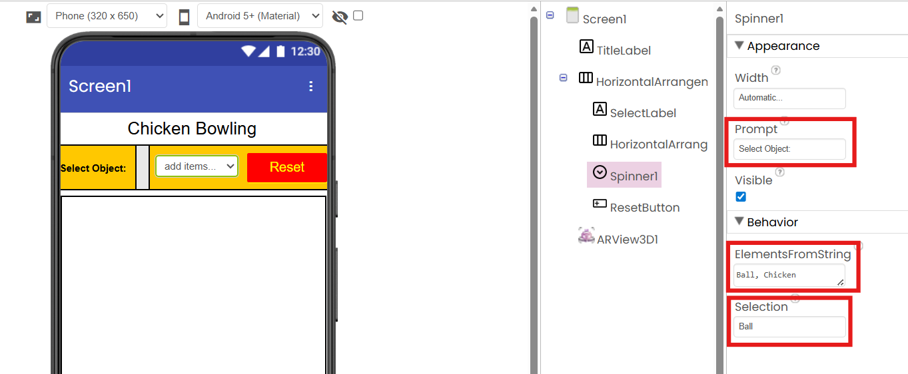{:.enlargeImage}

Under Layout, drag and drop a <strong> HorizontalArrangement </strong> between <strong> Spinner1 </strong> and <strong> ResetButton </strong>. This <strong> HorizontalArrangement </strong> is to create space between <strong> Spinner1 </strong> and <strong> ResetButton </strong>.

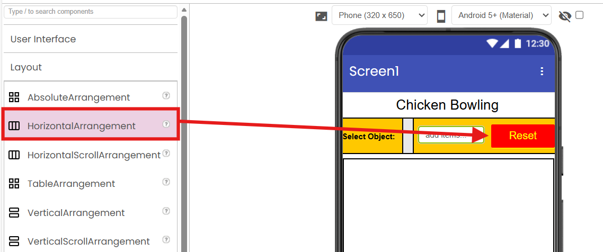{:.enlargeImage}

Under Properties, set <em> Width </em> to "15 pixels".

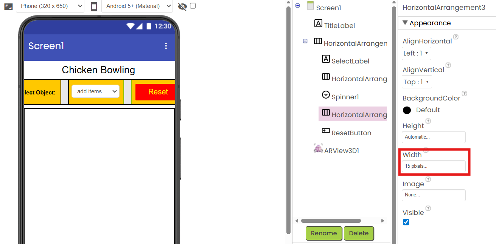{:.enlargeImage}

In the top right corner, select the "Blocks" button. This will take you to the Blocks screen where you will code the functionality of your app.

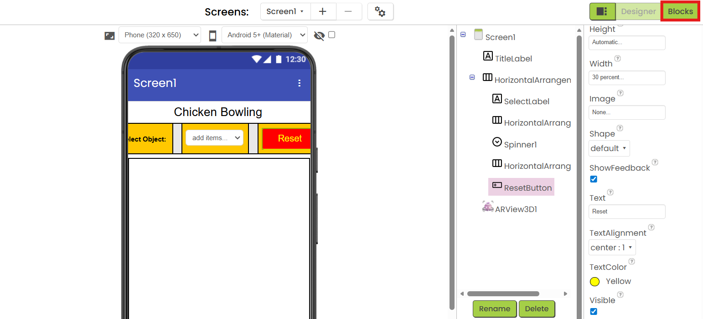{:.enlargeImage}

## Chicken Bowling Code

In your Blocks workspace, set aside the "when Screen1.Initialize" block and the "when ResetButton.Clicked" block. Both of these blocks will not change. From the "when ARView.3D1.TapAtPoint" block, remove the whole "initialize local newModelNode to" block and set it to the side in your workspace to use later.

{:.enlargeImage}

Under Control, drag and drop an "if-then" block into the "when ARView3D1.TapAtPoint" block.

{:.enlargeImage}

Click on the blue gear in the "if-then" block. Drag and drop an "else if" block into the "if" space. You should now have an "if-then-elseif-then" block.

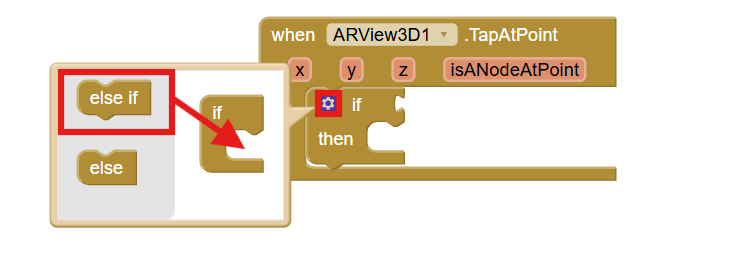{:.enlargeImage}

Under Logic, drag and drop an equal sign block into the "if" socket.

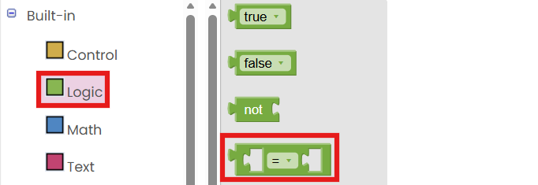{:.enlargeImage}

Under <strong> Spinner1 </strong>, drag and drop a "Spinner1.Selection" block into the first socket in the equal sign block. "Spinner1.Selection" is the text representation of the item selected from <strong> Spinner1 </strong>.

{:.enlargeImage}

Under Text, drag and drop an empty textbox into the second equals sign socket.

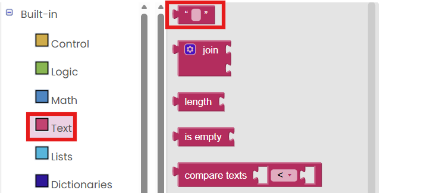{:.enlargeImage}

In the empty textbox, type "Ball". Your block should currently look like this.

{:.enlargeImage}

Under Variables, drag and drop an "initialize local name to" block into the "then" space of the "if-then-elseif-then" block. Change the local variable name from "name" to "newSphereNode".

{:.enlargeImage}

Under <strong> ARView3D1 </strong>, drag and drop a "call ARView3D1.CreateSphereNode" block into the "initialize local newSphereNode to" socket.

{:.enlargeImage}

Hover over "x" in the "when ARView3D1.TapAtPoint" block. Grab the "get x" block and drag and drop it into the "x" socket on the "call ARView3D1.CreateSphereNode" block.

{:.enlargeImage}

Repeat this for "y" and "z" so that your code block now looks like this.

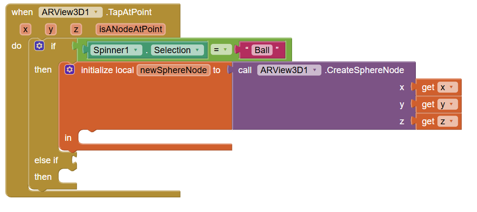{:.enlargeImage}

## SphereNode Texture

Click the little plus sign next to "Any Components". Under Any SphereNode, drag and drop a "set SphereNode.Texture to" in the "in" section of the "initialize local newSphereNode to" block. The texture provides the visual appearance of a <strong> SphereNode </strong>.

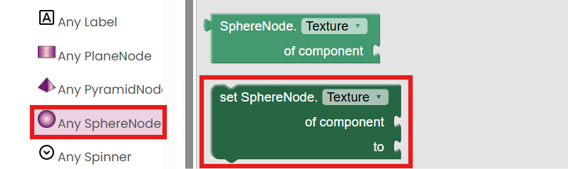{:.enlargeImage}

Hover over "newSphereNode". Grab a "get newSphereNode" block and drag and drop it into the "of component" socket.

{:.enlargeImage}

Under Text, drag and drop an empty textbox into the "to" socket. Change the text to "Palette.png".

{:.enlargeImage}

Your code block should now look like this.

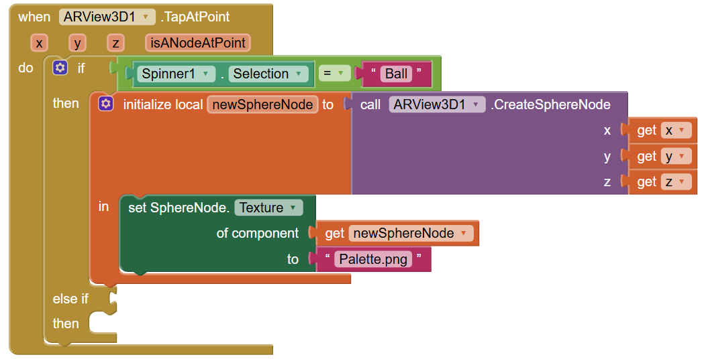{:.enlargeImage}

## SphereNode Scale

Under Any SphereNode, drag and drop a "set SphereNode.Scale" block beneath the "set SphereNode.Texture" block. Drag and drop a "get newSphereNode" block into the "of component" socket. We use Scale to change the scale of the SphereNode compared to its surroundings.

{:.enlargeImage}

Under Math, drag and drop an empty number into the "to" socket of the "set SphereNode.Scale" block. Set the number to 1. We want the SphereNode to be scaled normally.

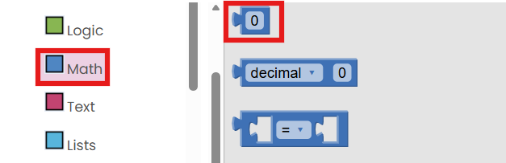{:.enlargeImage}

Check what your code block should look like now:

<hint markdown="block" title="Give me a hint">

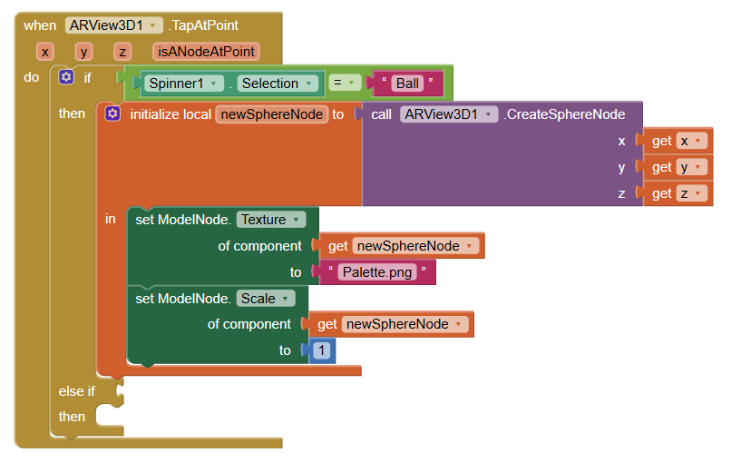{:.enlargeImage}

</hint>

## SphereNode PinchToScale

Under Any SphereNode, drag and drop a "set SphereNode.PinchToScale" beneath the "set SphereNode.Scale" block. Drag and drop a "get newSphereNode" block into the "of component" block. PinchToScale means that the user can change the size of the SphereNode by pinching or pulling the SphereNode on their screen.

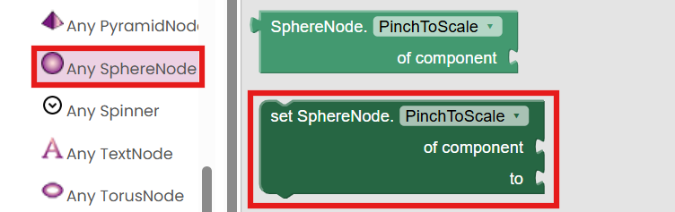{:.enlargeImage}

Under Logic, drag and drop a "true" block into the "to" socket.

{:.enlargeImage}

Check what your code block should look like now:

<hint markdown="block" title="Give me a hint">

{:.enlargeImage}

</hint>

## SphereNode PanToMove

Under Any SphereNode, drag and drop a "set SphereNode.PanToMove" block beneath the "set SphereNode.PinchToScale" block. Drag and drop a "get newSphereNode" block into the "of component" block. PanToMove means that the user can move a SphereNode with any pan movement or by swiping the SphereNode with the finger.

{:.enlargeImage}

Under Logic, drag and drop a "true" block into the "to" socket.

{:.enlargeImage}

Check what your code block should look like now:

<hint markdown="block" title="Give me a hint">

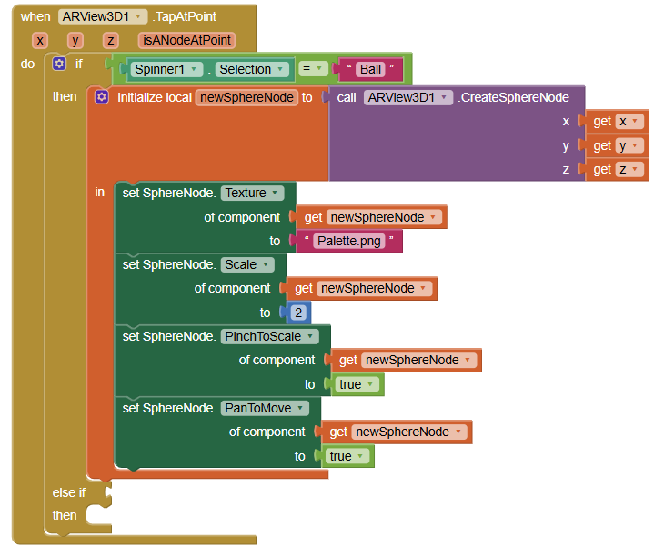{:.enlargeImage}

</hint>

## SphereNode EnablePhysics

Under Any SphereNode, drag and drop a "set SphereNode.EnablePhysics" block beneath the "set SphereNode.PanToMove" block. Drag and drop a "get newSphereNode" block into the "of component" block. Under Logic, drag and drop a "true" block into the "to" socket. EnablePhysics means that the SphereNode will behave as if physics exist. This means that the SphereNode will experience gravity and collisions with other objects.

{:.enlargeImage}

Check what your code block should look like now:

<hint markdown="block" title="Give me a hint">

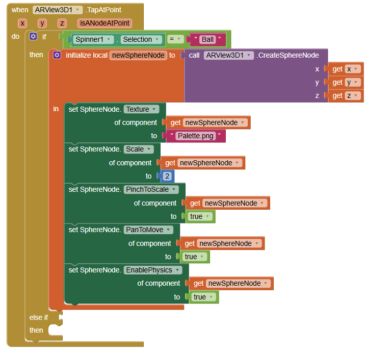{:.enlargeImage}

</hint>

## Else If Logic

Under Logic, drag and drop an equal sign block into the "else if" socket.

{:.enlargeImage}

Under <strong> Spinner1 </strong>, drag and drop a "Spinner1.Selection" block into the first socket in the equal sign block.

{:.enlargeImage}

Under Text, drag and drop an empty textbox into the second equals sign socket. In the empty textbox, type "Chicken".

{:.enlargeImage}

Drag and drop the code block you set aside earlier into the "then" section. Your code block should now look like this.

{:.enlargeImage}

Under Any ModelNode, drag and drop a "set ModelNode.EnablePhysics" block beneath the "set ModelNode.Scale" block. Drag and drop a "get newModelNode" block into the "of component" socket. Under Logic, drag and drop a "true" block into the "to" socket.

{:.enlargeImage}

Congratulation, you have finished coding the functionality of your AR Chicken Bowling App. Here is what your block code should look like.

{:.enlargeImage}

# Congratulations! And Testing Your App

You have now completed your AR Chicken Placement App and it is time to test it out! Make sure you have the App Inventor companion app downloaded on your mobile device. To connect your mobile device, click the “Connect” button in the top center, then select “AI Companion”.

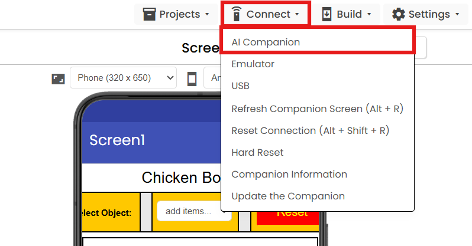{:.enlargeImage}

A QR code should appear on your screen.  Open the App Inventor app on your mobile device and click “scan QR code”. Your app should appear on your mobile device. Time to use your app! Start by placing some chickens on your screen. Then, place a ball. You can pinch to make the ball bigger or smaller. Use the ball to try and knock over the chickens as if you are bowling! You can always use the reset button to clear your game. If the app can not find clear planes to place an item, you will receive an error message. If this occurs, try changing your location and moving closer to the location you want to place an item. Have fun playing with augmented reality and remember, no actual chickens are harmed in this project. Below are some ideas as to how you can expand and improve your app.

# Expand Your App

Here are some ideas of how you can expand your app:

* Experiment with different scalings of balls and chickens.

* Add different node types to the spinner such as BoxNodes and CapsuleNodes. Be sure to EnablePhysics so that you can do fun things like stack nodes!

* Download the Scaniverse app from the App Store on your device and use it to create your own personal 3D models which you can upload into App Inventor.

* Add a scoring tool that tracks how many points a user earns. (Hint: utilize blocks such as ObjectCollidedWithObject to detect when collisions occur)

* See what other ideas you can come up with! There are countless ways to expand and improve your app.
