# Challenge

Make Your Own Calculator!

In this tutorial, you will learn how to use the <strong>MIT App Inventor’s Conversational AI Interface</strong> to create your own multiplication calculator for Alexa to tell the user the answer when a basic multiplication question is asked. 

The Skill we will be making uses <strong> slots </strong> to keep track of what numbers the user is asking Alexa to multiply.

# Setup

If you haven't already, follow the written instructions [here](../images/my_calculator/setup.pdf) or the YouTube video instructions [here](https://www.youtube.com/watch?v=NHbkpzBXQ84&ab_channel=MITAppInventor) to create a <u>free</u> <strong>Amazon Developer Account</strong>. 

This will allow you to save any Alexa Skills to your account and use your skills on any Alexa-enabled devices that you have linked to your Amazon account.

Plese note: If your instructor gave you access to an anonymous Alexa account then you can skip this section on how to set up an Alexa Developer Account.

# My Calculator Tutorial

## Add a Skill

To add a new Skill to our project, select the <strong>Add …</strong> dropdown next to Screen1, and select <strong>Skill</strong>.

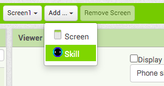{:.enlargeImage}

In the resulting popup, enter our Skill’s <strong>Invocation name</strong>, “my awesome calculator”. Then, select <strong>OK</strong>.

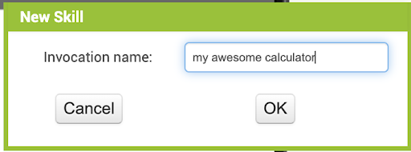{:.enlargeImage}

## Define the Slots

Once the skill has been created, you’ll be directed to the Designer page for the skill. You’ll notice that there are the <strong>Intent</strong> and <strong>Slot components </strong> in the Built-In section on the left side of the page: 

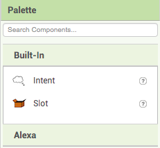{:.enlargeImage}

The <strong> Designer </strong> Page is where we will be defining our Skills’ <strong> Voice User Interfaces </strong> (the different ways the <strong> user </strong> might speak to our <strong>Alexa</strong>). 

First, let’s define our slots for the multiplication intent. Take a <strong>Slot</strong> component from the <strong>Palette</strong> and <strong>drag and drop</strong> it over the image of the <strong>Amazon Echo Dot</strong>. 

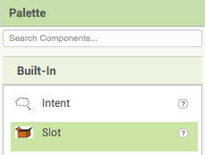{:.enlargeImage}

You should see a new <strong>Slot</strong> component named SlotA appear as a Non-visible component under the Echo Dot. The new Slot will also appear in our <strong>Components</strong> box to the right.

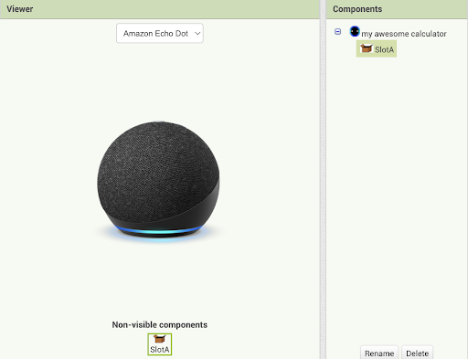{:.enlargeImage}

Let’s rename this slot to numbOneSlot so that it makes more sense to us later. At the bottom of the <strong>Components</strong> box, click the <strong>Rename</strong> button. In the resulting popup, enter “numbOneSlot” in the <strong>New name</strong> textbox. Then, click <strong>OK</strong>. 

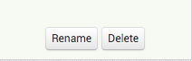{:.enlargeImage}
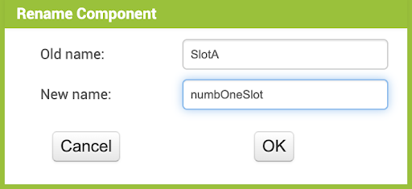{:.enlargeImage}

In the <strong>Properties</strong> box, you should see a dropdown menu named <strong>SlotType</strong>. Open the dropdown and select <strong>Number</strong> to tell Alexa that this slot will be a number. 

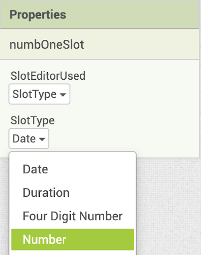{:.enlargeImage}

Repeat the same process with another slot, this time renaming it to <strong>numbTwoSlot</strong>. Don’t forget to change its SlotType to Number as well. Your Components box should now look like this:

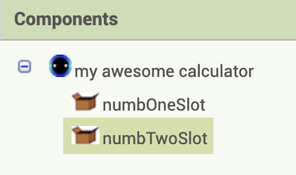{:.enlargeImage}

## Define the Intent

Now, we want to define our multiplication intent. First drag out an <strong>Intent</strong> component from the <strong>Palette</strong> to the left and drop it over the image of the Amazon Echo Dot. 

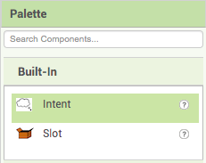{:.enlargeImage}

The Intent should appear as a <strong>Non-visible component</strong> named <strong>IntentA</strong> both under the Echo Dot and in the <strong>Components</strong> box. 

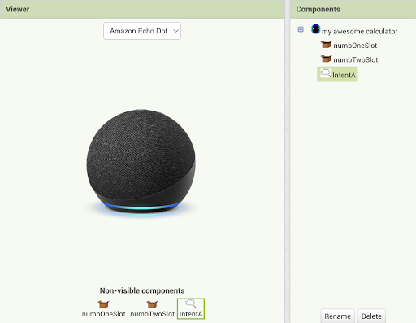{:.enlargeImage}

Let’s rename this Intent to multiplyIntent. At the bottom of the <strong>Components</strong> box, click the <strong>Rename</strong> button. In the resulting popup, enter “multiplyIntent” in the <strong>New name</strong> textbox. Then, click <strong>OK</strong>. 

{:.enlargeImage}
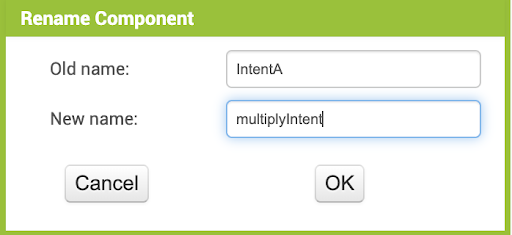{:.enlargeImage}

Notice the different parts of the <strong>Properties</strong> box available to edit the <strong>multiplyIntent</strong>.

First, we have a textbox to edit any <strong>utterance</strong> that you’re currently defining for this intent.

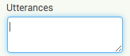{:.enlargeImage}

Then, we have buttons for each <strong>Slot</strong> we defined earlier. You can click on these as you’re typing an <strong>Utterance</strong> to insert the slot into the utterance. You can also choose to simply type the slot’s name instead of using the slot buttons. 

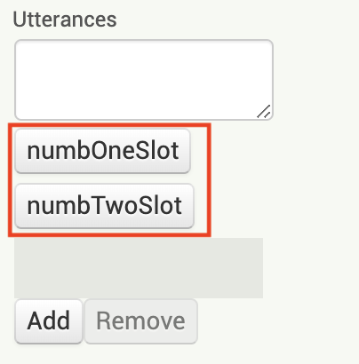{:.enlargeImage}

Next, we have an <strong>empty space</strong>. This will contain your first utterance when you start typing into the textbox and then click away to save it. 

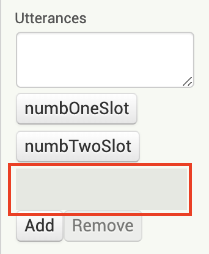{:.enlargeImage}

Finally, we have <strong>Add</strong> and <strong>Remove</strong> buttons to add and remove utterances from your Intent. To remove an utterance, simply click on the utterance you want to remove, and then click the Remove button.

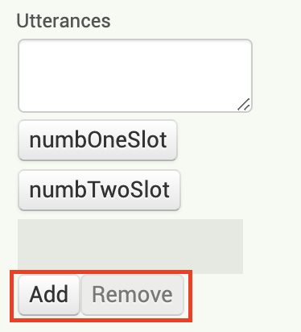{:.enlargeImage}

## Adding a List of Utterances

Let’s try defining our first <strong>Utterance</strong> for the <strong>multiplyIntent</strong>. In the Textbox at the top of the <strong>Properties</strong> box, type “What is ” and then click the button for the <strong>numbOneSlot</strong>. Your <strong>Properties</strong> box should now look like this. 

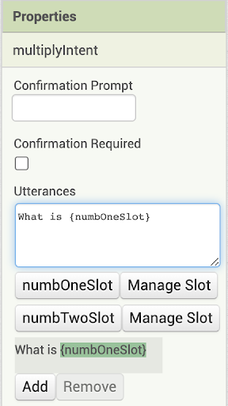{:.enlargeImage}

To complete this utterance, click at the end of the text in the Textbox, and type “ times ” and now click the button for the <strong>numbTwoSlot</strong>. Your <strong>Properties</strong> box should now look like this. 

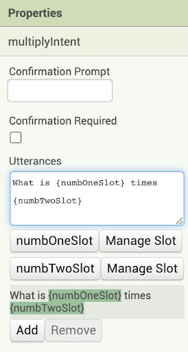{:.enlargeImage}

Let’s try adding our next utterance without using the slot buttons. First, click on the <strong>Add</strong> button under your first utterance. 

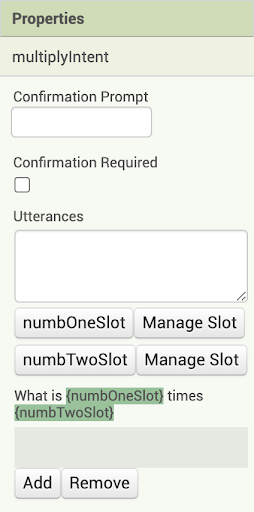{:.enlargeImage}

Notice that there is a new highlighted space under your first utterance. This is where your new utterance will appear once you edit it. In the textbox at the top, type “What is {numbOneSlot} multiplied by {numbTwoSlot}”. Then, click anywhere else on the page. Your <strong>Properties</strong> box should now look like this.

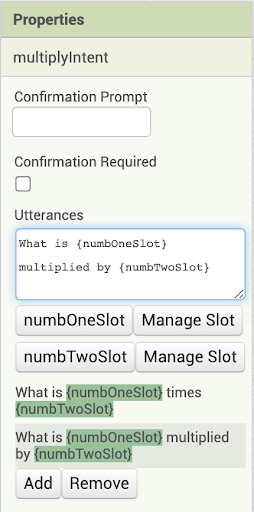{:.enlargeImage}

 

Finally, add the last utterance using whichever method you prefer. This utterance should be another way that someone might ask to multiply two numbers, such as “Multiply {numbOneSlot} and {numbTwoSlot}”. 

Your <strong>Properties</strong> box should now look something like this. 

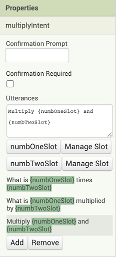{:.enlargeImage}

 

We’ve now completed our multiplyIntent for this skill! If you like, try following the same steps to define an Intent for another calculation that involves two numbers. Or, you can continue with only the multiply intent.

This is the completed Voice User Interface (VUI) for our skill! We can now move on to defining how Alexa will respond to our intents.

## Define the First Intent Handler

To define our Intent Handlers, let’s finally move to the <strong>Blocks</strong> page. 

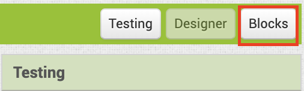{:.enlargeImage}

 

Let’s notice two things that are now different in the blocks.

First, open the <strong>Voice</strong> drawer. You’ll notice that all the blocks that were originally there for defining slots and intents are gone! This is because we are now defining the VUI in the Designer page, so we no longer have any use for those blocks.

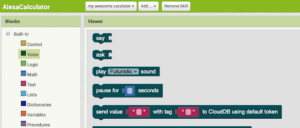{:.enlargeImage}

 

Next, notice that our <strong>Slot</strong> and <strong>Intent</strong> components now have their own block drawers in the components section. This is primarily meant to make the Alexa Skill interface more similar to the regular App Inventor interface. 

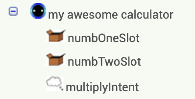{:.enlargeImage}

 

Now, let’s actually define our Intent Handlers. Open the <strong>multiplyIntent</strong>’s drawer, and drag out the <strong>when multiplyIntent .spoken</strong> block. 

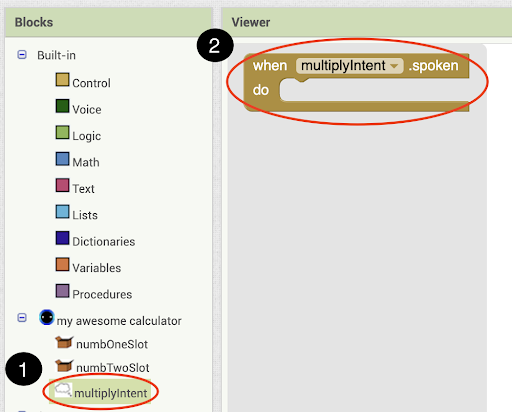{:.enlargeImage}

 

Next, open the <strong>Voice</strong> drawer and drag out the <strong>say</strong> block into the <strong>when multiplyIntent .spoken</strong> block. 

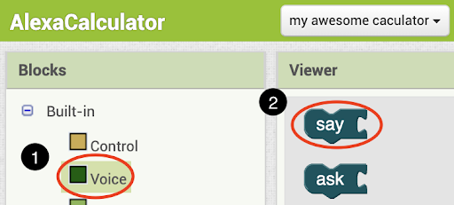{:.enlargeImage}

 

Next, open the <strong>Text</strong> drawer and drag out a <strong>join</strong> block. Attach it to your <strong>say</strong> block. 

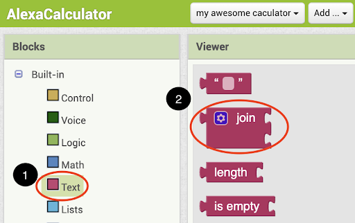{:.enlargeImage}
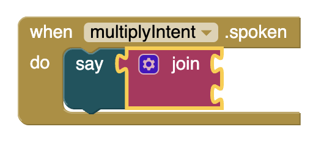{:.enlargeImage}

 

Click on the <strong>blue gear</strong> on the <strong>join</strong> block, In the resulting popup, drag 3 <strong>string</strong> blocks in under the existing 2 string blocks in the join block.

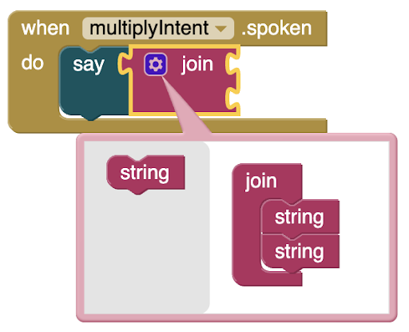{:.enlargeImage}
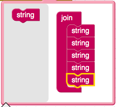{:.enlargeImage}

 

Open the <strong>numbOneIntent</strong> drawer and drag out the <strong>numbOneIntent.value</strong> block into the first spot in the <strong>join</strong> block. 

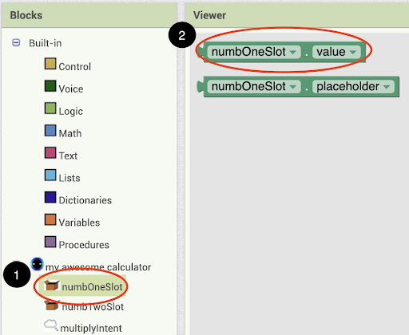{:.enlargeImage}

 

Next, open the Text drawer and drag out an empty text block into the second spot of the join block. Type into this text block “ times ”. Be sure not to forget the spaces on either side!

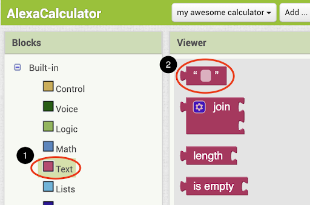{:.enlargeImage}
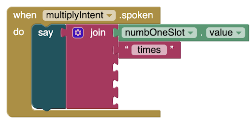{:.enlargeImage}

 

Now, open the <strong>numbTwoSlot</strong> drawer and drag out the <strong>numbTwoSlot.value</strong> block into the third spot in the <strong>join</strong> block.

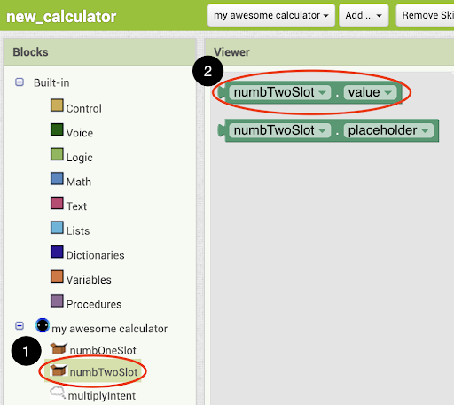{:.enlargeImage}

 

Add another <strong>text</strong> block to the fourth spot in the <strong>join</strong> block, and enter the text “ is definitely equal to ”. Make sure you include the spaces! We want to include the “definitely” to differentiate from Alexa’s builtin voice calculator so that we’re sure that we invoked our own Skill once we start testing. Your blocks should now look like this:

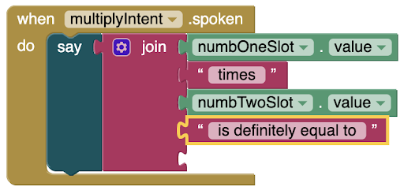{:.enlargeImage}

 

Finally, we want to do the calculation! Open the <strong>Math</strong> drawer and drag out the <strong>multiplication</strong> block into the last spot in the <strong>join</strong> block. 

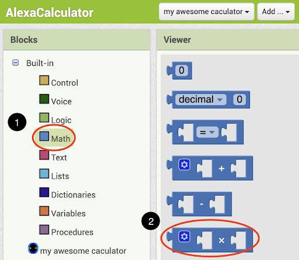{:.enlargeImage}
{:.enlargeImage}

 

Finally, right click on the <strong>numbOneSlot.value</strong> block in the first spot of the join block and select <strong>duplicate</strong>. Drop it into the first spot of the <strong>multiplication</strong> block. Repeat the same process with the <strong>numbTwoSlot.value</strong> block and drop it into the second spot of the <strong>multiplication</strong> block. 

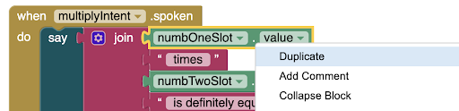{:.enlargeImage}

Your blocks should now look like this:

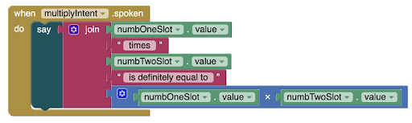{:.enlargeImage}

 

We have now completed the endpoint function for our multiplyIntent! If you added any more of your own intents in the Designer page earlier, feel free to follow a similar process to make endpoint functions for all your own intents.

Our new Calculator Skill is now finished! Let’s send it to Amazon and test it out.

## Send Your Skill to Amazon

At the bottom of the gray <strong>Testing</strong> box, there should be a button labeled <strong>Login to Amazon</strong>. Click that button and enter your Amazon Developer Account information into the external pop-up. 

**If this window does not appear, check if your browser has blocked a pop up and allow the pop-up.*

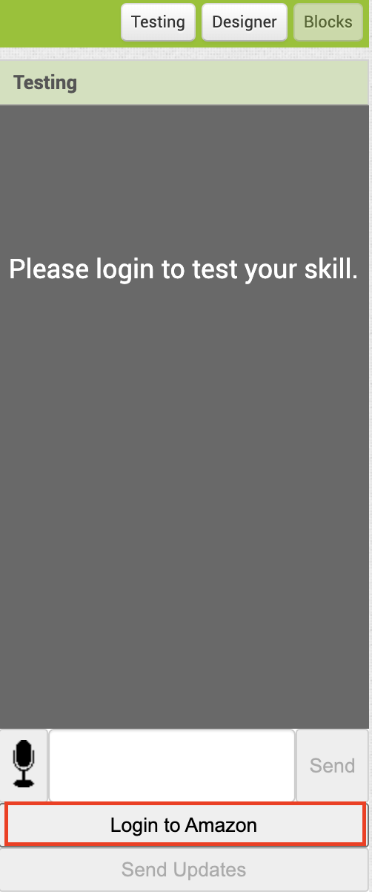{:.enlargeImage}
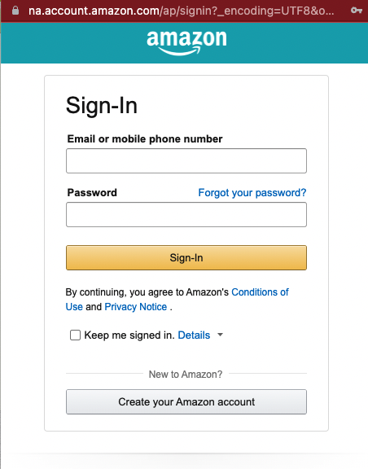{:.enlargeImage}

 

Once you’ve signed in, you should see the <strong>Send Updates </strong> become enabled. If it doesn’t, try refreshing the page and logging in on this Skill again. Click the Send Updates button to send your Skill to Alexa. 

After a while, you should get a pop-up at the top of your browser that says “Skill updated successfully on Amazon”. 

{:.enlargeImage}

 

## Test Your Project

Once your Skill finished building (this will usually take a minute or two), the Testing box should turn white and the textbox at the bottom should be enabled. Type “alexa ask my awesome calculator what is three times five” (or any other two numbers you want to multiply) and see how she responds! It should look something like this. 

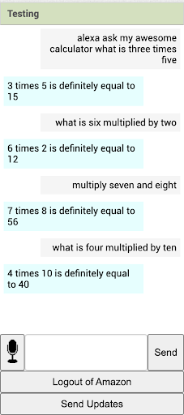{:.enlargeImage}

 

You can also try testing through speech by clicking on the “mic” button to start talking, and clicking on it again when you’re done talking! 

Note: If you are interested in testing in other ways, feel free to explore this [document](../images/my_calculator/testing.pdf)!

## Finish!

Congratulations! You’ve finished programming the <strong>My Calculator tutorial</strong> and learned about using <strong>slots</strong>! 

# Expand Your App

Here are some ideas for ways to enhance your app!

* Our app currently only has one intent - multiplying two numbers. Try adding more intents that instruct Alexa to add, subtract, and divide two numbers for a basic calculator.

* Our app allows multiplication of two numbers. Try altering the app to allow for the multiplication of more numbers. How can Alexa help us multiply three numbers? Or even four or five?

# About Youth Mobile Power
A lot of us spend all day on our phones, hooked on our favorite apps. We keep typing and swiping, even when we know the risks phones can pose to our attention, privacy, and even our safety.  But the computers in our pockets also create untapped opportunities for young people to learn, connect and transform our communities.

That’s why MIT and YR Media teamed up to launch the Youth Mobile Power series. YR teens produce stories highlighting how young people use their phones in surprising and powerful ways. Meanwhile, the team at MIT is continually enhancing MIT App Inventor to make it possible for users like you to create apps like the ones featured in YR’s reporting.

Essentially: Get inspired by the story, get busy making your own app!
 

 The YR + MIT collaboration is supported in part by the National Science Foundation. This material is based upon work supported by the National Science Foundation under Grant No. (1906895, 1906636). Any opinions, findings and conclusions or recommendations expressed in this material are those of the author(s) and do not necessarily reflect the views of the National Science Foundation.

 Check out more apps and interactive news content created by YR <a href="https://yr.media/category/interactive/" target="_blank">here</a>.

 

