# Challenge

Make Your Own Amazon Alexa Skill!

Have you tried programming Alexa skills? Tried programming App Inventor? Both can be powerful coding environments alone — but together they allow you to combine conversational AI with other types of AI and programming components. To get a taste of this combo, try the tutorial below! 

# Setup

1. If you have not done so, please complete the following prior to this tutorial to set up all the needed accounts, and Amazon devices if applicable: [App Inventor Setup Tutorial](../images/alexa_hello_world/setup.pdf)

2. Once that's done, you can move onto the tutorial!

Please note: If your instructor gave you access to an anonymous Alexa account then you can skip this section on how to set up an Alexa Developer Account.

# Alexa Messenger Tutorial

## Overview

Up to this point you have only seen App Inventor Alexa tutorials where App Inventor was only used to provide an easy block-based language environment to develop Alexa Skills.  These may have given the wrong impression that Alexa does not really integrate with many of the native mobile app developing features of App Inventor.  The purpose of this tutorial is to show how you can develop a mobile app with App Inventor that is fully integrated with Alexa’s conversational AI capabilities.

The app you will develop will be a messenger app where a user can write or speak a message they wish to their mobile device which will then be sent to the cloud and from where another user elsewhere can retrieve the message and hear it through an Alexa device.

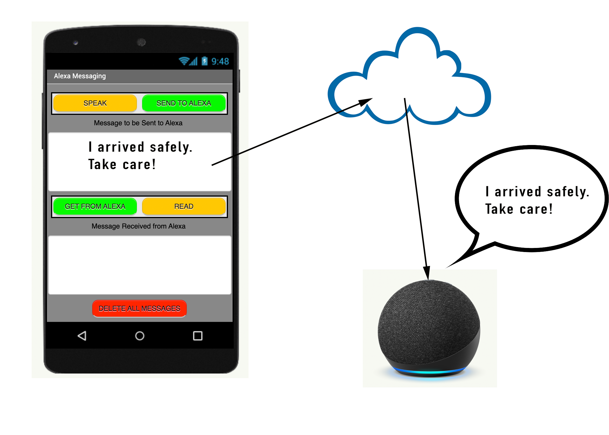{:.enlargeImage}
    

The messenger app will alternatively have a user ask Alexa to forward a message, which again will then be sent to the cloud and from where a user elsewhere can retrieve it using their mobile app.

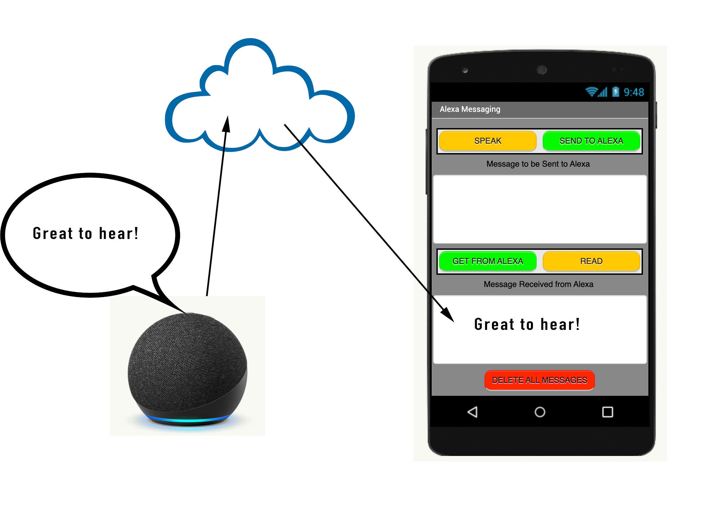{:.enlargeImage}
    

1. In the Designer Toolbar at the top of the screen, you will see a dropdown button labeled <strong>“Add…”</strong>. Press it, and within it, select the <strong>“Skill”</strong> button.

    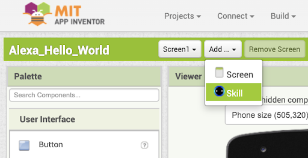{:.enlargeImage}
    

2. Enter the skill's <strong>Invocation name</strong>. For this demonstration, we will name it "hello world greeter". 

    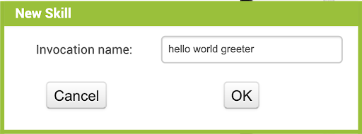{:.enlargeImage}
    

<hint markdown="block" title="What is an Invocation Name?">
Just like how every mobile app needs to have a name, so does our custom Alexa Skill. An <strong>Invocation Name</strong> is just the name of the Skill that we are making, and is used to “invoke”, or call our skill. The structure of any command you will tell Alexa is:

 “Alexa, ask  (Invocation name)  to  ...” 

The invocation name will help Alexa know which skill it needs to use, so make sure that every skill you make has a unique name. For our example, the Invocation name of a custom skill is “hello world greeter”

 “Alexa, ask  hello world greeter  to  do something” 

<strong>Note</strong>: The invocation name needs to be at least two (2) words long, but avoid making it a full sentence, since you will be saying the name a lot.
</hint>

## Logging in to your Amazon Account
1. You will now be taken to a new Designer Page for the Conversational AI Interface. On the rightmost part of the screen, there should be a “Testing” box. Click the <strong>“Login to Amazon”</strong> button and enter your Amazon Developer Account information into the external pop-up*.
    
    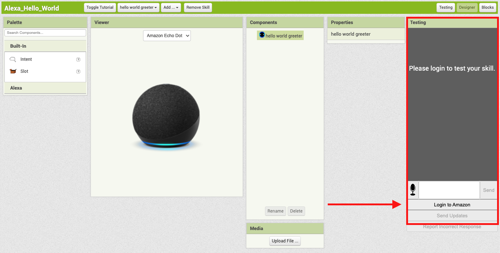{:.enlargeImage}
    {:.enlargeImage}
    

2. Your testing box should now look like the following after signing in successfully:

    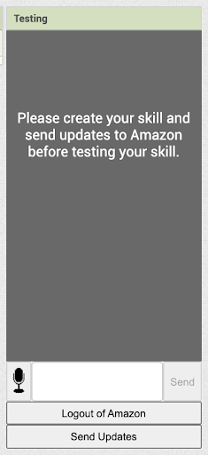{:.enlargeImage}
    

**If this window does not appear, check if your browser has blocked a pop up and allow the pop-up.*

## Defining a Custom Intent

Now we need to add a custom <strong>Intent</strong> to our app.

<hint markdown="block" title="What is an Intent?">
You can think of an **Intent** as a “command” that you want to teach Alexa to listen to. It could be a Stop Intent, a HelloWorld Intent, or any intent you can really think of that you will need in a skill. 
</hint>

1. Let’s teach our app to listen for the “HelloWorldIntent” intent. To make this intent, from the leftmost box on the screen, drag the “Intent” button to the Amazon device on the screen.

    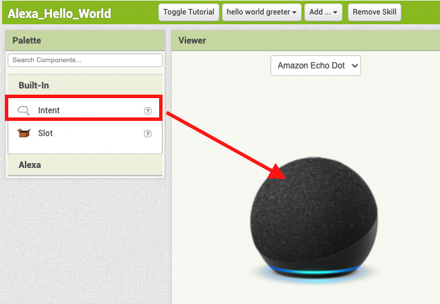{:.enlargeImage}
    

2. In the components box, select IntentA and rename the intent to “HelloWorldIntent”. Press <strong>“OK”</strong> after renaming.

    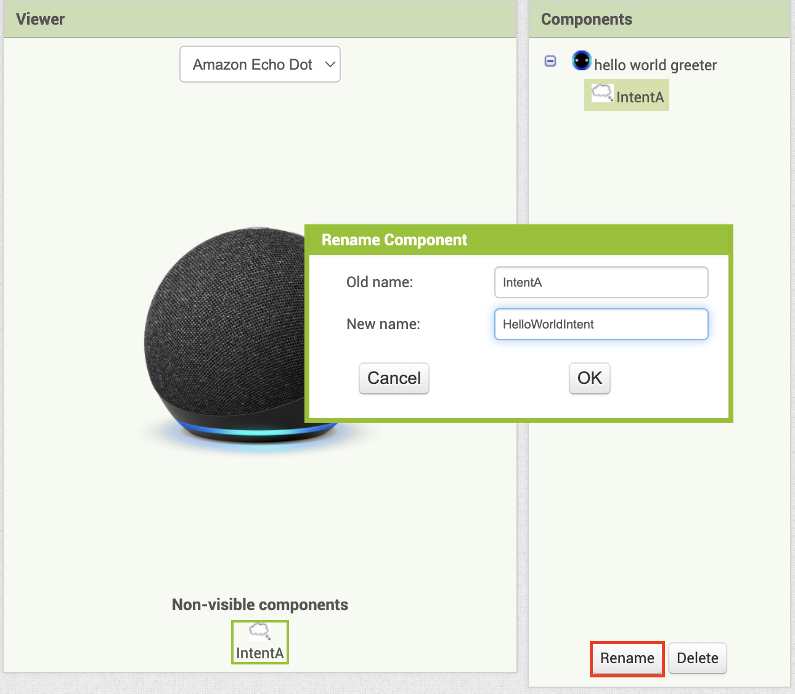{:.enlargeImage}
    

The current screen should look something like this:

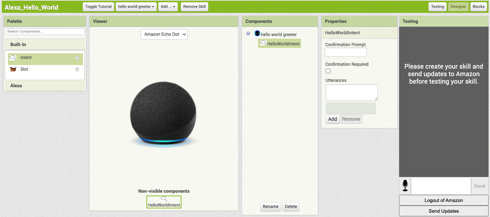{:.enlargeImage}

## Adding a List of Utterances

After creating an intent, we need to give the intent a list of <strong>utterances</strong>.

<hint markdown="block" title="What are Utterances?">
When talking to Alexa, there might be a lot of ways to say something to trigger an intent. Each of these phrases that all mean the same thing is called an <strong>utterance</strong>. 

 Let’s say your parent wants you to do the dishes. They might say one of the following:
 
- “Clean the dishes.” 
- “Do the dishes.” 
- “Wash the dirty plates.” 

All these sentences have the same <em>intent</em>: you need to do the dishes.

</hint>

1. Select the "HelloWorldIntent" intent.

2. In the “Properties” box, there should be an utterance text box at the bottom. Write in the utterance, “say hi”, and press <strong>“Add”</strong> after.

    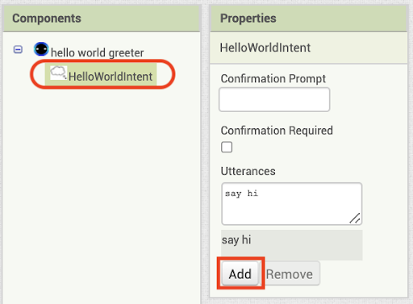{:.enlargeImage}
    

3. Add in more utterances like “say hello”, and “say hello world” following the same step 2. Be sure to add utterances in one at a time by pressing <strong>“Add”</strong> after each one!

    *IMPORTANT:* Make sure your utterances follow the rules below or your skills will not work properly:

    - Must be all lowercase letters (ex. say hello, NOT Say Hello)
    - At least two words (ex. say hello, NOT sayhello)
    - Starts with a letter (ex. say hello, NOT ‘’say hello)
    - Punctuations can only be spaces, apostrophes, or periods (ex. codi’ bee, NOT ^codi bee)
    - No period at the end of your utterance (ex. say hello, NOT say hello.)

4. After inputting your utterances, there may be an empty utterance created. Remove it by selecting it then pressing the <strong>“Remove”</strong> button.

    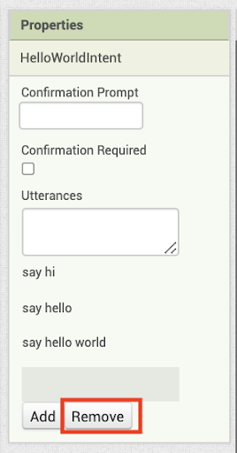{:.enlargeImage} 
    

    Your properties box should look like the following:

    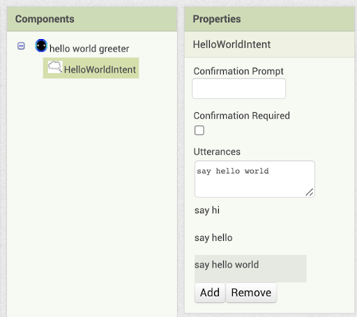{:.enlargeImage} 
    

## Defining the First Intent Handler

Now we will tell Alexa what to say after it detects the intent.

1. Move to the Blocks section located above the “Testing” Box.

    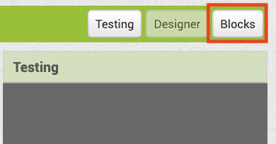{:.enlargeImage}
    

2. On the leftmost part of the screen, there’s now a “Blocks” box. Within it, select the “HelloWorldIntent” intent. A drawer should open with yellow and green blocks. Drag the <strong>HelloWorldIntent.spoken</strong> block out.
 
    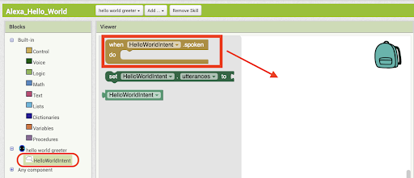{:.enlargeImage} 
    

3. Next, select the Voice drawer (2nd button in the Blocks section), and drag out the <strong>say</strong> block from the top. Connect it within the <strong>HelloWorldIntent.spoken</strong> block. 
    
    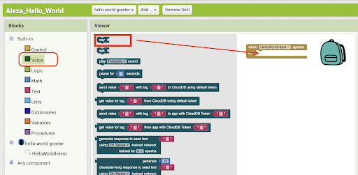{:.enlargeImage}
    

4. Select the Text drawer (5th button in the Blocks section) and drag out the empty <strong>“ ”</strong> block from the top. Connect it to the <strong>say</strong> block.

    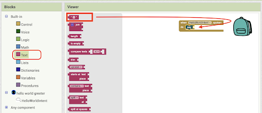{:.enlargeImage}
    

 

5. Within the empty quotation block, type “hello world”. 

    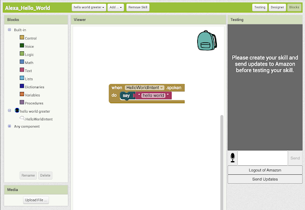{:.enlargeImage}
    

## Sending Your Skill to Amazon

Now, we need to send this <strong>skill</strong> to Amazon.

1. At the rightmost part of the screen, there is the “Testing” box. Within it, there is a button labeled <strong>“Send Updates”</strong>. Click this button.

    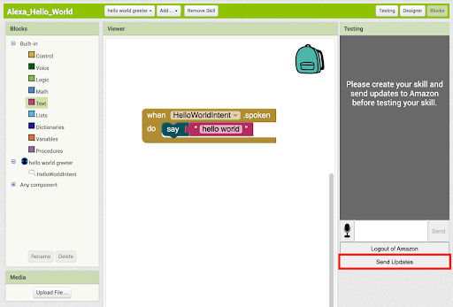{:.enlargeImage} 
    

2. The gray part of the “Testing” box should change text when loading. Wait a few minutes until the gray part turns white.

Your current screen should look like the following:

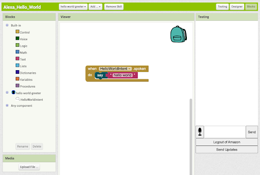{:.enlargeImage} 

## Testing your Skill

Now it’s time to test our Alexa skill! If you have an Alexa-enabled device handy and [set up](../images/alexa_hello_world/setup.pdf), say *“Alexa, open hello world greeter”,* and then *“Alexa, tell hello world greeter to say hello.”* to it and hear the response, which should be “hello world”, as we programmed it.

If you don’t have an Alexa-enabled device on hand, App Inventor allows you to simulate an Alexa using your custom Alexa skill right in your browser! Simply type in the textbox at the bottom, *“Alexa, ask hello world greeter to say hi.”* The response should be what we plugged into the <strong>say</strong> block earlier, *“hello world.”*

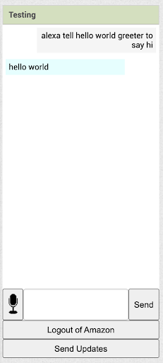{:.enlargeImage} 

Note: If you are interested in testing in other ways, feel free to explore this [document](../images/alexa_hello_world/testing.pdf)!

## Finish!

Congratulations! You’ve made your first custom Alexa Skill! Feel free to extend this app by adding new intents and new ways for Alexa to respond to each intent.

# Expand Your App

Here are some ideas for ways to enhance your app!

* Our Alexa app currently only has one intent- saying "hello world." Try adding more intents that instruct Alexa to say different things. For example, you can add an intent for Alexa to say "good bye."

* Have Alexa learn the name of the user from an input user sentence like "my name is Sebastian" and respond "It is my pleasure to meet you Sebastian." 
    <hint markdown="block" title="Hint">
    Hint: you will need to learn about Slots.
    </hint>

# About Youth Mobile Power
A lot of us spend all day on our phones, hooked on our favorite apps. We keep typing and swiping, even when we know the risks phones can pose to our attention, privacy, and even our safety.  But the computers in our pockets also create untapped opportunities for young people to learn, connect and transform our communities.

That’s why MIT and YR Media teamed up to launch the Youth Mobile Power series. YR teens produce stories highlighting how young people use their phones in surprising and powerful ways. Meanwhile, the team at MIT is continually enhancing MIT App Inventor to make it possible for users like you to create apps like the ones featured in YR’s reporting.

Essentially: Get inspired by the story, get busy making your own app!
 

 The YR + MIT collaboration is supported in part by the National Science Foundation. This material is based upon work supported by the National Science Foundation under Grant No. (1906895, 1906636). Any opinions, findings and conclusions or recommendations expressed in this material are those of the author(s) and do not necessarily reflect the views of the National Science Foundation.

 Check out more apps and interactive news content created by YR <a href="https://yr.media/category/interactive/" target="_blank">here</a>.

