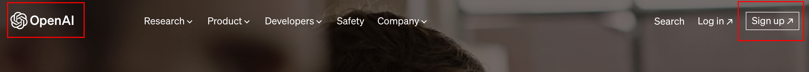
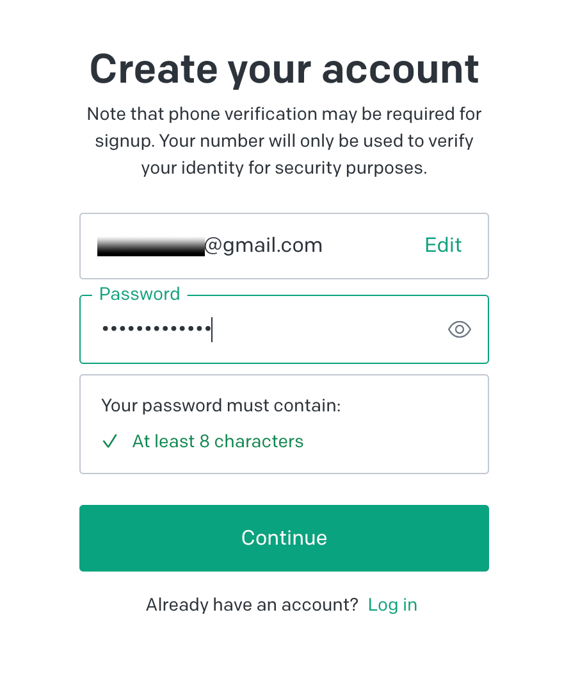
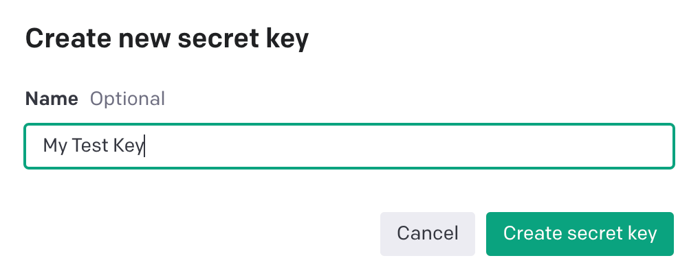
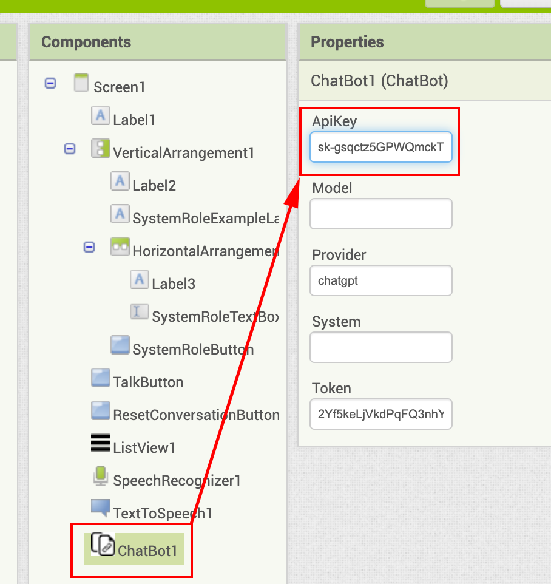
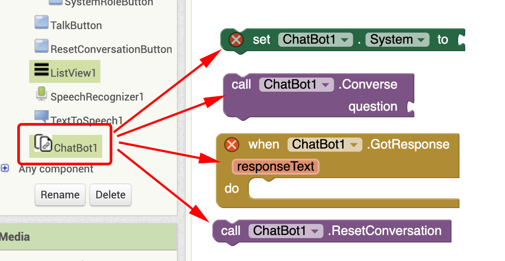
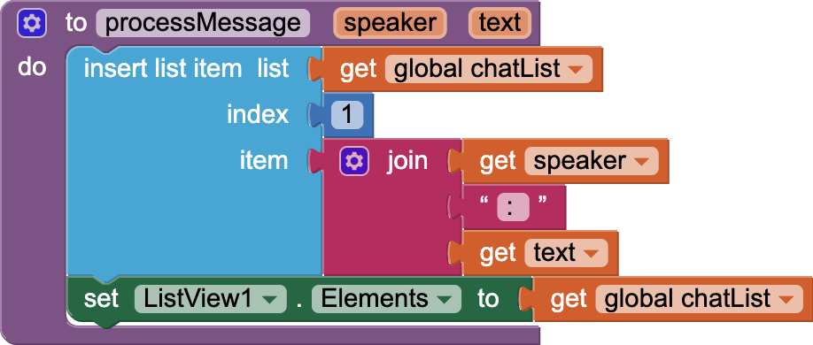
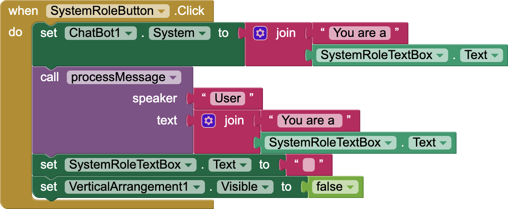
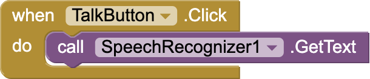
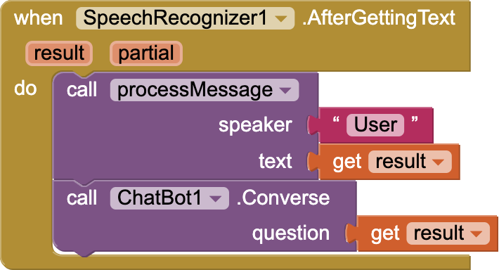
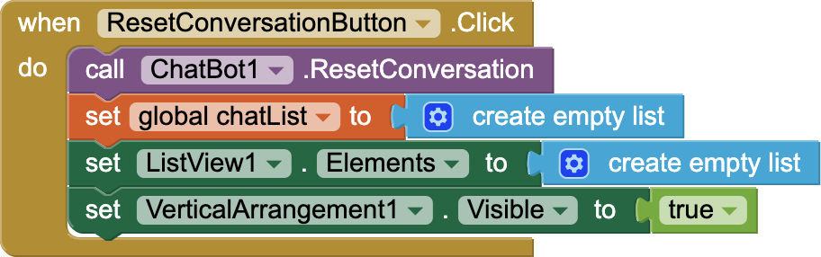

# Challenge

MIT App Inventor ChatGPT Tutorial: 
Capturing the world’s wisdom at your fingertips

Have you ever wondered how it is possible to create your very own ChatGPT app that will allow you, wherever you are, to tap into a world of useful information?  In this tutorial, you will build a simple app with MIT App Inventor that allows users to connect to ChatGPT, ask questions, and have a conversation.

{:.enlargeImage}

# Setup

## Getting your own OpenAI API Key

For this project you will need to get your own OpenAI API key to use MIT App Inventor’s ChatBot component.  As of the writing of this tutorial, OpenAI allows users 13 years old and older to create their own OpenAI accounts and generate their own OpenAI API keys.  For the first 3 months you are given a $5 free credit which should get you quite a bit of exploration time.  After 3 months any unused portion of the free credit expires.  Once your free credit is gone you will need to be a paying customer and will need a credit card to use OpenAI.   

Follow the steps below to create you OpenAI account and get your OpenAI API key.

1. Go to <a href="https://openai.com/" target="_blank">https://openai.com/ </a>
    
2. Click on the Sign up button on  the upper right

    {:.enlargeImage}
    

3. Create your account by entering your email and choosing a password.  You can also sign up using your Google, Microsoft and Apple accounts.

    {:.enlargeImage}
    

    {:.enlargeImage}
    

4. You will need to verify your e-mail and phone number during the signup process.

5. To get your personal OpenAI API  key go to <a href="https://platform.openai.com/account/api-keys" target="_blank">https://platform.openai.com/account/api-keys </a>
 
6. Click on the  API keys tab and the Create new secret key button.

    {:.enlargeImage}
    

7. Give your key a name if you wish.  This step is optional.

    {:.enlargeImage}
    

8. Copy and save your API key somewhere safe.  You will need it while doing the project.

## Updating AI2 Companion

If you have not done so, please upgrade your AI2 Companion to version 2.67 or higher.

# ChatGPT Tutorial

## Overview

In this tutorial, you will build a simple app with MIT App Inventor that allows users to connect to ChatGPT, ask questions, and have a conversation.

The app will allow users to define a System Role first so that ChatGPT will respond according to the role assigned to it. For example, if the user defines the System Role as:

 <em><strong>“You are a kindergarten teacher explaining everything at the level of 4 year old children”</strong></em>

and then asks ChatGPT to “explain the Big Bang Theory,” the response will be matched to the understanding of a 4 year old.

{:.enlargeImage}

{:.enlargeImage}

## The Graphical User Interface (GUI)

In this project you are given a GUI that is almost completed.

{:.enlargeImage}

What do you think is the function of each component? Many of the components may be self-explanatory. However, <strong>ListView</strong> is where you will display the user’s conversation with ChatGPT.

Drag and drop a <strong>SpeechRecognizer</strong> component and then a <strong>TextToSpeech</strong> component from the <strong>Media</strong> drawer.

{:.enlargeImage}

{:.enlargeImage}

Then, from the <strong>Experimental</strong> drawer drag and drop a <strong>ChatBot</strong> component.

{:.enlargeImage}

Your Viewer and Components panel now should look like this with three non-visible components added.

{:.enlargeImage}

## Adding your OpenAI API Key

Now you are ready to copy paste your OpenAI API key you generated during the Setup phase into the <strong>ChatBot</strong> property <em>ApiKey</em>. Your key will be different than what you partially see below

{:.enlargeImage}

## Coding the GUI functionality (1)

Click on the Blocks button to go to the Blocks editor.

{:.enlargeImage}

You will accomplish all the details of this ChatBot app with only 4 essential blocks of the <strong>ChatBot</strong> component.  So first pull these blocks and have them ready for deployment.  Can you guess what each block does?

{:.enlargeImage}

Now you are ready to start.  Initialize a global variable <em><strong>chatList</strong></em> to an empty list. This is the variable that will hold the messages of the chat as list entries.

{:.enlargeImage}

## Coding the GUI functionality (2)

Recall that when you use a chunk of code many times throughout your program it is best to “factor it out” — that is, define it as a procedure so you can simplify your code and make it more maintainable (i.e., if you need to edit something due to an error for example, you can fix it in one place instead of all over your program)

Create a procedure <em><strong>processMessage</strong></em> which takes two inputs: <em>speaker</em> and <em>text</em>.
The speaker will either be “AI” or “User” for a given instance of the conversation and the text will be the text of a given message. The procedure will form text that looks like

<em><strong>User</strong>: explain the Big Bang Theory</em>
 
by joining the speaker (“User”) to the text (“explain Big Bang Theory”) with a ": " (colon-space) in between. This new text will be added to the <em><strong>chatList</strong></em> and then the procedure will update the <strong>ListView</strong> with the newly added text. Note that the <strong>ListView</strong> will display the chat between the user and the AI in <em>reverse</em> order so it is easier to read with the most recent conversation always at the very top.

{:.enlargeImage}

## Coding the GUI functionality (3)

When the <strong>SystemRoleButton</strong> is clicked, assign the <strong>ChatBot</strong>’s <em>System</em> property to the role designated by the user in the <strong>SystemRoleTextBox</strong>. The first entry in the <em><strong>chatList</strong></em> should be an indication of the assigned system role. For example:

<em><strong>User</strong>: You are a kindergarten teacher explaining everything at the level of 4 year old children</em>

Once the system role has been assigned, clear the <strong>SystemRoleTextBox</strong> of any text and make invisible the <strong>VerticalArrangement</strong> that holds all the system role assignment components.

Note: Don't forget to include a space after "You are a" in the two join blocks.

{:.enlargeImage}

## Coding the GUI functionality (4)

When the user presses the <strong>TalkButton</strong>, the <strong>SpeechRecognizer</strong> should capture the user’s speech and send it to Google for analysis:

{:.enlargeImage}

When the text of the speech is received from Google, the app will create the next line in the chat. For example:

<em><strong>User</strong>: explain the Big Bang Theory</em>

Also include code to send this text to ChatGPT as a question:

{:.enlargeImage}

## Coding the GUI functionality (5)

When ChatGPT returns with a response, a new message should be added to the <strong>ListView</strong>, like:

<em><strong>AI</strong> : The Big Bang Theory is like a really big explosion that happened a really long time ago…</em>

And make the <strong>TextToSpeech</strong> component read this response out loud. 

{:.enlargeImage}

## Coding the GUI functionality (6)

Finally, when the user clicks <strong>ResetConversationButton</strong>, reset the conversation, set the variable <em><strong>chatList</strong></em> to an empty list, clear the <strong>ListView</strong>, and make visible the <strong>VerticalArrangement</strong> that hosts system role assigning components.

{:.enlargeImage}

## Testing the app

Now test your app by scanning the QR Code generated via your AI2 Companion.  Give the system an interesting role and ask ChatGPT some questions.  For example:

<em><strong>User</strong>: You are a Shakespearean actor who answers every question in limerick</em>

<em><strong>User</strong>: Explain why the chicken crossed the road </em>

<!--Please note that unless you use your own OpenAI API key, the number of questions you can ask ChatGPT is limited.  This limit is approximately 10,000 tokens at the time of the writing of this tutorial, where a token is roughly a word, which includes ChatGPT's responses to you.-->

Congratulations! You just created a powerful app that will allow you to chat with ChatGPT at the touch of a button and access a reservoir of knowledge and wisdom. 

<strong>Disclaimer</strong>: Always use common sense when evaluating ChatGPT’s responses and be aware that, like any computer system, ChatGPT may fail.

# Expand Your App

* Do some research on and/or ask ChatGPT how Large Language Models (LLM) like it are trained and how they operate.

* How can you use the chatGPT app to act as a non-directive therapist and guide you in your mental-health-related questions?  You may also enjoy revisiting the classical (pre- Machine Learning) AI project <a  href="http://appinventor.mit.edu/explore/resources/ai/therapist-bot" target="_blank">Therapist Bot</a> based on the <a  href="https://en.wikipedia.org/wiki/ELIZA" target="_blank">Eliza</a>  project from the 1960’s.

* How can you use the app to collaborate with you in creating some bars for a rap song or lines of poetry?

* Can ChatGPT give you information about current events? Are there topics ChatGPT is <em>not</em> programmed to chat about? Are there times when ChatGPT clearly gives you false information? What examples can you find that point to the limitations of ChatGPT? Explore other limitations and failings of ChatGPT.

* ChatBot component allows you to access chatbot API’s other than the default ChatGPT API via the <em>Provider</em> property.  An example would be Google's PaLM. Explore these other options.

* Explore the new <strong>ImageBot</strong> component which uses generative AI of DALL-E to create fascinating visuals.

* What other cool ideas do you have?

# About Youth Mobile Power
A lot of us spend all day on our phones, hooked on our favorite apps. We keep typing and swiping, even when we know the risks phones can pose to our attention, privacy, and even our safety.  But the computers in our pockets also create untapped opportunities for young people to learn, connect and transform our communities.

That’s why MIT and YR Media teamed up to launch the Youth Mobile Power series. YR teens produce stories highlighting how young people use their phones in surprising and powerful ways. Meanwhile, the team at MIT is continually enhancing MIT App Inventor to make it possible for users like you to create apps like the ones featured in YR’s reporting.

Essentially: Get inspired by the story, get busy making your own app!
 

 The YR + MIT collaboration is supported in part by the National Science Foundation. This material is based upon work supported by the National Science Foundation under Grant No. (1906895, 1906636). Any opinions, findings and conclusions or recommendations expressed in this material are those of the author(s) and do not necessarily reflect the views of the National Science Foundation.

 Check out more apps and interactive news content created by YR <a href="https://yr.media/category/interactive/" target="_blank">here</a>.

