# Challenge

The Chicken Bowling App allows users to go bowling with bowling pins or chickens as pins in augmented reality. This app tutorial is designed to help users become comfortable with MIT App Inventor's augmented reality feature.

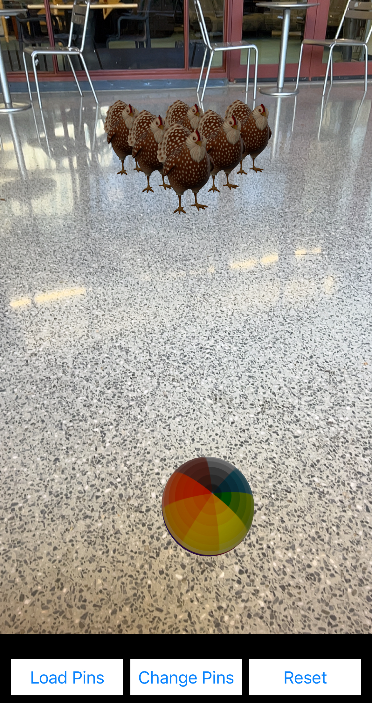{:.enlargeImage}

# Setup

## Getting Started

If you need help getting started and set up with App Inventor please visit our <a href="https://appinventor.mit.edu/explore/ai2/setup" target="_blank">Setting Up App Inventor</a> page.

## Using the Neo Interface

For this tutorial, we will be using the App Inventor Neo Interface, which has a more modern look.

To switch to Neo Interface, go to your Projects space. On the top bar, click on "Settings", and select "User Interface Settings".

{:.enlargeImage}

Click on the "Neo" Interface, then click "OK".

{:.enlargeImage}

## Updating AI2 Companion

If you have not done so, please upgrade your AI2 Companion to version 2.69 or higher.

# Chicken Bowling Tutorial (Level: Beginner)

## User Interface

Take some time to look over the components in the User Interface of the app. Some key features in the User Interface include:

* <strong> ARView3D1 </strong>
    * The <strong> ARView3D </strong> component displays the live camera feed once tracking has started. This is where the user will see and experience the augmented reality. The origin of the world, or the (0, 0, 0) coordinate, is placed where the phone is when tracking is first started.

* <strong> SphereNode </strong>
    * The <strong> SphereNode </strong> component displays a 3D sphere in <strong> ARView3D </strong> that can roll and bounce.

* <strong> ModelNode </strong>
    * The <strong> ModelNode </strong> component displays a 3D model in <strong> ARView3D </strong>. Users can upload their own 3D models. In the Chicken Bowling app, users will utilize a bowling pin model and a chicken model.

*  <strong> LoadPinsButton </strong>
    * The <strong> LoadPinsButton </strong>  places the pins in <strong> ARView3D </strong>.

*  <strong> ChangePinsButton </strong>
    * The <strong> ChangePinsButton </strong> toggles between the bowling pins 3D model and the chicken 3D model.

* <strong> ResetButton </strong>
    * The <strong> ResetButton </strong> clears all <strong> SphereNodes </strong> and all <strong> ModelNodes </strong> from the screen to reset the game.

In the top right corner, switch to the Blocks screen.

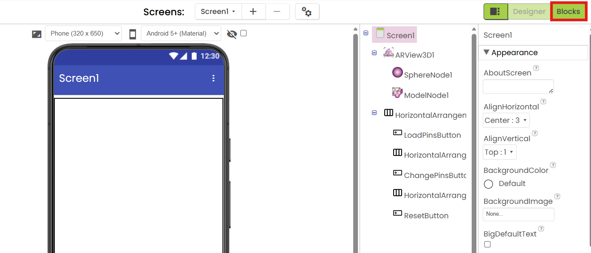{:.enlargeImage}

## Coding Screen Initialization

On the Blocks screen, you will see a lot of code! The good news is that you don't need to understand most of these blocks to play Chicken Bowling. However, we will take the time to walk you through what each block does so that you can better understand the code that makes the game work. Let's start with the coding that you will do.

On the left hand side of your screen, you will see the drawers of the blocks you will use to code your app. The rest of the screen is your workspace. There are already some blocks here that provide functionality for the app.

Under Screen1, select the "when Screen1.Initialize" block and drag and drop it into your workspace.

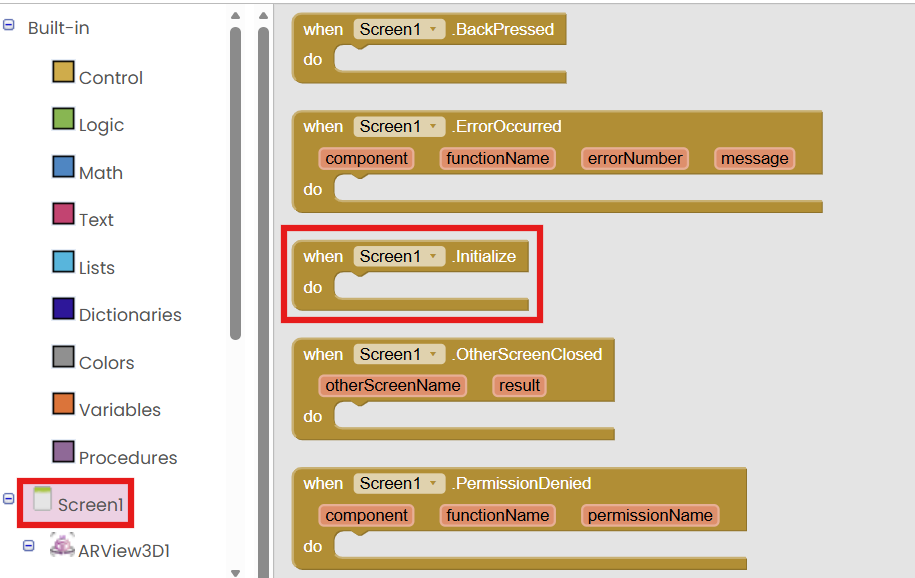{:.enlargeImage}

Under ARView3D1, drag and drop the "call ARView3D1.StartTracking" block into the "when Screen1.Initialize" block.

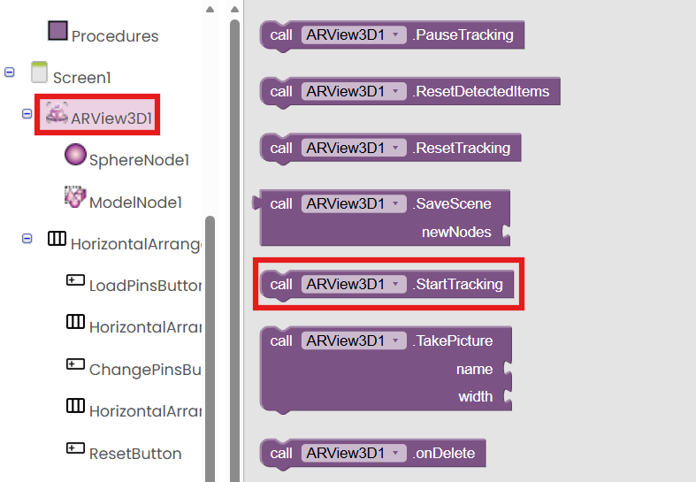{:.enlargeImage}

Under ARView3D1, drag and drop the "set ARView3D1.Visible to" block into the "when Screen1.Initialize" block.

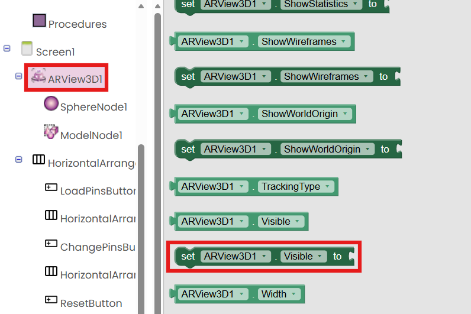{:.enlargeImage}

Under Logic, drag and drop a "true" block into the "set ARView3D1.Visible to" socket.

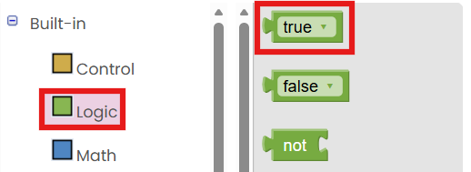{:.enlargeImage}

Your completed code block should look like this.

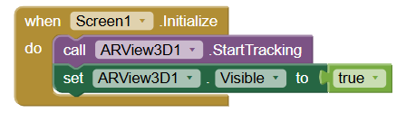{:.enlargeImage}

## Explaining the Other Code

These blocks initialize global variables that are accessible throughout the entire app.

* height_y stores the y value for where the pins will initialize at.

* pin_scale stores the value that a ModelNode will be scaled by.

* pin_type stores the 3D model that will be displayed for the pins.

* selectedNode creates an empty list to store a selected node in.

* arNodes creates an empty list to store all nodes in.

* camera_coordinates creates an empty dictionary to hold the (x,y,z) coordinates of where the camera looks when getCameraLook is called.

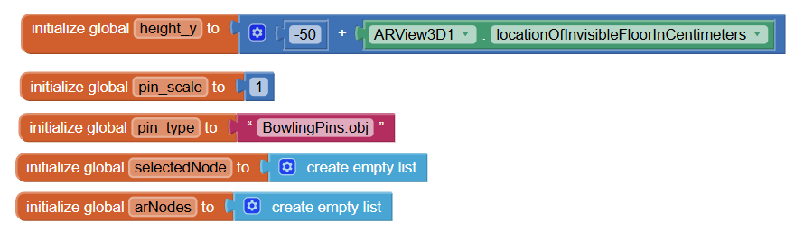

This block places a SphereNode (ball) for the user to play with at the coordinates (x, height_y, -100) when the user taps in the ARView3D. Additionally, it changes other elements of the SphereNode, including enabling physics, which allows for collisions.

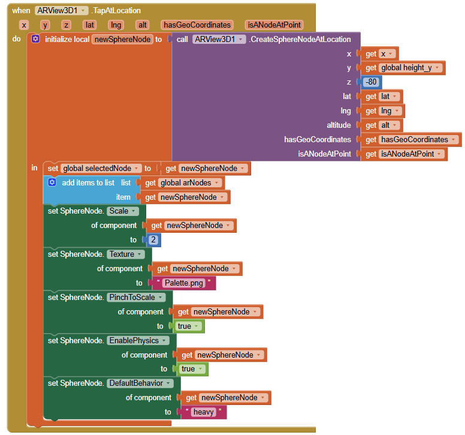

This block changes the global variable pin_type from BowlingPins.obj to Halva_the_Chicken.usdz and back. It also changes the value of the global variable pin_scale so that the ModelNode is scaled properly. These changes occur when the <strong> ChangePinButton </strong> is clicked.

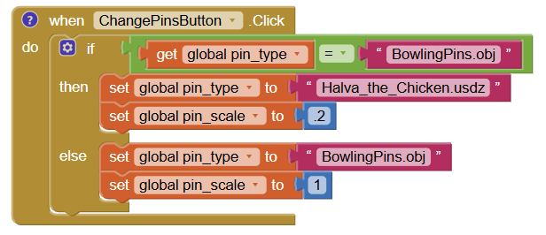

This block calls the procedure "set_pins", which places the pins for the user to play with when the <strong> LoadPinsButton </strong> is clicked. The set_pins procedure places all of the pins at a given location in the (x, y, z) plane.

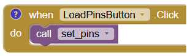

This block gets rid of all <strong> ModelNodes </strong> and <strong> SphereNodes </strong> from <strong> ARView3D1 </strong> when the <strong> ResetButton </strong> is clicked.

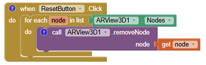

## Congratulations! And Testing Your App

You now have completed your Chicken Bowling App and it is time to test it out! Make sure you have the App Inventor app downloaded on your mobile device. To connect your mobile device, click the "Connect" button in the top center, then select "AI Companion".

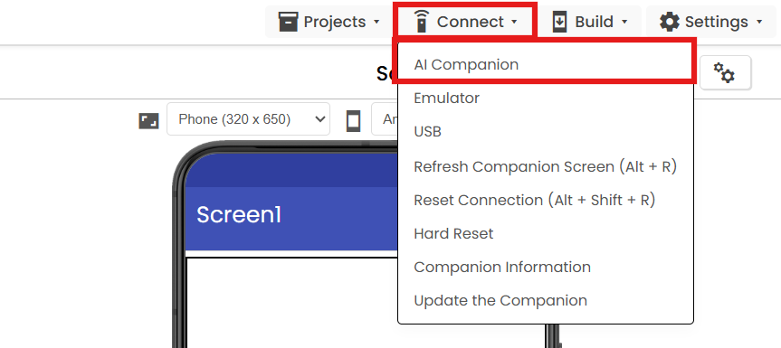{:.enlargeImage}

A QR code should appear on your screen. Open the App Inventor app on your mobile device and click "scan QR code". Your app should appear on your mobile device. Time to use your app!

# Expand Your App

Here are some ideas of how you can expand your app:

* Experiment with different scalings of the ball, pins, and chickens.
* Download the Scaniverse app on your device and use it to create your own personal 3D models which you can upload into App Inventor.
* Add a scoring tool that tracks how many points a user earns.
