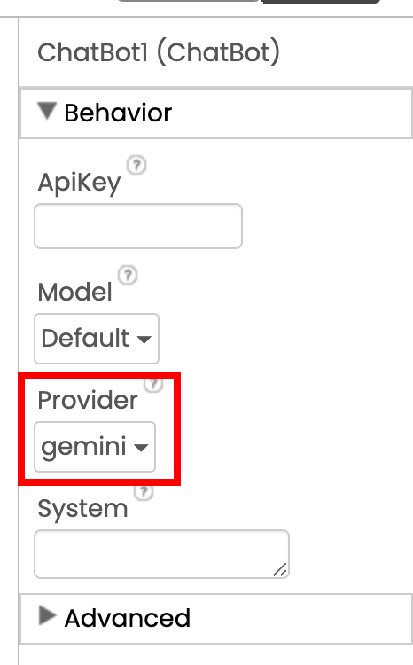

# Challenge

Wisdom of the Ages: Historical Character Advisor App

{:.enlargeImage}
Imagine that you could access all these great teachers from history and benefit from their life experiences and wisdom  with the touch of a phone on your finger tips.  Imagine that you could ask them any questions you wanted and get authentic answers.  What would you ask?  What would you want to know?  With GenAI this is now a possibility.  In this project you will build an app to realize such a dream.

# Setup

## Getting Started

If you need help getting started and set up with App Inventor please visit our <a href="https://appinventor.mit.edu/explore/ai2/setup" target="_blank">Setting Up App Inventor</a> page.

## New User Interface Neo

In this project we will be using the <em>new</em> App Inventor User Interface called "Neo".  To set this up, go to the Settings menu and select "User Interface Settings:
{:.enlargeImage}

When the following dialog comes up, select the "Neo" option:
{:.enlargeImage}

## Using Gemini or Getting your own OpenAI API Key

For this project, by default, you will be using Google's Gemini LLM to power your <strong>ChatBot</strong> component.  If you are happy with this choice, you can ignore the following comments.

{:.enlargeImage}

If, instead, you wish to use OpenAI's ChatGPT instead, you will need to get your own OpenAI API key to use the <strong>ChatBot</strong> component.  As of the writing of this tutorial, OpenAI allows users 13 years old and older to create their own OpenAI accounts and generate their own OpenAI API keys. For the first 3 months, you are given a $5 free credit which should get you quite a bit of exploration time. After 3 months, any unused portion of the credit expires. Once your free credit is gone, you will need to become a paying customer with a credit card.  Follow the steps below to create your OpenAI account and get your OpenAI API key.

Follow the steps below to create your OpenAI account and get your OpenAI API key.

1. Go to <a href="https://openai.com/" target="_blank">https://openai.com/ </a>
    
2. Click on the <strong>Login</strong> button on  the upper right, then click <strong>Sign up</strong> option.

    {:.enlargeImage}
    

3. Create your account by entering your email and choosing a password.  You can also sign up using your Google, Microsoft and Apple accounts.

    {:.enlargeImage}
    

4. You will need to verify your e-mail and phone number during the signup process.

5. To get your personal OpenAI API  key go to <a href="https://platform.openai.com/account/api-keys" target="_blank">https://platform.openai.com/account/api-keys </a>
 
6. Click on the  API keys tab and the Create new secret key button.

    {:.enlargeImage}
    

7. Give your key a name if you wish.  This step is optional.

    {:.enlargeImage}
    

8. Copy and save your API key somewhere safe on your computer.  You will need it while doing the project.

9. During the project, you will need to copy-paste your OpenAI API key in the <strong>ChatBot</strong> property <em>ApiKey</em>.

{:.enlargeImage}

## Updating AI2 Companion

If you have not done so, please upgrade your AI2 Companion to version 2.73 or higher.

# Historical Character Advisor App (Level: Intermediate)

## Introduction I

In 1985 Steve Jobs shared a vision for an AI tool that could capture the “underlying worldview” of a historical figure like Aristotle and answer students’ questions <strong><em>as</em></strong> that character. 

{:.enlargeImage}
<a href="https://youtu.be/iosUmVdobnM?si=qT2ZkHuMNys2vCFu" target="_blank">YouTube video.</a>

Amazingly, in just 40 years, generative AI tools such as ChatGPT have done that. In this project, you will learn how to create a GenAI-powered app that will allow you to ask questions to a historical character and get answers and advice.

{:.enlargeImage}

## The User Interface (UI)

In this project, the user interface (UI) has already been created for you. Study the diagram below, which shows how each component is used in the UI.

{:.enlargeImage}

Of these components, you may be least familiar with <strong>Spinner</strong>, which provides a menu from which users can select one option. Here, <strong>Spinner</strong> will contain a list of famous characters — <em>Socrates, Aristotle, Marcus Aurelius, Confucius, Buddha, Gandhi, Mother Teresa, Albert Einstein, Sigmund Freud, Virginia Woolf, Maya Angelou, Ruth Bader Ginsburg, Oprah Winfrey, Barack Obama</em>. (Feel free to replace any of these characters with personal heroes <em>you</em> like! If you do so, be sure to add image files for the characters in Media.)

{:.enlargeImage}

## Initial Code

Now switch to the <strong>Blocks</strong> editor to look at the code blocks already in the app template.

{:.enlargeImage}

First, notice that a variable named <var>photoList</var> is initialized to a list containing the image file names for the historical characters. If you add your own choices be sure to also update this initialization. The order in the <var>photoList</var> must match the exact order in the <strong>Spinner</strong>’s <em>ElementsFromString</em> property.

{:.enlargeImage}

Now you will need to fill in the following event handler blocks:

{:.enlargeImage}

## Speak Button

When the Speak button is clicked, the <strong>SpeechRecognizer</strong> should be called to get the text of the voice recording.

<hint markdown="block" title="Solution">

{:.enlargeImage}

</hint>

When the <strong>SpeechRecognizer</strong> gets the text, the text should be pasted in the <strong>QuestionTextBox.Text</strong>

<hint markdown="block" title="Solution">

{:.enlargeImage}

</hint>
 

## Get Advice Button

When the Get Advice button is clicked
* Start the <stong>Notifier</stong> telling the user that the app is working on the task
* Create a prompt like: 
	<strong><em>“You are [selected character]. Based on everything you know about [selected character]’s personality and life experience, answer the questions and give advice clearly and concisely as if this personality would answer or give advice. Do NOT make up stuff. Be truthful to the character. Chat with the mannerisms and in the style of the character. Start by stating what character you are and give some background information.”</em></strong>
* Have the <strong>ChatBot</strong> send the user’s question to the LLM along with the above prompt.

<hint markdown="block" title="Solution">

{:.enlargeImage}

</hint>
 

When <strong>ChatBot</strong> returns with a response, dismiss the <strong>Notifier</strong> and paste this response to the appropriate text box.

<hint markdown="block" title="Solution">

{:.enlargeImage}

</hint>
 

## Spinner Option Selection

When the user selects a historical character option from the <strong>Spinner</strong> menu
* The <strong>ResponseTextBox.Text</strong> should be cleared
* The <strong>ChatBot</strong> should reset the conversation
* The <strong>Image.Picture</strong> should be set to the newly selected character’s image stored in the <var>photoList</var> variable

<strong>Note:</strong> We are not, by default, clearing the <strong>QuestionTextBox.Text</strong>, in case the user would like to ask the same question to multiple historical characters.

<hint markdown="block" title="Solution">

{:.enlargeImage}

</hint>
 

## Clear Button

When the Clear button is clicked, both text boxes should be cleared.

<hint markdown="block" title="Solution">

{:.enlargeImage}

</hint>
 

## Test

Now test your app by scanning the QR Code generated via your AI2 Companion on your mobile device.

{:.enlargeImage}

Select different historical characters, ask questions, and seek advice. In your opinion, does the app do a convincing job of embodying the life experiences and mannerisms of the character you have selected?

Congratulations! You have created a GenAI app that fulfills Steve Jobs’ vision from 1985, allowing you to access the wisdom of the ages.

# Expand Your App

* Add at least one more character (for example, Michelle Obama) to your <strong>Spinner</strong> list and their image to your Media files. Then, test that your app works with the new character(s).
* Create an app that groups many historical characters by category using multiple screens, such as <em>Ancient Philosophers, Spiritual Teachers, Politicians, Scientists, Literary Figures,</em> etc.
* Try to break down your app so that the GenAI <a href="https://en.wikipedia.org/wiki/Hallucination_(artificial_intelligence)" target="_blank"><em>hallucinates</em></a>. Have it say things that your historical character is unlikely to say. Explore the limits of your app.
* As technology improves, it will be possible to have an animated 3D avatar of the characters you select and have them speak in the voice of these characters (especially for those living after the 20th Century when voice recordings are available). Explore whether these advancements are available now. Imagine how your app could incorporate such features.
* Add your amazing ideas here.

