# Challenge

Make Your Own Number Guessing Game!

In this tutorial, we will be using the <strong>App Inventor Alexa Skills interface</strong> to create an interactive number guessing game, where the player tries to guess a random number selected by Alexa. After each guess, Alexa will give you feedback on whether your guess is too big, too small, or just right! Once you have finished this tutorial, you should understand the basics of creating Alexa Skills.

{:.enlargeImage}

<hint markdown="block" title="What is an Alexa Skill?">

An Alexa Skill is a <strong>voice-based application</strong> for Amazon Alexa-enabled devices, such as Amazon Echo Dots for Alexa-enabled smartphones. Don't worry about developing and testing Alexa Skills if you don't have your own Alexa-enabled devices. We'll show you how to use the Alexa testing interface in your project to test your skills. You can also use the Alexa app on your phone, your Alexa device at home or the Amazon Developer console to test your skills.
</hint>

# Setup

If you haven't already, follow the written instructions [here](../images/number_guessing_game/createDevAccount.pdf) or the Youtube video instructions [here](https://www.youtube.com/watch?v=NHbkpzBXQ84&ab_channel=MITAppInventor) to create a <u>free</u> <strong>Amazon Developer Account</strong>. 

This will allow you to save any Alexa Skills to your account and use your skills on any Alexa-enabled devices that you have linked to your Amazon account.

# The Number Guessing Game Tutorial 

## Add a Skill
To start, we want to add a new Skill to our project. Select the <strong>Add...</strong> dropdown next to Screen 1, and select <strong>Skill</strong>.

{:.enlargeImage}

In the resulting popup, enter our Skill's <strong>Invocation name</strong>, "guessing game host". Then, select <strong>OK</strong>. 

{:.enlargeImage}

The first thing we want to teach our skill to listen out for is its <strong>Invocation Name</strong>. 
For this demonstration, we named our skill "guessing game host". This means when we want to call our skill, we will say: 

 “Alexa, tell  guessing game host to  do something” 

<hint markdown="block" title="What is an Invocation Name?">
Just like how every mobile app needs to have a name, so does our custom Alexa Skill. An Invocation Name is just the name of the Skill that we are making, and is used to “invoke” our skill. The structure of any command you will tell Alexa is:

 “Alexa, tell  (Invocation Name) to  ...” 

The invocation name is what will help Alexa tell which Skill it needs to use, so make sure that every skill you make has a unique name.
For example, if we decided to make the Invocation name of a custom skill “Codi bee” we would say:

 “Alexa, tell  Codi bee to  do something” 

Note: The invocation name needs to be at least two (2) words long, but avoid making it a full sentence, since you will be saying the name a lot.
</hint>

## Login to your Amazon Account

At the bottom of the gray <strong>Testing</strong> box, there should be a button named <strong>Login to Amazon</strong>. Click that button and enter your Amazon Developer Account information into the external pop-up. 

*If this window does not appear, check if your browser has blocked a pop up and allow the pop-up.*

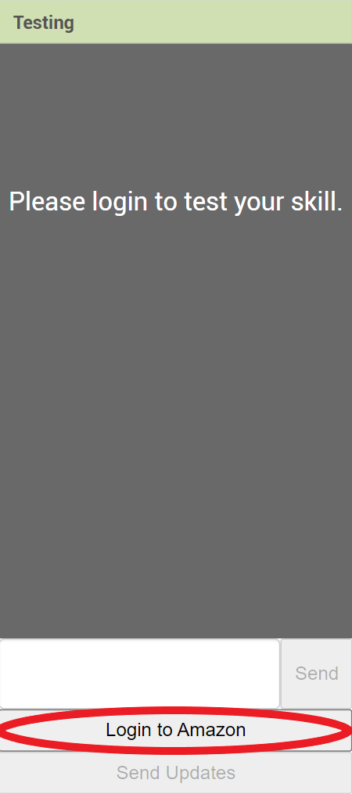{:.enlargeImage}

Once you've signed in, you should see the <strong> Send Updates</strong> button become enabled. If it doesn't, try refreshing the page and logging in again.

## Define a Custom Intent: *quizmeIntent*
Now, we need to add a custom <strong>Intent</strong> to our app.

<hint markdown="block" title="What is an Intent?">
 You can think of an **Intent** as a “command” that you want to teach Alexa. It could be a Stop Intent, a SayHelloWorld Intent, or any intent you can really think of that you will need in any Skill. 
</hint>

Let's design the flow of our conversation. Our goal is to have Alexa generate a random number as a "guess", and ask us to guess this random number. Then, based on the user's guess, Alexa will respond with three options: the user's guess was too high, too low, or correct.

We want Alexa to know when to begin quizing the user, so we will first teach our app to listen for the *quizmeIntent* intent. 

First, drag out an <strong>Intent</strong> component from the Palette to the left and drop it over the image of the Amazon Echo Dot. The Intent should appear as a <strong>Non-visible component</strong> named <strong>IntentA</strong> both under the Echo Dot and in the <strong>Components</strong> box. 

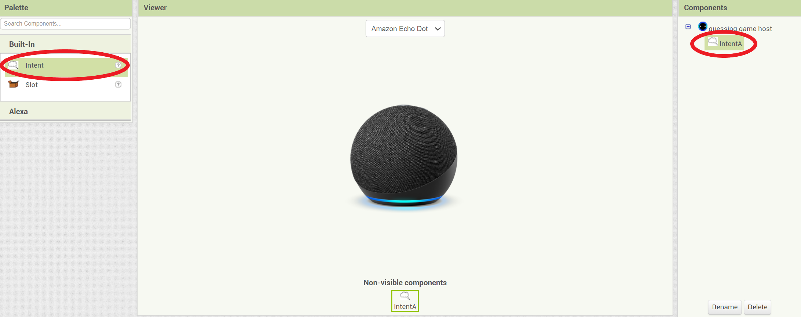{:.enlargeImage}

## Rename Your Intent
Let's rename this Intent to <strong>"quizmeIntent"</strong>. At the bottom of the <strong>Components</strong> box, click the <strong>Rename</strong> button. In the resulting popup, enter <strong>"quizmeIntent"</strong> in the <strong>New name</strong> textbox. Then, click <strong>OK</strong>.

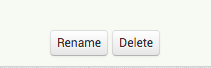{:.enlargeImage}
{:.enlargeImage}

## Add a list of Utterances: 
As you might have noticed, we need to give the intent block a list of <strong>utterances</strong>. 

<hint markdown="block" title="What are Utterances?">
Let’s say your parent wants you to do the dishes. They might say “Clean the dishes.” Or, maybe they’ll say “*Do* the dishes.” Maybe they’ll just say “Wash the dirty plates.” All these sentences have the same *intent*: you need to do the dishes.

Just like this example, when talking to Alexa, there might be a lot of ways to say something to trigger an intent. Each of these phrases that all mean the same thing is called an **utterance**. 
</hint>

{:.enlargeImage}

In the text box beneath the text **"Utterances"**, we will write a phrase which Alexa will understand to mean to begin quizzing the user and start the conversation. We can add several **utterances** to invoke the Intent, for example we added “quiz me”, “start the quiz”, “start the game” as our **utterances** to invoke the quizmeIntent. We encourage you to be creative and add more **utterances**!

{:.enlargeImage}

Remember that the structure of any command you tell Alexa when you want to trigger a skill is: 

 “Alexa, tell  (Invocation Name) to  (Utterance)” 

We already set the invocation name as **guessing game host**, and now we’ve added the **utterance** phrases for the <strong>*quizmeIntent*</strong>. Here is a full example of what Alexa might hear when we want to trigger the <strong>*quizmeIntent*</strong> of our new Skill:

 “Alexa, tell  guessing game host  to  start the game” 

## Define the Intent Handler for *quizmeIntent*

We need to now define the “brain” of this intent in our Alexa skill. Our skill can recognize whenever we want it to begin quizzing the user and start the *“quizmeIntent”*, but it doesn’t know what to do or how to handle it. To make the response, we need to define the **Endpoint Function**, the “brain” of our Skill. To begin, let’s navigate back to the **Blocks** view.

{:.enlargeImage}

## Define the Intent Handler for *quizmeIntent*
Here, you should see our **quizmeIntent** as its own Component drawer to the left. Click on that to open it up and drag out the when quizmeIntent.spoken block into your workspace.

{:.enlargeImage}

Whenever our Skill hears the user say the **utterances** of **quizmeIntent**, this block will run anything inside of it. Let's have our Skill guess a random number, respond back to the user, and ask us to guess this number.

To have our Skill pick a random number, we need to initialize a variable to hold the value of the random number chosen. Open the **Variables** drawer, and drag out the initialize global name to block into our workspace.

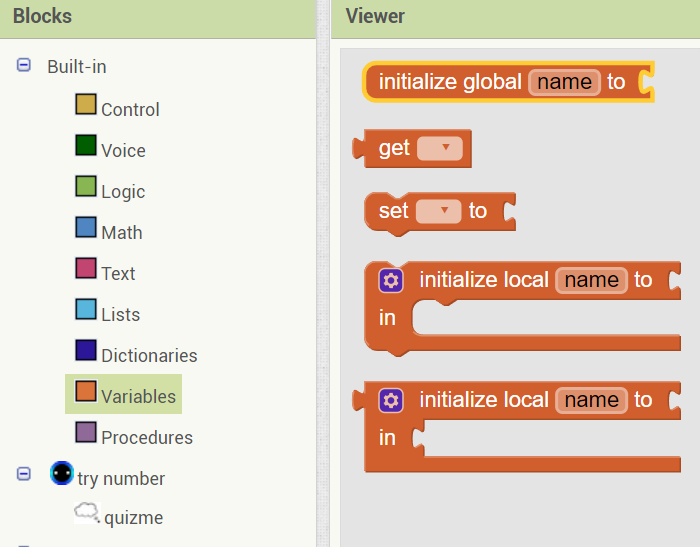{:.enlargeImage}

Let's set the variable name to secret. Do so by clicking on "name" within the block and typing in "secret". 

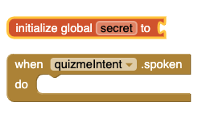{:.enlargeImage}

Next, open the **Math** drawer and drag out the 0 block into our initialize global secret to variable block. This will initialize secret to the value of 0. 

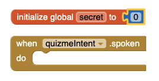{:.enlargeImage}

Now we want to set the range of possible secret numbers by providing a maximum bound. To do this, we will initialize another variable called **“max”** to the value of 100. To change the value of the blue block to 100, simply click the 0 and change the value to 100.

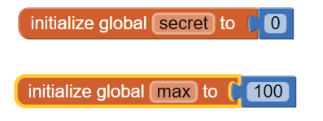{:.enlargeImage}

## Define the Intent Handler for *quizmeIntent*

Let’s now **set** our variable secret to a random value from 1 to max. To do so, open up the **Variables** drawer and drag out the set __ to block into the when quizmeIntent.spoken. Click the dropdown menu within the set __ to block and choose the “global secret” option. 

{:.enlargeImage}

Open the **Math** drawer and connect the random integer from 1 to 100 block to the set global secret to block. Remove the value of "100" by clicking on the "100" and dragging it into the trash can at the bottom right. Replace the value with the get __ block in the **Variable** drawer, and set the **get** variable to global max. 

{:.enlargeImage}

Now we want Alexa to **say** to the user: "I am thinking of a number from 1 to  max. Can you guess it?"

To do this, we need to use the **say** block from the **Voice** drawer and the join block from the **Text** drawer (because Alexa's response consists of both text and a variable).

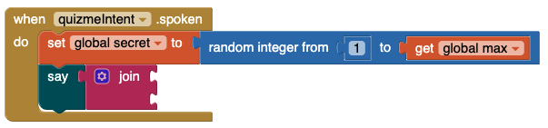{:.enlargeImage}

If we break down the answer that we want Alexa to give us, it has 3 parts:

 I am thinking of a number from 1 to max. Can you guess it? 

Our join block only has two sections, so we need to expand it. Click the blue gear icon on the join block and drag a string block into the join block.

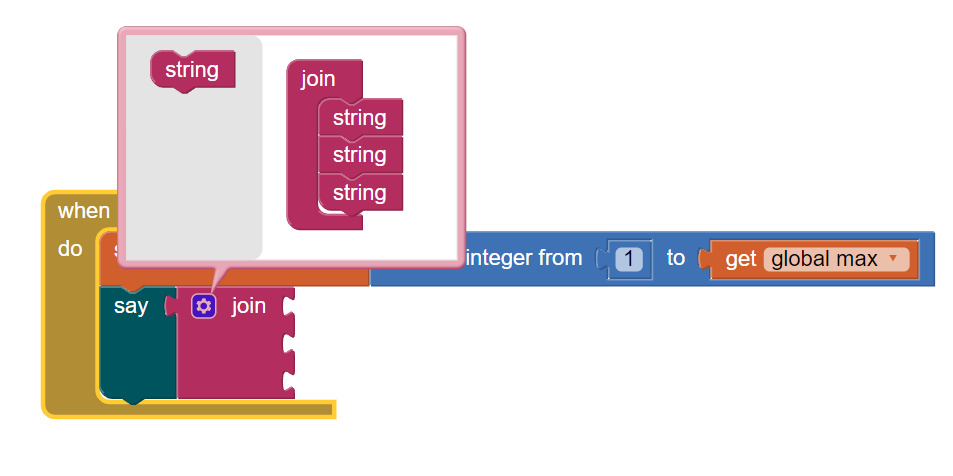{:.enlargeImage}

Grab two empty blocks from the **Text** drawer and place them in the 1st and 3rd section. Within the 1st textbox, type: "I'm thinking of a number from 1 to " and in the other textbox, type ". Can you guess it?". Don't forget the spaces! 

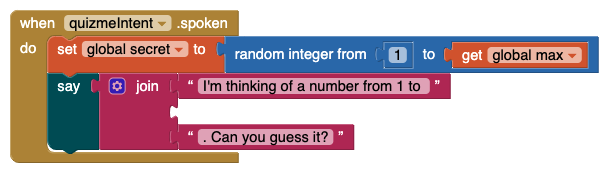{:.enlargeImage}

Put our variable max into the middle section by opening the **Variables** drawer, dragging get__ into the middle, and selecting **global max** from the dropdown menu. 

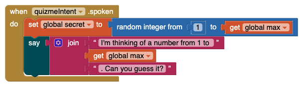{:.enlargeImage}

## Define the Intent Handler for *quizmeIntent*

We now want our Skill to prompt the user for their guess. To do this, we need to use the **Ask** block in the **Voice** drawer.

<hint markdown="block" title="Tip on the Ask block">
The Ask block is similar to the Say block in that it causes Alexa to say something. However, unlike the Say block, the Ask block does not end the interaction with Alexa. Instead, it causes Alexa to say something, like a question, and then wait for us to respond. What we say in response will then act as another utterance, which will invoke another intent, so we can have a “multi-turn” conversation—or talk back-and-forth with Alexa.
</hint>

Add the **Ask** block to the inside of the when quizmeIntent.spoken block, at the bottom.

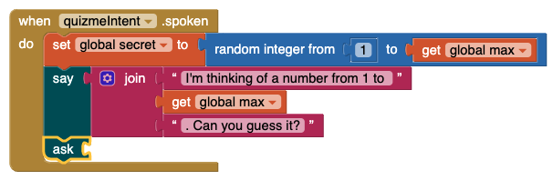{:.enlargeImage}

Next, attach an empty text block to the **Ask** block and type inside the text block, "What is your guess?"This will tell Alexa to listen for the user’s response and use the response to trigger the next intent, which will  determine whether our guess is too high, too low, or correct.

{:.enlargeImage}

And now we’ve finished defining your first intent handler! When we add more intents later, you need to add a new when intent. spoken block for each intent. Before we add the second intent, let’s test what we have in our Alexa **quizmeIntent**!

## Test Your Skill
Now it’s time to test our Alexa skill! 

At the bottom of the testing box, click on **Send Updates**.

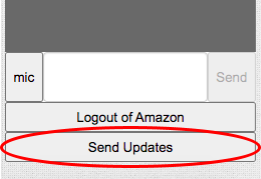{:.enlargeImage}

The updates should take about 1 - 2 minutes to finish updating. If you decide to make any changes to your Alexa Skill after completing this tutorial (e.g., updating/adding/deleting blocks), make sure you do this step again to send your new changes to Amazon!

If you have an Alexa-enabled device handy, say *“Alexa, tell guessing game host to quiz me.”* to it and hear the response. You can also do this on your mobile device by downloading the free **Amazon Alexa** app, which comes with a built-in Alexa simulator.

If you don’t have an Alexa-enabled device on hand, the **Testing** page in App Inventor allows you to simulate an Alexa using your custom Alexa skill right in your browser! After sending updates to Amazon, the testing box should turn white. There, you can test your skill by typing in the textbox: *“Tell guessing game host to quiz me.”* (You can omit the Alexa at the beginning of the phrase when using the testing box). 

You can also use the mic instead! Click on the microphone, talk to your skill, and then click the mic again when you’re done talking. 

The result should look like this:

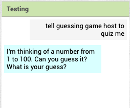{:.enlargeImage}

## Create the Second Intent: *makeGuessIntent*

We will now move on to creating our second intent, *“makeGuessIntent”*. In our first *“quizmeIntent”*, we’ve taught Alexa to guess a random number from 1 to max and ask us for our guess. Our new intent should have **utterances** matching reasonable ways to respond to our first question so that our conversation with Alexa may continue.

Let's first teach our app to listen for the **makeGuessIntent**. To define this intent, repeat the previous steps done to create the **quizmeIntent**, but this time rename the intent to **makeGuessIntent**. If done correctly, the page should look like this.

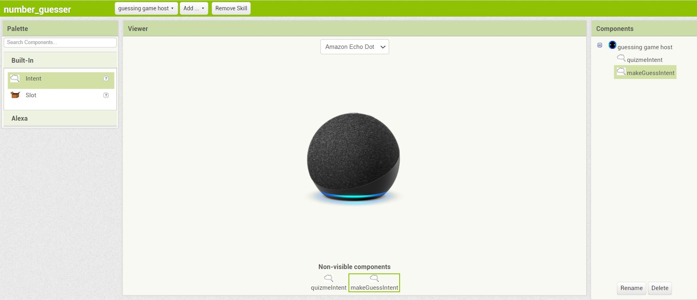{:.enlargeImage}

Now, we need to give the intent a list of **utterances**.

## Define a Slot and Add a List of Utterances 

To do this, we'll need to think of some ways that someone might respond to the question "What is your guess?". One possibility might be "I guess nine". Since we want the user to be able to tell our Alexa skill *any* number, we'll have to define it as a **slot**. Our Alexa skill can have multiple slots.

<hint markdown="block" title="What are slots?">
A **slot** is like a variable in an **utterance**. You use slots when you want to store something that a user said, like a particular date, place, or number. A slot tells Alexa what part of the **utterance** it should store. 

For example, if you want to ask Alexa which continent a country is in, you might say something like “Where is Argentina?” Without your help, Alexa won’t know which part of the sentence needs to be stored (which, in this case, is “Argentina”). To tell Alexa which part of the sentence is important, we use slots. 

In your code, you would need to define a slot with the type “Country” and structure the **utterance** as follows:

 "Where is  Country slot?" 

Now, when a user says, “Where is Argentina?”, Alexa will set the value of the slot to “Argentina”.
You should also add additional example **utterances** with slots, to help Alexa understand where the slot might occur. For example:

 "Do you know where  Country slot is?" 

 "Can you help me find  Country slot?" 

The more examples you add, the more likely it is that Alexa will understand correctly.
</hint>

Let's define our slot for the user's guess. Take a **Slot** component from the **Palette** and **drag and drop** it over the image of the **Amazon Echo Dot**.

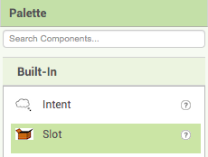{:.enlargeImage}

You should see a new **Slot** component named SlotA appear as a Non-visible component under the Echo Dot. The new Slot will also appear in our **Components** box to the right. 

{:.enlargeImage}

For this slot, we’ll rename the slot to be *“myGuessSlot”*, and we’ll change the slot type to **Number**.
At the bottom of the **Components** box, click the **Rename** button. In the resulting popup, enter *“myGuessSlot”* in the **New name** textbox. Then, click **OK.**

In the **Properties** box, you should see a dropdown menu named **SlotType**. Open the dropdown and select **Number** to tell Alexa that this slot will be a number.

{:.enlargeImage}

Your **Components** box should now look like this:

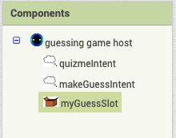{:.enlargeImage}

## Define a Slot and Add a List of Utterances 
Now that we have our slot defined for the user's guess, we want to define an **utterance** for **makeGuessIntent**. One example of something you might respond to Alexa’s question is “I guess nine”. In this case, *nine* is the value of our **slot**, **{myGuessSlot}**. To define this **utterance**, we’ll need to use different parts of the **Properties** box.

Within **Properties**, we first have a textbox to edit any **utterance** that you're currently defining for this intent.

{:.enlargeImage}

Then, we have buttons for each **Slot** we defined earlier. You can click on these as you're typing an **Utterance** to insert the slot into the **utterance**. You can also choose to simply type the slot's name in curly brackets instead of using slot buttons. For example, one could type in: I guess **{myGuessSlot}**.

{:.enlargeImage}

Next, we have an **empty space**. This will contain your first **utterance** when you start typing into the textbox and then click away to save it. 

Finally, we have **Add** and **Remove** buttons to add and remove **utterances** from your Intent. To remove an **utterance**, simply click on the **utterance** you want to remove, and then click the Remove button.

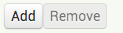{:.enlargeImage}

Let’s try defining our first **Utterance** for the **makeGuessIntent**. In the **Properties** utterances textbox, type “I guess " and click the button for the **myGuessSlot**. Don't forget the spaces! Your **Properties** box should now look like this. Note that **utterances** cannot have question marks within them.  

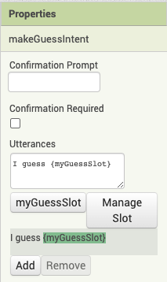{:.enlargeImage}

Click on the **Add** button at the bottom of the Textbox to complete our first **utterance** for the **makeGuessIntent** intent! Remember that the slots act as placeholders that will be assigned to some value when the user says a phrase that matches this **utterance**. So, the structure of this **utterance** is:

 "I guess myGuessSlot."

And an example of what you might say to match this utterance is: 

 "I guess nine."

Let’s add our second **utterance** for the **makeGuessIntent** intent. Another phrase you might respond to Alexa’s question of “What is your guess?” might be something else like “My guess is nine”. Follow the previous steps done to complete our first **utterance**. If done correctly, your **Properties** box should now look like this:

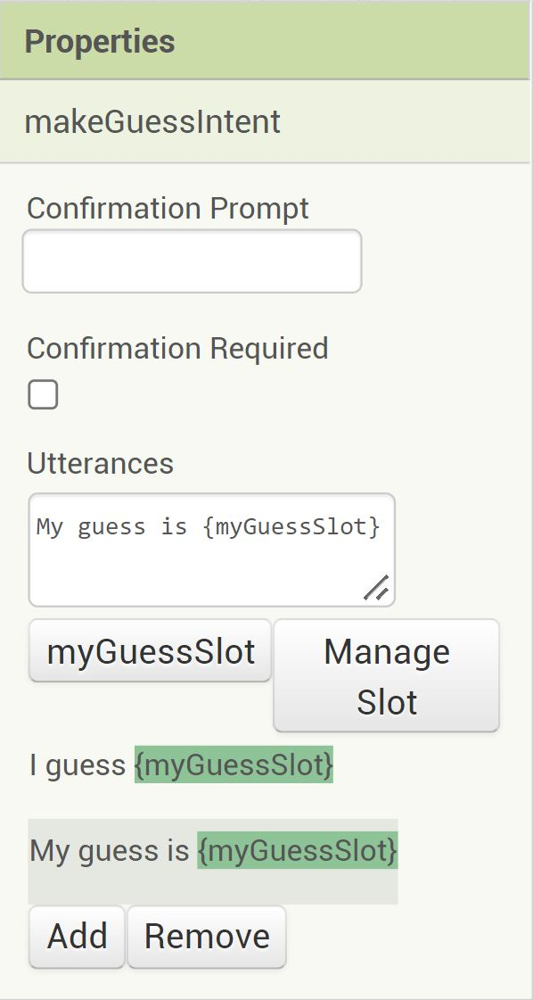{:.enlargeImage}

Feel free to create your own **utterances**! (e.g., "**{myGuessSlot}** is my guess”). Remember, the more **utterances** you have, the more likely Alexa will understand correctly.

At this point in our conversation with Alexa we have already invoked the invocation name *guessing game host* and triggered **quizmeIntent**, which causes Alexa to ask us "What is your guess?". We’ve also added the new intent’s **utterances**, “I guess **{myGuessSlot}**" and “My guess is **{myGuessSlot}**.” Remember that **{myGuessSlot}** is a **slot** that represents numbers. To trigger the new *makeGuessIntent* intent, we don’t need to say the invocation name again. Here is a full example of what Alexa might hear when we want to trigger our new intent:

 "My guess is ten."

## Define the Intent Handler for *makeGuessIntent* 

Now that we have defined the Interaction Mode of our new **makeGuessIntent**, we need to define the “brain” of the Alexa intent. Our skill can now recognize when we give it our guess, but it doesn’t know what to do or how to handle it. To make the response, we need to define the when makeGuessIntent spoken block to tell Alexa what to do when you trigger the **“makeGuessIntent”**. To begin, let’s go back to the Blocks view.

{:.enlargeImage}

Here, you should see our **makeGuessIntent** as its own Component drawer to the left. Click on that to open it up and drag out the when makeGuessIntent.spoken  block into your workspace.

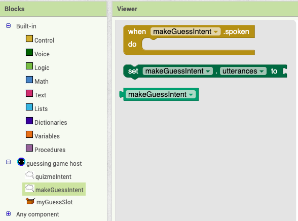{:.enlargeImage}

Whenever our Skill hears the user trigger the **makeGuessIntent**, this block will run anything inside of it.

Let's first have our Skill repeat our guess and say: "You guessed **{myGuessSlot}**", where **{myGuessSlot}** represents the value of our guess. Similar to before, we need to use the **say** block from the **Voice** drawer and the join block from the **Text** drawer. Try implementing everything except **{myGuessSlot}** yourself! Click the Answer button when you're finished to see what your blocks should look like.

<hint markdown="block" title="Answer!">
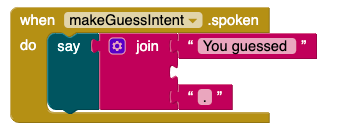{:.enlargeImage}

</hint>

In order to get the value of our slot **{myGuessSlot}**, click the **myGuessSlot** drawer on the lower left of the **Components** block, and drag out the **myGuessSlot.value** block into the join block.

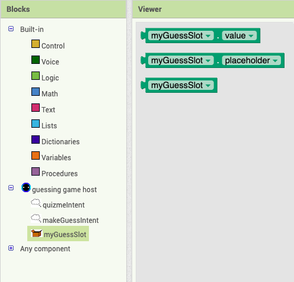{:.enlargeImage}

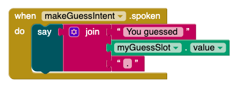{:.enlargeImage}

## Define the Intent Handler for *makeGuessIntent* 
Now we want our **makeGuessIntent** to respond differently based on our **myGuessSlot** value. **IF** our guess is greater than our **secret** variable, **THEN** Alexa will **ask**: “**{myGuessSlot}** is too big. Guess again”. The user will then have another opportunity to guess, which will create a loop until the user guesses correctly. **IF** our guess is less than our **secret** variable, **THEN** Alexa will **ask**: “**{myGuessSlot}** is too small. Guess again”, which will once again create a loop. **IF** our guess is accurate, **THEN** Alexa will say: “**{myGuessSlot}** is correct. Congratulations!"

Because we want a different response based on our **myGuessSlot** value, we need to use **conditionals**. **Conditionals** provide us with the ability to choose different responses based on different parameters using **if/else if/then** statements. Let’s try it out!

To start, open the **Control** drawer and drag out the if/then/else if/then/else block, and place it into the when makeGuessIntent.spoken block.

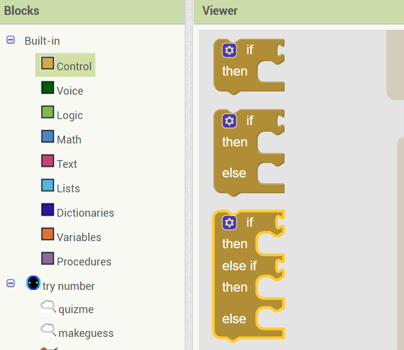{:.enlargeImage}

{:.enlargeImage}

Let's first check whether our **myGuessSlot** value is greater than our secret variable. To do so, open the **Math** drawer and pull out the equality function block and attach it to the "if" statement.

{:.enlargeImage}

Next, click the equal sign, and in the drop-down menu, pick the greater than sign (>). 

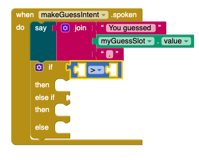{:.enlargeImage}

Let's fill in these empty values! In the first space, put in **myGuessSlot.value** from the **myGuessSlot** drawer and in the second space, put in  get global secret from the **Variables** drawer. 

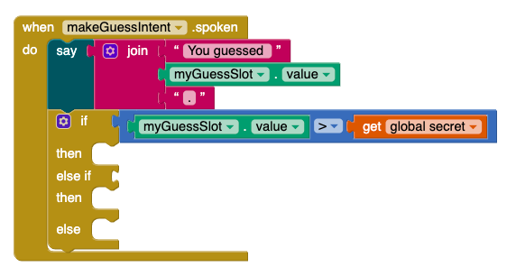{:.enlargeImage}

We've now set our first if statement! **IF** our **myGuessSlot** value is greater than our secret value, then the expression within the first **then** statement will be run. Let's define this first **then** statement - we want Alexa to **ask**: "**{myGuessSlot}** is too big. Guess again". To do this, we need to once again use the **ask** block from the **Voice** drawer, the **myGuessSlot.value** block, and the join block from the **Text** drawer. Try it yourself! (Hint: How many parts are there in Alexa's response? Do we need to add parts to the **join** block? Click the Answer button to check your blocks!)

<hint markdown = "block" title = "Answer!">
If done correctly, your blocks should look like this: 

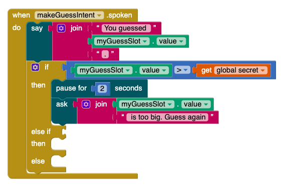{:.enlargeImage}

(Don’t forget the spaces! Additional note: in order to make the game a little bit more intense, in our example we added a pause before the Intent gives the answer. Feel free to to use adjust the pause time based on your preference, you can find the pause function in the **Voice** drawer)
</hint>

## Define the Intent Handler for *makeGuessIntent* 

We've now programmed the **makeGuessIntent** such that **if {myGuessSlot}** is greater than our **secret** value, we tell the user information about **{myGuessSlot}** and prompt the user to guess again. But what if **{myGuessSlot}** is smaller than our **secret** value? We need to define the **else if** and **then** statement to have Alexa know what to do in this situation.

In order to define the **else if** statement, follow the same steps as before for defining the **if statement**, using the equality function block to compare **{myGuessSlot}** and our **secret** value - but this time change the greater than sign to a less than sign (<).

Now let's define the second **then** statement. Follow the same steps as the first **then** statement, but instead of having Alexa **ask**: "**{myGuessSlot}** is too **big**. Guess again", we want Alexa to **ask**: "**{myGuessSlot}** is too **small**. Guess again". 

Your blocks should look like this! 

{:.enlargeImage}

Finally, we want to define what happens if **{myGuessSlot}** is not bigger or less than **secret** (equal to the value of **secret**). To do so, we need to define the **else** statement). 

## Define the Intent Handler for *makeGuessIntent* 

If our guess is correct and equal to **secret**, we no longer need to continue the conversation. Therefore, instead of using **ask**, we will use **say** instead. We want Alexa to **say**: "**{myGuessSlot}** is correct." To do this, we need to use the **say** block from the **Voice** drawer, the **myGuessSlot.value** block, and the join block from the **Text** drawer. Try it yourself! (Hint: How many parts are there in Alexa's responses? Do we need to add parts to the join block?)

Our final result should look like this:

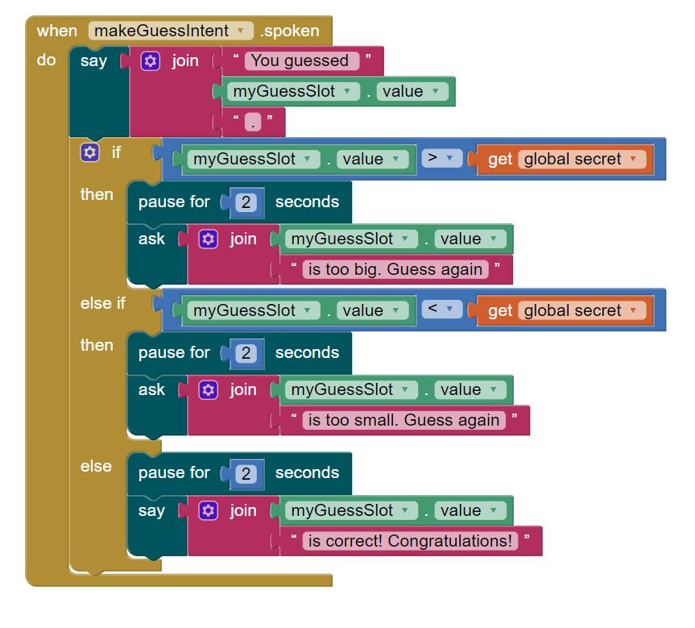{:.enlargeImage}

Let's summarize the logic flow of our  conditional if/then/else if/then/else block to better understand conditionals. First, we check whether the **if** statement is true: **{myGuessSlot} > secret**. If it is, then whatever is in the first **then** statement is run, and the other following statements are ignored. However, if the **if** statement is false, then we move on to checking whether the **else if** statement (**{myGuessSlot} < secret**) is true or not. If it is true, then the second **then** statement is run and the other following statements are ignored. If it is not true, then we move onto the **else** statement and run it.

Our new guessing game host Skill is now finished! Let's send it to Amazon and test it out.

## Send the Code to Amazon

At the bottom of the testing box, click on **Send Updates**. 

{:.enlargeImage}

The updates should take about 1-2 minutes to finish updating. If you decide to make any changes to your Alexa Skill after completing this tutorial (e.g. updating/adding/deleting blocks), make sure you do this step again to send your new changes to Amazon! 

## Test your Skill!

If you have an Alexa-enabled device handy, say *“Alexa, tell guessing game host to quiz me”* to it and hear the response. You can also do this on your mobile device by downloading the free **Amazon Alexa** app, which comes with a built-in Alexa simulator.

If you don’t have an Alexa-enabled device on hand, the Testing page in App Inventor allows you to simulate an Alexa using your custom Alexa skill right in your browser! Simply type in the textbox at the bottom, *“tell guessing game host to quiz me”* (You can omit the Alexa at the beginning of the phrase when using the testing box). Does the conversation flow like we planned it to? Here’s an example conversation:

Note that the "secret" number is randomly generated, so that the user will see different sequences than the example shown here.

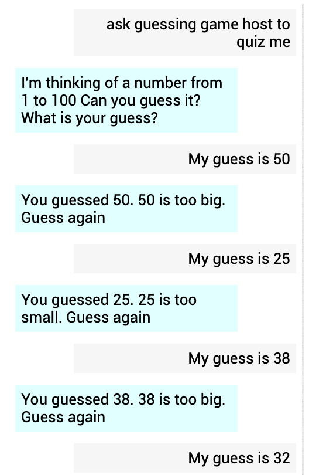{:.enlargeImage}

## Finish!

Congratulations! You've finished programming the **number guessing game** and learned about using **conditionals** in the context of programming an Alexa skill!

# Expand Your App

Here are some ideas for ways to enhance your app! 

* The way our app is built as of now, once we guess the correct number, the game ends. Try changing the app so that you can "restart" the game once you guess the right number! 
* Try implementing a tracking system that tells the user at the end how many guesses it took them to find the secret number!
* Try reversing the role of Alexa and the user! Let the user pick a random number and have Alexa find it by guessing and responding to "too low" or "too high" comments. (Hint: One way to do this is by implementing a binary search method for Alexa using upper and lower bounds that update every round)

# About Youth Mobile Power
A lot of us spend all day on our phones, hooked on our favorite apps. We keep typing and swiping, even when we know the risks phones can pose to our attention, privacy, and even our safety.  But the computers in our pockets also create untapped opportunities for young people to learn, connect and transform our communities.

That’s why MIT and YR Media teamed up to launch the Youth Mobile Power series. YR teens produce stories highlighting how young people use their phones in surprising and powerful ways. Meanwhile, the team at MIT is continually enhancing MIT App Inventor to make it possible for users like you to create apps like the ones featured in YR’s reporting.

Essentially: Get inspired by the story, get busy making your own app!
 

 The YR + MIT collaboration is supported in part by the National Science Foundation. This material is based upon work supported by the National Science Foundation under Grant No. (1906895, 1906636). Any opinions, findings and conclusions or recommendations expressed in this material are those of the author(s) and do not necessarily reflect the views of the National Science Foundation.

 Check out more apps and interactive news content created by YR <a href="https://yr.media/category/interactive/" target="_blank">here</a>.

