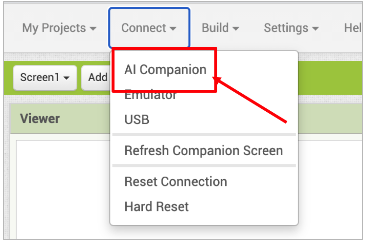
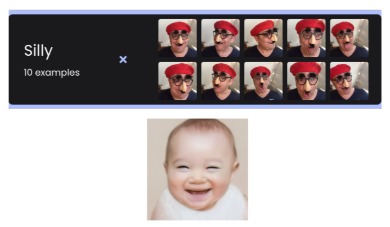

# Challenge

How can a machine learn about the world? In some ways computers are like very young babies, always soaking up new examples and trying to put what they sense into different buckets — dog, cat, familiar face, stranger. 

In this two-part tutorial, you will learn about a type of artificial intelligence (AI) called machine learning (ML), exploring an example called “image classification” — a way for computers to put what they see into various buckets. You will create an app that sees a human gesture that you make and intelligently responds!

If you haven’t set up your computer and mobile device for App Inventor, go to the “Setup Your Computer” tab below. Otherwise, go directly to the “PICaboo” tab to start the tutorial.

# Setup Your Computer

# PICaboo (Level: Intermediate)

## Introduction

In this tutorial, you will make a "Peekaboo" game with your very own Personal Image Classification (PIC) model. A baby shown in the app smiles when you show your face and cries when you hide your face.

{:.enlargeImage}

<hint markdown="block" title="What is the Game of Peekaboo?">
Very young babies do not quite understand how to make sense of the visual world around them. One challenge? They lack an understanding that objects continue to exist even when not visible. This concept is described by the famous child psychologist Jean Piaget as “object permanence.” Parents often play a game with their very young babies in the US, called Peekaboo, where the parent hides her face (with her hands or a pillow etc.) and “disappears” to the baby's surprise.  Then, she suddenly shows her face, saying, “Peekaboo, I see you!” –much to the delight of the baby, who is astonished to see the parent suddenly appear out of “nowhere.”  Here is a <a href="https://www.youtube.com/watch?v=Z37Ru-GRtks" target="_blank"> video</a> you can watch about this game. 

A machine <em>learns</em> to make sense of visual data somewhat like a baby learns visual cues. Both babies and computers need many examples (large sets of training data).  Also, they need the categories for the examples to be easily distinguishable (visually distinct data classes).

</hint>

 
**Important**: Please note that you cannot use the Emulator to test your app for this project.  The Emulator cannot run MIT App Inventor extensions such as the <strong>PersonalImageClassifier</strong> (PIC) extension.  To make sure that your mobile device has the needed hardware capability for PIC, use the MIT AI2 Companion on this<a href="../aiaFiles/PICaboo/LookTest.aia" target="_blank"> LookTest.aia </a>test file.  If the status at the top reads "Status: Ready!" then the <strong>PersonalImageClassifier</strong> extension will work. If not, you won't be able to run apps made with this extension. If it works, try classifying some objects by pointing the device at an object and pressing the Classify button.

## PICaboo Part 1: Training the Model

First, you need to train an image classification model.  This training happens on the App Inventor —<a href="https://classifier.appinventor.mit.edu/" target="_blank">Personal Image Classifier</a> page.  Follow the instructions on the <a href="../images/PICaboo/PICaboo_Part1.pdf" target="_blank">PICaboo Part 1 pdf document</a>.  At the end of this process, export the model.mdl file to your computer.  In the next part of the tutorial, you will upload this file to App Inventor.

{:.enlargeImage}

## PICaboo Part 2: Designing and Coding the App

An example of a Graphical User Interface (GUI) is in the starter file.  (Change the properties of the components, if you wish, to get the look and feel you want.  However, please do not rename the components, as this tutorial will refer to the given names in the instructions.)

{:.enlargeImage}

## Uploading Your Trained Model

Click on the non-visible component <strong>PersonalImageClassifier1</strong>. This component will classify your poses based on your trained model.

Upload the model you trained in Part 1 by clicking on the “Model” property and selecting the model on your computer's hard drive.

{:.enlargeImage}

## Sequence of Events

The following graphic shows the sequence of events in PICaboo. Fill in the missing blocks with the letter corresponding to the correct event.

{:.enlargeImage}

<hint markdown="block" title="Check my solution">
    Left to right boxes: A, B, C.
</hint>
 

## Reviewing the Given Code

Now switch to the Blocks Editor to start coding the behavior for the app.  First, look at the code blocks already there. These blocks set up the <strong>PersonalImageClassifier</strong> when the app first starts.

In case the <strong>PersonalImageClassifier</strong> returns an error, the when PersonalImageClassifier1.Error event block displays the error in the <strong>StatusLabel</strong>.

{:.enlargeImage}

The when PersonalImageClassifer.ClassifierReady block is called when the classifier is ready to start classifying images. <strong>StartButton</strong> and <strong>ToggleCameraButton</strong> are enabled. “Ready” is displayed in the <strong>StatusLabel</strong>. <strong>BarLabel1</strong> and <strong>BarLabel2</strong> are assigned the names of the model labels ("Me" and "NotMe"). These are the classes you trained in the model.

{:.enlargeImage}

When <strong>ToggleCameraButton</strong> is pressed, the camera switches from front to back or vice versa. 

{:.enlargeImage}

<strong>StartButton</strong> stops or starts the <strong>PersonalImageClassifier</strong> classification process. Button text changes from “Start” to “Stop” or vice versa.

{:.enlargeImage}

## Image Classification Result (Part 1)

Now we finally get to the block that provides the important results from the classification model. Before coding, let’s see how this result data from the component <strong>PersonelImageClassifier</strong> is received and used.

When the classifier produces a classification for what it sees, the when PersonalImageClassifier1.GotClassification event handler block is called. In this tutorial, your main task is to complete the code in this block.

{:.enlargeImage}

The result lists the classifications in the form of a data structure called a "dictionary".  In computer science a <em>dictionary</em> stores key/value pairs –much like a real-world dictionary stores words and their definitions. But unlike a real-world dictionary, the dictionary data structure can hold arbitrary keys associated with arbitrary values. They can be pretty much anything: letters, words, multi-word strings, numbers, as well as combinations of all these.  Below is an example:

{:.enlargeImage}

In the above example of key/value pairs, the key is “Name” and the value is “Tel."  This dictionary is an ordinary phonebook. 

## Image Classification Result (Part 2)
The result returned by <strong>PersonelImageClassifier</strong> lists the names (key) of two classes (“Me” and “NotMe”) with their confidence levels (value). The code blocks below represent this data structure. (Note: the dictionary lists key/value pairs in the result, in the order of highest to lowest confidence levels.)

{:.enlargeImage}

In this example, the result consists of the class “Me” with a high confidence level of 0.925 (that is 92.5%) and the class “NotMe” with a low confidence level of 0.075 (that is 7.5%). These confidence levels were computed by the model you created during the training phase. At this instance, the baby in the PICaboo app would be smiling as the computer is confident that it is seeing your face.

{:.enlargeImage}

## Image Classification Result (Part 3)

To find out the value of a particular key from the result, use the get value for key block. In the example below, if you searched for the key “Me” in the given dictionary, you would get 0.925 –its associated confidence level (value). If no key matched, you would get 0.

{:.enlargeImage}

## Got Classification

The when PersonalImageClassifier1.GotClassification event handler block starts by initializing two local variables. (Local variables can only be used inside the code block where they are defined.)

* MeConfidence: is the confidence level for the “Me” class (showing face).
* NotMeConfidence: is the confidence level for the “NotMe” class (hiding face).

{:.enlargeImage}

You will see soon how the code uses these variables.

## Initializing the Variables

Initialize the variables MeConfidence and NotMeConfidence to the confidence levels associated with each class, "Me" and "NotMe."  (Remember that these confidence levels are the values in the dictionary data structure returned by result.)

<hint markdown="block" title="Give me a hint">

Initialize the local variables as shown.  If you mouse over the parameter result, you will see the needed block.  Be sure to replace the default "not found" Text block with a “0” from Math blocks.  This makes sure that a confidence level of 0% is assigned in case the classifier has not yet returned a result.

{:.enlargeImage}

<hint markdown="block" title="Check my solution">

{:.enlargeImage}

</hint>

</hint>
 

## Sequence of Events Recap

When the classifier gets its classification, you can:

* Set the <strong>Percentage1</strong> text and <strong>BarGraph1</strong> width percent correctly.
* Set the <strong>Percentage2</strong> text and <strong>BarGraph2</strong> width percent correctly.
* If the classification with a higher confidence is “Me” (meaning that the machine is highly confident it is seeing your face) then show the happy baby image and hide the sad baby image and make the Screen1 background a light green color.
* Otherwise, show the sad baby image and hide the happy baby image and make the Screen1 background a light pink color.

{:.enlargeImage}

## Setting Percentages and Bar Graphs

First, set the <strong>Percentage1</strong> text to the confidence level of the “Me” class.  This value is a decimal between 0 and 1, so you will need to convert it to a percentage (multiplying by 100) and add the “%” symbol.  For example if the confidence level was 0.75, this proper percentage would be 75 %.

Secondly, note that <strong> BarGraph1</strong> is a colored label showing the confidence level of the “Me” class by its width.  Set its <var>WidthPercent</var> accordingly.  You can duplicate part of earlier code you wrote.

Finally, do a similar thing for <strong>Percentage2</strong> and <strong>BarGraph2</strong>.  Be sure to use the NotMeConfidence local variable for these cases.

<hint markdown="block" title="Give me a hint">

{:.enlargeImage}
{:.enlargeImage}

<hint markdown="block" title="Check my solution">

Snap code in as shown.

{:.enlargeImage}

</hint>

</hint>
 

## Forming the Conditional Statement

Now build the if-then-else conditional block, which tests whether the class with a higher level of confidence is the “Me” class.  This means that the computer recognizes you showing your face with a higher level of confidence.

<hint markdown="block" title="Give me a hint">

{:.enlargeImage}

<hint markdown="block" title="Check my solution">

{:.enlargeImage}

</hint>

</hint>
 

## Displaying Happy Baby and Sad Baby

First, build the code blocks for the <strong>then</strong> part of the if-then-else block set:

* Set the Screen1 background color to light green.  (Use the light green color block already in the template.)
* Show the happy baby image.
* Hide the sad baby image.
    
Now, build code blocks for the <strong>else</strong> part of the  if-then-else block and snap these code blocks where they belong. (Use the light pink color block already in the template.)

<hint markdown="block" title="Give me a hint">

{:.enlargeImage}

<hint markdown="block" title="Check my solution">

{:.enlargeImage}

</hint>

</hint>
 

## Finalizing the Code

When you are done, your entire code should look something like this:

{:.enlargeImage}

## Testing your App

{:.enlargeImage}

Can you play Peekaboo with the baby on the screen? Connect to the AI Companion, and try the app out. Remember to open your fingers a crack when covering your face to see what you are doing. Does the baby smile when you show your face and cry when you hide your face? What happens to the confidence levels? What happens when you wave your hand up and down in front of your face? Then, what happens to the confidence levels?

Congratulations, you are done! You have created an AI app that uses machine learning to classify images and intelligently respond to your actions.

# Expand Your App

Here are some ideas for expanding your project. Explore them or come up with your own!

* Retrain your model so that in addition to recognizing you showing your face (“Me”) and hiding your face (“NotMe”), it recognizes a third facial posture, such as you making a silly face (“Silly”).  Make sure this last class is visually distinct from the previous two classes (for instance, a bright color or another distinctive feature might improve the model.)

    * Save a copy of your original code for the PICaboo app, then add your new code to this copy. 
    * Upload a new and expanded machine learning model. Then, change the code so that there are now three bar graphs for the confidence levels for three classes.
    * Change the code to manipulate three images of the baby to respond to each case (happy baby, sad baby, and laughing baby for the “silly” face). 

{:.enlargeImage}

* An ambitious class project would be to make an app that automatically takes classroom attendance using Personal Image Classifier (PIC).  
    * In the PIC trainer, create a classification for each student in the classroom (“Eva,” “Philip,” “Andrea,” etc.) and for each classification (student), take 25 images of that student from various angles. 
    {:.enlargeImage}
    * Train the classifier on the images. (The classifier may take extra time to process the large number of images.) 
    * Then test your model to see if it correctly identifies randomly selected students.  
    * If the model is accurate and you build a good app, then the teacher would only need to have each student pass by a mobile device running this app at the start of class. When the student is recognized with a high level of confidence, the student is marked as present. 
    * It may be wise to make a simplified version of this app first for a small class of, say, five so you can understand how the code would change. 
    * In the process you may discover some inherent limitations of the PIC program.  Note these down and let the MIT team know.

* What amazing ideas do you have?

# About Youth Mobile Power 
A lot of us spend all day on our phones, hooked on our favorite apps. We keep typing and swiping, even when we know the risks phones can pose to our attention, privacy, and even our safety.  But the computers in our pockets also create untapped opportunities for young people to learn, connect and transform our communities.

That’s why MIT and YR Media teamed up to launch the Youth Mobile Power series. YR teens produce stories highlighting how young people use their phones in surprising and powerful ways. Meanwhile, the team at MIT is continually enhancing MIT App Inventor to make it possible for users like you to create apps like the ones featured in YR’s reporting.

Essentially: Get inspired by the story, get busy making your own app!
 
 
 The YR + MIT collaboration is supported in part by the National Science Foundation. This material is based upon work supported by the National Science Foundation under Grant No. (1906895, 1906636).   Any opinions, findings and conclusions or recommendations expressed in this material are those of the author(s) and do not necessarily reflect the views of the National Science Foundation.

 Check out more apps and interactive news content created by YR <a href="https://yr.media/category/interactive/" target="_blank">here</a>.