# Challenge

Reinforcement Learning: Tame the Dog

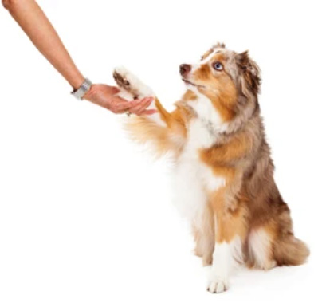
Learning is a mysterious phenomenon —the process through which humans and animals learn how to adopt certain behaviors in response to environmental stimuli.  However, it is clear that introducing a <em>feedback cycle</em> into any learning process (<em>rewards</em> and <em>penalties</em>) can help solidify and speed it up.  In this project, you will be using a type of machine learning called <strong>Reinforcement Learning (RL)</strong> where you will learn how to employ <em>rewards</em> and <em>penalties</em> to emulate and reinforce a learning process.

# Setup

If you need help getting started and set up with App Inventor please visit our <a href="https://appinventor.mit.edu/explore/ai2/setup" target="_blank">Setting Up App Inventor</a> page.

# Reinforcement Learning: Tame the Dog (Level: Advanced)

## Introduction I

In this project, we will explore <strong>Reinforcement Learning (RL)</strong> which is one of the main machine learning methods in AI along with Supervised Learning and Unsupervised Learning. We will use the context of “taming a dog” to illustrate the main ideas of RL. In our simulation, we would like to teach a dog which is initially standing,

to sit or shake hands when the user gives the commands “Sit!” or “Shake!”

## Introduction II

The dog initially does not understand any of these commands, so it behaves randomly for a while. However, after each command, the user gives the dog either positive feedback (i.e., a reward — “Good boy!”) or negative feedback (i.e., a penalty — “No Doggy!”).The type of feedback (reward or penalty) allows the dog to create a “memory” of his training (i.e. which actions led to what consequences)

The accumulating rewards and penalties appear in a 2-by-2 matrix called a <strong>Q-Table</strong>. The row headers of this matrix are the <em>commands</em> given by the user: “Sit!” and “Shake!” The column headers are <em>actions</em> taken by the dog: the dog sat, or the dog shook.  (For simplicity, we will call both the commands and actions SIT and SHAKE)

{:.enlargeImage}

The values in the cells are initially all zero. At each turn in the training, the app computes them  with a formula (We will explain this formula in the last step of the tutorial!): 

{:.enlargeImage}
Where Q(c,a):Q[command,action] and α: Learning Rate

## The User Interface (UI)

To allow you to focus on the new ideas of RL in this project, the User Interface (UI) has been created for you.
{:.enlargeImage}

<strong>Note</strong>: If the entire UI is not visible in the default Phone size given in the <strong>Viewer</strong>, try switching to the Tablet size to be able to see everything together.

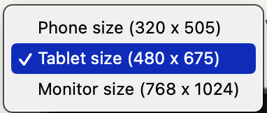

## Variable Initializations

Now switch to the <strong>Blocks</strong> editor.

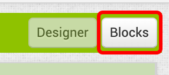{:.enlargeImage}

The coding starts by initializing the variables you will use.

{:.enlargeImage}

* The variables <strong><em>STAND</em></strong>, <strong><em>SIT</em></strong>, and <strong><em>SHAKE</em></strong> correspond to various states of the dog and have numerical values 0, 1, and 2, respectively (rather than text) to allow numerical use and manipulation.

* The variables <strong><em>command</em></strong> and <strong><em>action</em></strong> are both initialized to 0 and will eventually store and keep track of the current command given by the user and the action chosen by the dog.  Thus, <strong><em>command</em></strong> and <strong><em>action</em></strong> will be assigned values <strong><em>SIT</em></strong> (1) or <strong><em>SHAKE</em></strong> (2).

* The variable <strong><em>reward</em></strong> is initialized to 0. It will take the value +1 if the dog receives a reward, and the value -1 if the dog receives a penalty.

* The variable <strong><em>counter</em></strong> will keep track of the number of trials in the training process and is initially set to 0.

* The variable <strong><em>learningRate</em></strong> will control the learning rate of the dog, a measure of how quickly the dog learns from its experience. For example, when <strong><em>learningRate</em></strong> is 1 (or 100%), the dog will immediately learn from its current reward or penalty what to do or what not to do. When <strong><em>learningRate</em></strong> is 0 (or 0%), the dog will not be able to learn from its current reward or penalty no matter what. <strong><em>learningRate</em></strong> is initialized to 0.5 (50%), halfway between perfect and no learning (probably a realistic learning rate for a dog?).

* <strong><em>Qtable</em></strong> variable keeps track of the 2X2 matrix mentioned above — a record of the memory of the dog's training. (There is no matrix data structure currently in App Inventor, so a list of lists will hold the data. Make sure you understand how the list of lists corresponds to the 2X2 matrix, as you will be manipulating the Q-Table a lot.) 

Initially, all the matrix entries are 0’s as there is no memory of a training:

{:.enlargeImage}

Initialize the variable Qtable as shown below:

{:.enlargeImage}

## Q-Table Procedures I

Study the following Q-Table procedures:

* the first procedure  allows you to access a <em>row</em> of the Q-Table, which is a list of two numbers, 

{:.enlargeImage}

* the second procedure allows access to an <em>individual cell</em> of the Q-Table, which is a number

{:.enlargeImage}

* the third procedure allows you to <em>assign</em> a value to a given cell of the Q-Table. 

{:.enlargeImage}

Notice that the two latter procedures use the first procedure in their definitions.

## Q-Table Procedures II

Here are some examples to solidify your understanding of Q-Tables.  Note that you do need to replicate these examples in code.

For example, for the Q-Table shown below
{:.enlargeImage}

which is equivalent to this Q-Table
{:.enlargeImage}

QTable Row#1 is a list of two numbers:
[0.25, -0.15]

{:.enlargeImage}

In code, the procedure block <strong>QTableRow(1)</strong> returns the list containing the numbers 0.25 and -0.15.
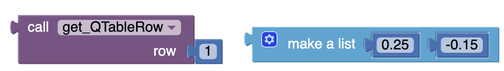{:.enlargeImage}

Similarly, QTable Row#2 is a list of two numbers:
[-0.35, 0.45]

{:.enlargeImage}

In code, the procedure block <strong>QTableRow(2)</strong> returns the list containing the numbers -0.35 and 0.45.

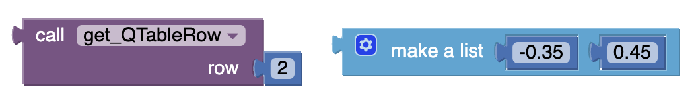{:.enlargeImage}

The following identifies a specific cell of the Q-Table. QTable Row#2 Column#1 is a number: -0.35.

{:.enlargeImage}

In code, the procedure block <strong>QTable(2,1)</strong> returns the number -0.35.

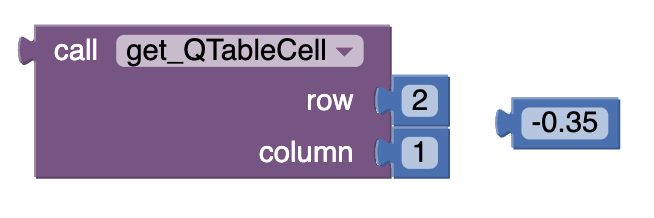{:.enlargeImage}

What do you think is QTable Row#1 Column#2?

{:.enlargeImage}

i.e. What value does this procedure <strong>QTable(1,2)</strong> return?

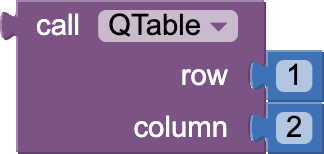

<hint markdown="block" title="Solution">
 -0.15
</hint>

What does this procedure call <strong>set_QTable(1,2,-0.75)</strong> do?

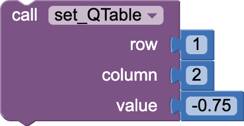

<hint markdown="block" title="Solution">

The procedure call alters the given Q-Table cell at row 1, column 2 

{:.enlargeImage} 

which becomes the following when -0.15 is replaced by -0.75.

{:.enlargeImage}

</hint>

These procedures will make accessing and revising the Q-Table matrix easier than manipulating a list of lists.

## Learning Rate Slider

Study this block. Can you explain what it does when the Learning Rate slider is moved?

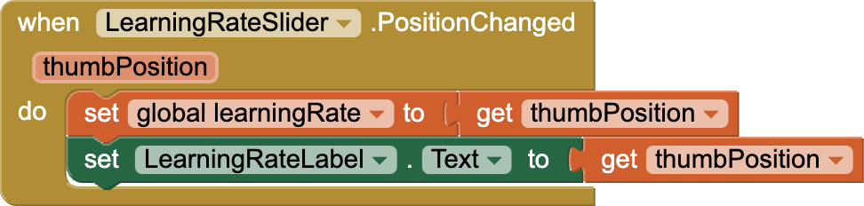{:.enlargeImage}

<hint markdown="block" title="Explanation">
 The variable <strong><em>learningRate</em></strong> is set to the <strong><em>thumbPosition</em></strong> of the slider, and the associated label is updated to report this value in the UI.
</hint>
 

## Reset Button

In this code, see if you can explain what happens when the Reset button is clicked.

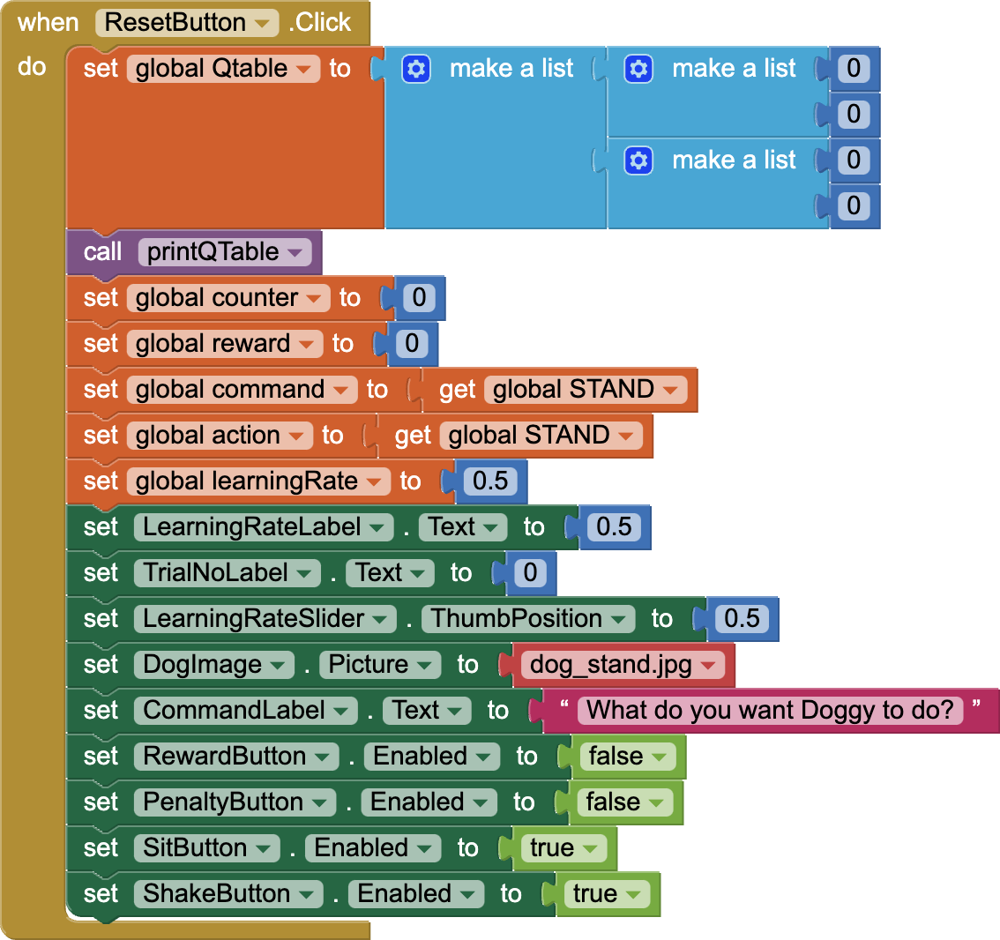{:.enlargeImage}

<hint markdown="block" title="Explanation">

* <strong><em>Qtable</em></strong> entries are re-initialized to 0’s, and these values are displayed via the <strong>printQTable</strong> procedure on the UI. 
* The variables <strong><em>counter</em></strong> and <strong><em>reward</em></strong> are set to 0, and the variables <strong><em>command</em></strong> and <strong><em>action</em></strong> are also initialized to <strong><em>STAND</em></strong> (or the number 0). 
* <strong><em>learningRate</em></strong> and its label are re-initialized to 0.5, as is the <strong>LearningRateSlider.ThumbPosition</strong>. 
* The dog’s image is set to the “standing” image. 
* <strong>RewardButton</strong> and <strong>PenaltyButton</strong> are both disabled, and the <strong>SitButton</strong> and <strong>ShakeButton</strong> are enabled. 

Everything resets to what it was before the training started.
</hint>
 

## Sit Button and Shake Button

Study this code. Can you explain what happens when the Sit button is clicked. You will shortly see what the procedures <strong>chooseAction</strong> and <strong>showDogAction</strong> do. Notice how the <strong><em>counter</em></strong> variable is updated when this button is clicked.

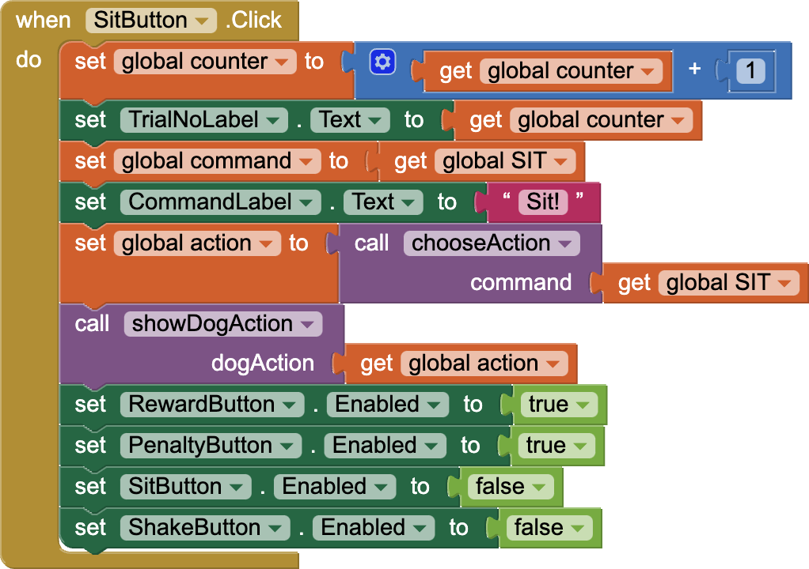{:.enlargeImage}

Next, use the above code to program the <strong>whenShakeButton.Click</strong> event handler. You can do much with copy/paste (CTRL-C/CTRL-V) and a few minor edits.

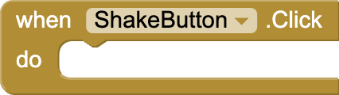

<hint markdown="block" title="Possible Solution">

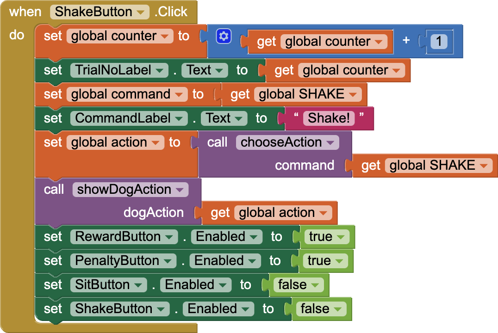{:.enlargeImage}
</hint>
 

## Procedure findMaxAction

Now, define the procedure <strong>findMaxAction</strong>. This procedure uses the Q-Table to decide how to act optimally given a user command. 

* If the dog is given the command “Sit!” then it should look at the first row of the Q-Table and take an action based on the higher Q-value in either cell of the first row.  

* If the dog is given the command “Shake!” then it should look at the second row of the Q-Table and take an action based on the higher Q-value in either cell of the second row. 

For example, say the Q-Table at that point in the training looked like this:

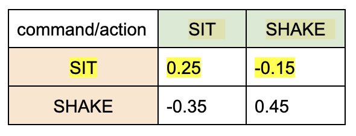{:.enlargeImage} 

and the user gives the command “Sit!” You would examine the <em>first</em> row of the matrix and see that the value at the first cell is 0.25, which is larger than -0.15. So the optimal action for the dog, according to the Q-Table, is to sit.

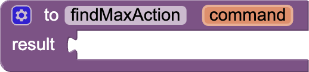{:.enlargeImage}

<hint markdown="block" title="Possible Solution">

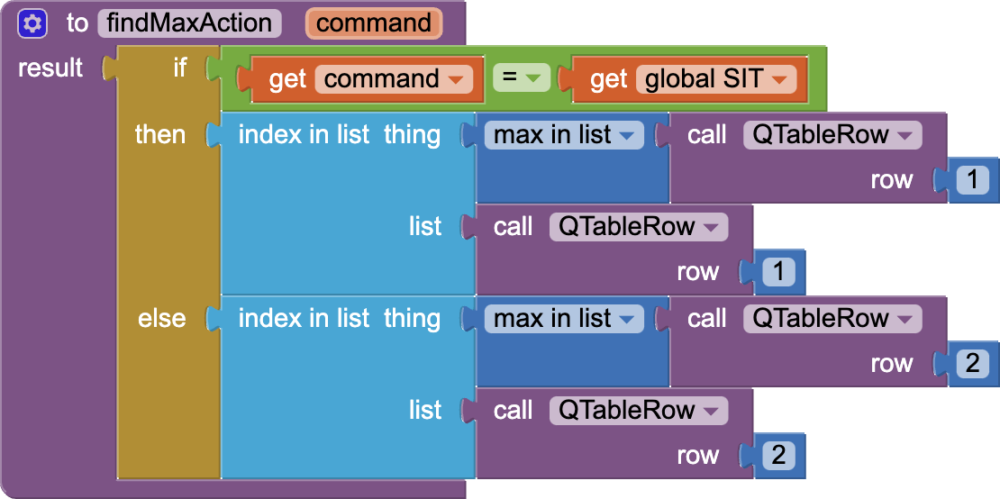{:.enlargeImage}

<strong>Note</strong>: the block <strong>max in list</strong> is in the Math blocks, selectable under the menu of <strong>arithmetic mean (average)</strong> block.

Observe that the procedure will return the column index corresponding to the higher Q-value, either 1 (<strong><em>SIT</em></strong>) or 2 (<strong><em>SHAKE</em></strong>). This is why we wanted to define the variables <strong><em>SIT</em></strong> and <strong><em>SHAKE</em></strong> as numbers 1 and 2 rather than as text.

</hint>
 

## Procedure chooseAction

Now, define the <strong>chooseAction</strong> procedure. This procedure will determine how the dog acts based on the user's command. 

There are many ways to define this procedure. For starters, you can try the following simplistic scheme: for the first 10 trials, assume that the dog is clueless and only <em>randomly</em> sits or shakes hands whatever commands are given. That is, it takes a while for the dog to realize that the commands and the rewards following its actions are somehow related to each other.   

After that, the dog wisens up, starts paying attention to the memory of its training, and acts according to the optimal action dictated by its Q-Table. This optimal action will be decided by the procedure <strong>findMaxAction</strong>.

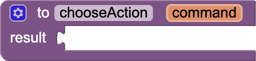{:.enlargeImage}

<hint markdown="block" title="Possible Solution">

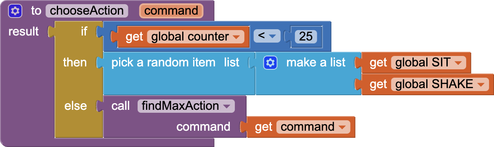{:.enlargeImage}

<strong>Note</strong>: In the extensions of this project, you can try more advanced approaches to defining this procedure.
</hint>
 

## Procedure showDogAction

The following procedure determines which image of the dog to display based on the dog's action. Double-check your understanding of it.

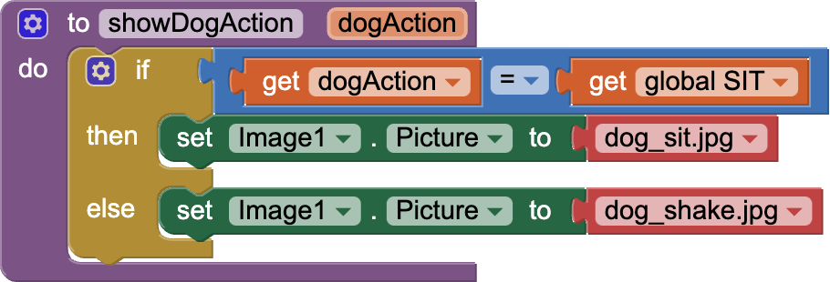{:.enlargeImage}

## Reward Button and Penalty Button

The following code shows what happens when the user gives a command, the dog performs the right action, and the user gives the dog feedback with the Reward button. 

First, the variable <strong><em>reward</em></strong> is set to +1. (For the Penalty button, the reward value will be -1). Then, based on a computation (covered soon!), the app updates the Q-Table and displays the updated Q-Table in the User Interface. The <strong>RewardButton</strong> and the <strong>PenaltyButton</strong> then must be disabled, and the <strong>SitButton</strong> and <strong>ShakeButton</strong> must be enabled so the training process can start again.

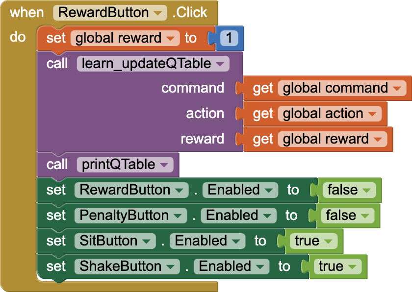{:.enlargeImage}

Now using the <strong>RewardButton</strong> as a reference, code the when <strong>PenaltyButton.Click</strong> event handler. Again, you can use copy/paste for this.

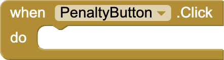{:.enlargeImage}

<hint markdown="block" title="Possible Solution">

{:.enlargeImage}
</hint>
 

## Procedure printQTable

The following procedure prints/displays the Q-Table's current state by copying the <strong><em>Qtable</em></strong> variable's contents in each row and column to the appropriate labels in the User Interface.

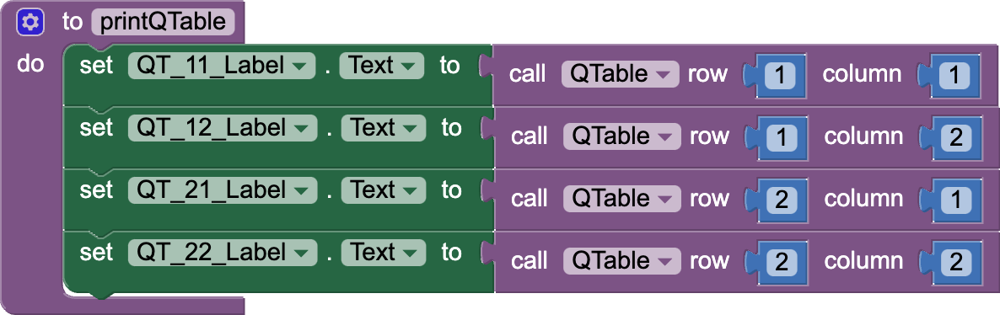{:.enlargeImage}

## Updating the Q-Table

Now, it is time to understand the critical formula in RL: how to update Q-Table values when the user gives a command (c), the dog performs an action (a) and the user gives the dog feedback (reward: +1 or penalty: -1) based on the action.

Q(c,a) is the Q-Table value for a given user command (c) and dog action (a). (Remember, the commands are in the rows, and the actions are in the columns) The formula below shows how to update the value Q(c,a):

{:.enlargeImage}

Where α: Learning Rate

To understand this formula, study the diagram below:

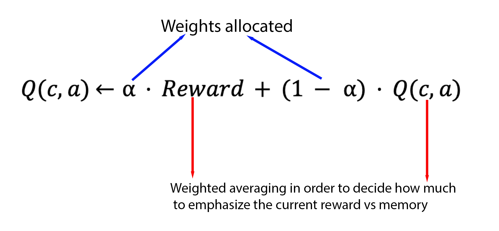{:.enlargeImage}

The new Q-value will be a <em>weighted average</em> of the current Reward (i.e. +1 or -1) and the existing Q-value, which represents the memory of the training so far. The formula decides how much to emphasize the current Reward versus the memory of the training so far using weights  α (the learning rate) and 1-α (the complement of the learning rate).

For example, if the learning rate is 100% (i.e. the dog learns perfectly and immediately), then α = 1 and (1-α) = 0, so the new Q value is exactly equal to the value of the current reward (+1 or -1). In contrast, if the learning rate is 0% (i.e. the dog does not learn anything at all), then α=0 and (1-α)=1, the new Q value is equal to the existing Q value, and nothing changes.

Here is another example:
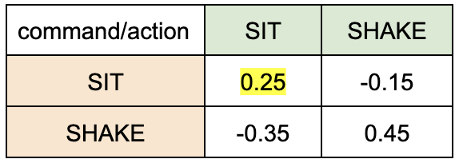{:.enlargeImage}

Assuming the Q-Table above, if the learning rate is 0.7 (70%), the command was “Sit!”, and the dog responded by sitting, then the new Q-value at Q[1,1] is computed by

Q[1,1]  = 0.7X(+1)+(1-0.7)X<strong>0.25</strong>  = 0.7X(+1)+0.3X<strong>0.25</strong> = 0.775

Now code this procedure based on what you learned about how to revise the Q-Table:

{:.enlargeImage}

<hint markdown="block" title="Possible Solution">

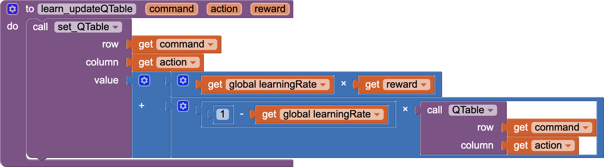{:.enlargeImage}

To make the addition block and <strong>QTable(row,column)</strong> block look more compact, right-click on these blocks and select “External Inputs”. This formatting change will align the parameters vertically rather than horizontally.
</hint>
 

## Test
Now test your app by scanning the QR Code generated via your AI2 Companion.

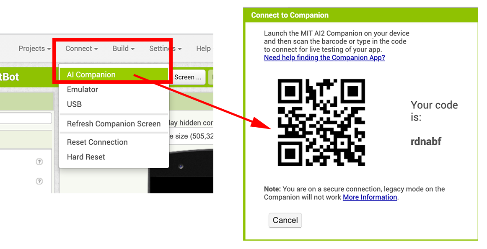{:.enlargeImage}

Test everything thoroughly and see if the dog is learning according to its learning rate after the first 10 random responses.  Be sure to try different learning rates (for example: 0.00, 0.25, 0.50, 0.75, 1.0) for the dog and see that the learning results are in accordance with these different learning rate values.

Congratulations! You have coded your first AI Reinforcement Learning (RL) project.

# Expand Your App

## Further Explorations

Once you train the dog correctly, can you then “untrain” the dog to always perform the wrong actions?

## Further Explorations

Can you include a learning graph showing the cumulative percentages of correct actions? You can use the graphing component <strong>Chart1</strong> already placed in the UI by making it visible.  Please note that you may need to scroll down in the UI to see the chart.

## Further Explorations

Incorporate a new parameter called “Memory Responsiveness”, which would measure how responsive the dog is to the memory of its training. Most animals (and people) take a while before they start paying attention to the memories of their training. These memories need to reach a high enough threshold of pain and pleasure for them to start understanding what their training is trying to teach and thus how to act appropriately. 

Revise the procedure <strong>chooseAction</strong> based on this new parameter. For example, you now can let this parameter decide when the dog will stop acting randomly. Initially, we arbitrarily chose this to be the first 10 trials. However, this new parameter should allow you to revise the procedure so it more naturally guides the decision process based on when the Q-Table values start becoming significant. 

In the UI, make visible the Horizontal Arrangements 3 and 4 containing this slider. 

Note that if the dog is <em>very responsive</em> to its memory, then even <em>very small</em> Q-values (close to 0) will prompt the dog to act according to its training. If the dog is <em>not responsive</em> to its memory, then even <em>large</em> Q values (close to +1 or -1) will not allow the dog to rely on its memory. Below is a possible adjustment to the <strong>chooseAction</strong> procedure that considers the dog's memory responsiveness.

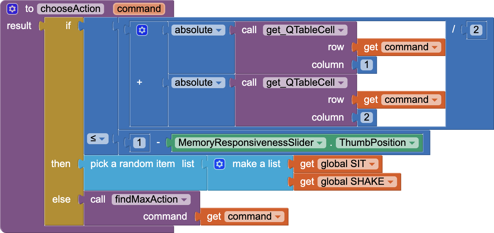{:.enlargeImage}

## Further Explorations
How would this project change if there were not two, but three commands?

“Sit!”, “Shake!”, and “Roll!”

Implement this new version by revising the UI and the code.

What other awesome ideas do you have?

