# Challenge

MIT App Inventor ImageBot Tutorial: Imagine, Articulate, Generate

Have you ever wondered how to create your own generative AI app for wildly imaginative visualizations? In this tutorial, you will build a simple app with MIT App Inventor that allows users to connect to OpenAI’s DALL-E generative AI program, submit their own prompts, and see the result in exciting artistic visions from the AI.

<!---->
# Setup

## Getting your own OpenAI API Key

For this project you will need to get your own OpenAI API key to use MIT App Inventor’s <strong>ChatBot</strong> component.  As of the writing of this tutorial, OpenAI allows users 13 years old and older to create their own OpenAI accounts and generate their own OpenAI API keys. For the first 3 months, you are given a $5 free credit which should get you quite a bit of exploration time. After 3 months, any unused portion of the credit expires. Once your free credit is gone, you will need to become a paying customer with a credit card.  Follow the steps below to create your OpenAI account and get your OpenAI API key.

Follow the steps below to create you OpenAI account and get your OpenAI API key.

1. Go to <a href="https://openai.com/" target="_blank">https://openai.com/ </a>
    
2. Click on the <strong>Login</strong> button on  the upper right, then click <strong>Sign up</strong> option.

    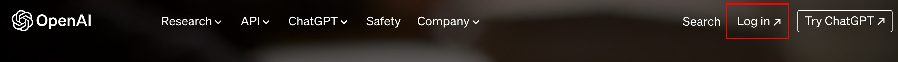{:.enlargeImage}
    

3. Create your account by entering your email and choosing a password.  You can also sign up using your Google, Microsoft and Apple accounts.

    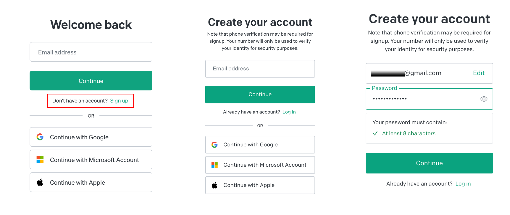{:.enlargeImage}
    

4. You will need to verify your e-mail and phone number during the signup process.

5. To get your personal OpenAI API  key go to <a href="https://platform.openai.com/account/api-keys" target="_blank">https://platform.openai.com/account/api-keys </a>
 
6. Click on the  API keys tab and the Create new secret key button.

    {:.enlargeImage}
    

7. Give your key a name if you wish.  This step is optional.

    {:.enlargeImage}
    

8. Copy and save your API key somewhere safe on your computer.  You will need it while doing the project.

9. During the ImageBot project, when you add your <strong>ImageBot</strong> component, you will need to copy-paste your OpenAI API key in the <strong>ImageBot</strong> property <em>ApiKey</em>.

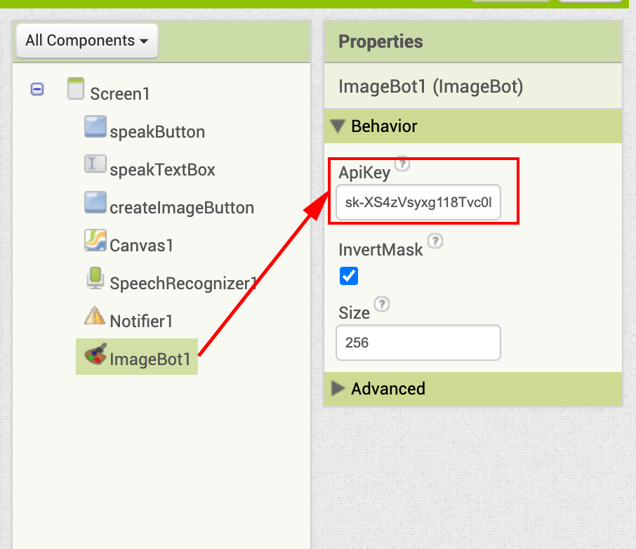{:.enlargeImage}

## Updating AI2 Companion

If you have not done so, please upgrade your AI2 Companion to version 2.67 or higher.

# Simple ImageBot Tutorial

## Overview

In this project you are going to learn how to build an app that can access a generative AI tool like DALL-E and create wildly imaginative visuals based on user input.

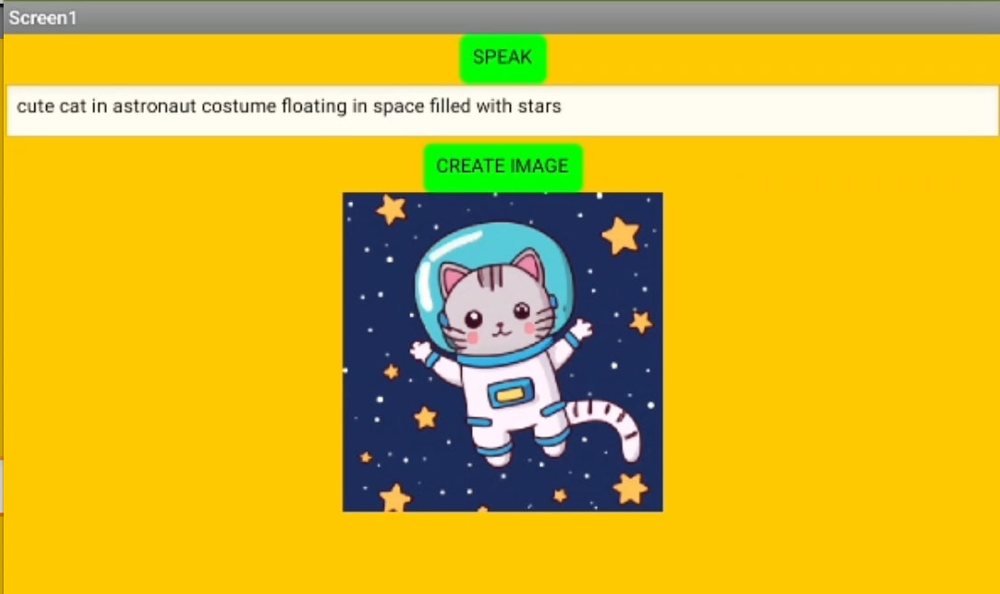{:.enlargeImage}

## The Graphical User Interface (GUI)

In this project you are given a GUI that is almost completed.

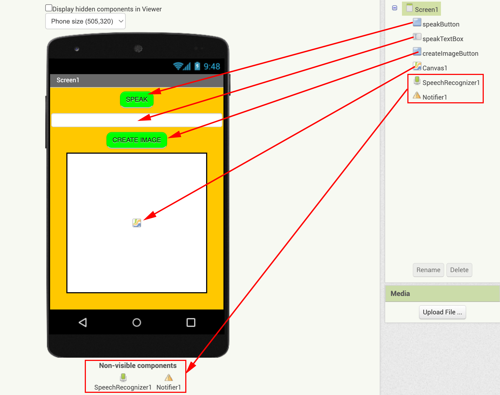{:.enlargeImage}

What do you think is the function of each component? Hopefully many of the components will be self-explanatory.

Now from the <strong>Experimental</strong> drawer drag and drop a <strong>ImageBot</strong> component.

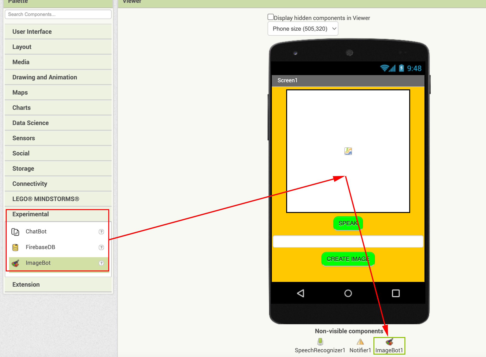{:.enlargeImage}

## Adding your OpenAI API Key

Now you are ready to copy paste your OpenAI API key you generated during the Setup phase into the <strong>ImageBot</strong> property <em>ApiKey</em>. Your key will be different than what you partially see below.  If you do not generate and use your own OpenAI API Key, the number of queries you can send to OpenAI will be limited.

{:.enlargeImage}

## Getting Users’ Prompt Input

Now click on the Blocks button to start the coding to give functionality to your components.

{:.enlargeImage}

Start by coding the <strong>speakButton</strong>.

When <strong>speakButton</strong> is clicked, call the <strong>SpeechRecognizer</strong> to get the text of the speech

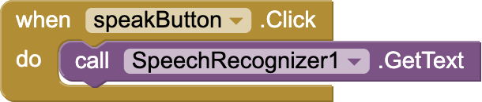{:.enlargeImage}

When the <strong>SpeechRecognizer</strong> returns with the text of the speech, paste this text to the <strong>TextBox</strong>.

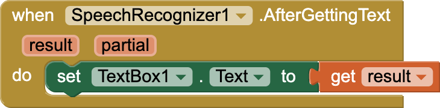{:.enlargeImage}

## Communicating with DALL-E

When the <strong>createImageButton</strong> is clicked:
* Check to make sure that the <strong>TextBox</strong> is not empty, if so
    * Call the <strong>Notifier</strong> to show a progress dialogue to notify the user that their image is being generated.
    * Call the <strong>ImageBot</strong> to send the description entered by the user to be sent to OpenAI DALL-E to create an image.

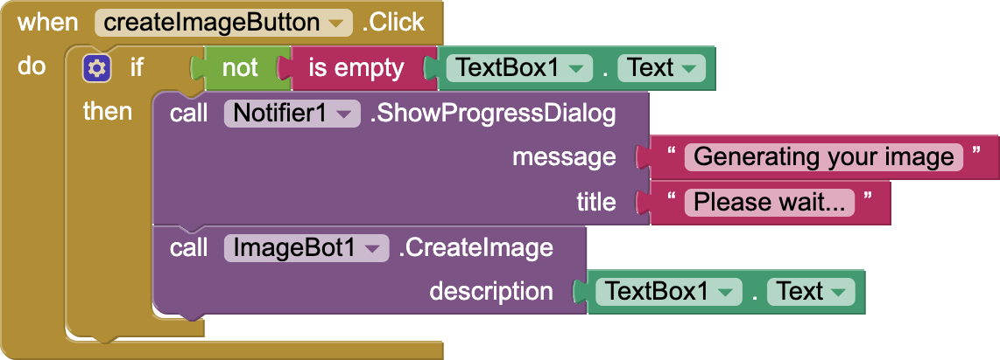{:.enlargeImage}

When <strong>ImageBot</strong> returns with an image:
* Dismiss the <strong>Notifier</strong> progress dialogue.
* Paste the image to the <strong>Canvas</strong>.

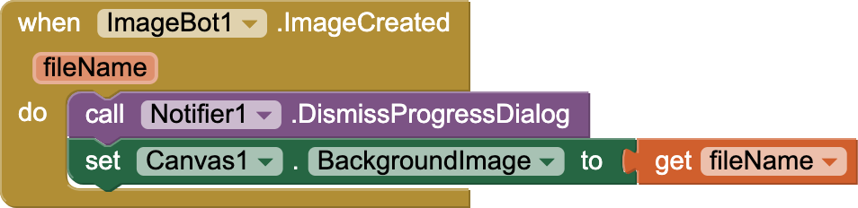{:.enlargeImage}

## Testing the app

Now test your app by scanning the QR Code generated via your AI2 Companion.  
{:.enlargeImage}

Now test your app by speaking a prompt, generating an image.  Try to break it by testing different possibilities of button presses. If any issues are found, revisit your code and make the necessary revisions.

Please note that unless you use your own OpenAI API key, the number of queries you can make to DALL-E is limited.
 
Congratulations — you have just created a powerful app that can generate creative images from user prompts.

# Expand Your App

* If you have not done so already, get your own OpenAI API key so the number of  image generations you can have with the ImageBot is not limited.

* Learn about Large Language Models (LLM) and how they are able to generate images from user’s prompts.  Research artistic generative AI programs like DALL-E to catch a glimpse of how they are trained and how they operate.

* Have a way  for the user to select the image resolution they wish for the image generated.  256, 512 or 1024.

* Create a  share button that allows the image to be shared on social media or via email.

* Create a version of your app in which users can save their favorite image in an image gallery.

* Create a UI that allows users to draw over generated images and share these.

* Create a program that uses ChatGPT to generate a story from user input and then uses DALL-E to generate the visuals that go with the story.

* Play a game where you separate the prompts from their generated images and see if people can guess which goes with which.

* Organize a visual arts competition (in your class, school, district) to see who can create the best images.

* What other awesome ideas do you have?

# About Youth Mobile Power
A lot of us spend all day on our phones, hooked on our favorite apps. We keep typing and swiping, even when we know the risks phones can pose to our attention, privacy, and even our safety.  But the computers in our pockets also create untapped opportunities for young people to learn, connect and transform our communities.

That’s why MIT and YR Media teamed up to launch the Youth Mobile Power series. YR teens produce stories highlighting how young people use their phones in surprising and powerful ways. Meanwhile, the team at MIT is continually enhancing MIT App Inventor to make it possible for users like you to create apps like the ones featured in YR’s reporting.

Essentially: Get inspired by the story, get busy making your own app!
 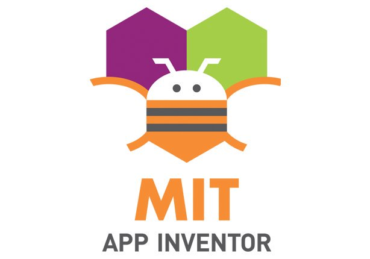

 The YR + MIT collaboration is supported in part by the National Science Foundation. This material is based upon work supported by the National Science Foundation under Grant No. (1906895, 1906636). Any opinions, findings and conclusions or recommendations expressed in this material are those of the author(s) and do not necessarily reflect the views of the National Science Foundation.

 Check out more apps and interactive news content created by YR <a href="https://yr.media/category/interactive/" target="_blank">here</a>.

