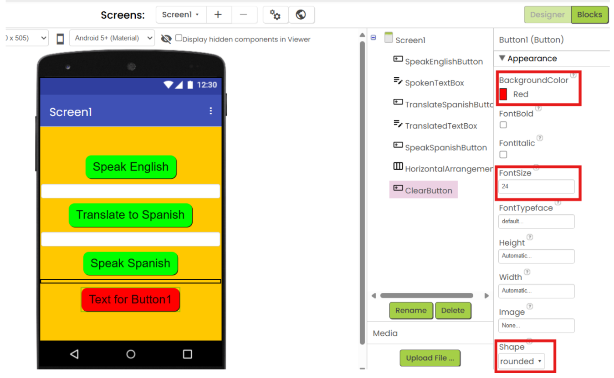
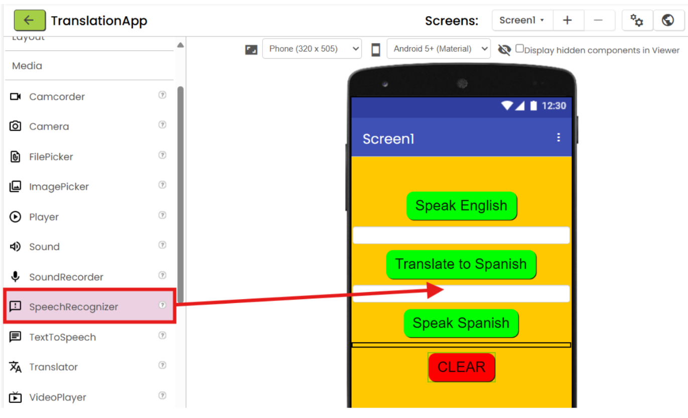
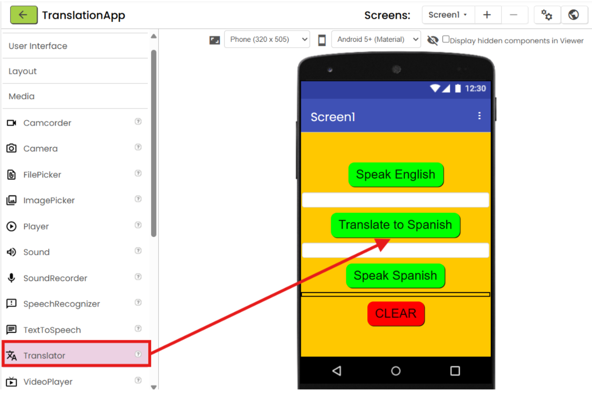
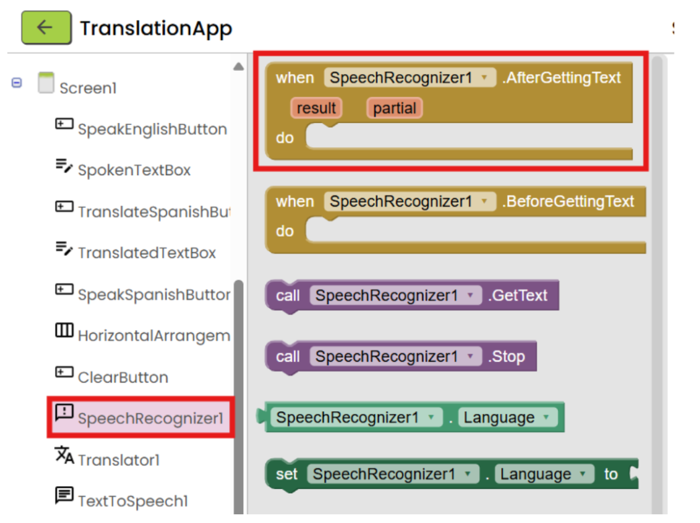

# Challenge

The Translation App allows users to translate from English to Spanish. The user speaks into the translator and the app provides both a text translation and an audio translation.

{:.enlargeImage}

# Setup

## Getting Started

If you need help getting started and set up with App Inventor please visit our <a href="https://appinventor.mit.edu/explore/ai2/setup" target="_blank">Setting Up App Inventor</a> page.

## Using the Neo Interface

For this tutorial, we will be using the App Inventor Neo Interface, which has a more modern look.

To switch to Neo Interface, go to your Projects space. On the top bar, click on "Settings", and select "User Interface Settings".

{:.enlargeImage}

Click on the "Neo" Interface, then click "OK".

{:.enlargeImage}

## Updating AI2 Companion

If you have not done so, please upgrade your AI2 Companion to version 2.69 or higher.

## Familiarizing Yourself With App Inventor Layout

The screen you are currently looking at is the "Design" Screen. On the left hand side of your screen (outlined in red) is the Palette, where there are drawers with components you can add to your app. In the center of the screen (outlined in green) is the Viewer, which is an empty phone screen where you will build the User Interface (UI) of your app. On the right side of the screen (outlined in blue) is the Properties window, you can edit specific aspects of each component you add to your app. Take a few minutes to explore the components within the drawers.

{:.enlargeImage}

# Translation Tutorial (Level: Beginner)

## Translation App User Interface (UI)

Start by changing the background color of your app. Select the Screen1 button and under properties, change its <em> Background Color </em> to a color of your choice.

{:.enlargeImage}

## SpeakEnglishButton UI

From the User Interface drawer, drag and drop a Button onto the phone screen in the middle.

{:.enlargeImage}

Under the Screen1 panel, select <strong> Button1 </strong>, click “Rename”, and rename it to <strong> SpeakEnglishButton </strong>.

{:.enlargeImage}

Under properties, set the <em> Background Color </em> of <strong> SpeakEnglishButton </strong> to green. Set the <em> Font Size </em> to “24”.

{:.enlargeImage}

Set the <em> Text </em> of <strong> SpeakEnglishButton </strong> to “Speak English”. Set the <em> Shape </em> to “rounded”.

{:.enlargeImage}

Under “Screen1”, set <em> AlignHorizontal </em> to “Center : 3” and <em> AlignVertical </em> to “Center : 2”.

{:.enlargeImage}

## SpokenTextBox UI

In the User Interface drawer, drag and drop a <strong> TextBox </strong> beneath your <strong> SpeakEnglishButton </strong>.

{:.enlargeImage}

Rename <strong>TextBox</strong> to <strong>SpokenTextBox</strong>.

{:.enlargeImage}

Set the <em> BackgroundColor </em> to “White”. Set the <em> FontSize </em> to “24”. Set the <em> Width </em> to “Fill Parent”.

{:.enlargeImage}

Check the box for <em> MultiLine </em>.

{:.enlargeImage}

## TranslateSpanish Button UI

Drag a <strong>Button</strong> onto the screen below <strong>SpokenTextBox</strong>.

{:.enlargeImage}

Rename <strong>Button1</strong> to <strong>TranslateSpanishButton</strong>.

{:.enlargeImage}

Set <em>BackgroundColor</em> to “Green”. Set <em>FontSize</em> to “24”. Change the <em>Shape</em> to “rounded”.

{:.enlargeImage}

Change <em>Text</em> to “Translate to Spanish”.

{:.enlargeImage}

## TranslatedTextBox UI

Drag and drop a <strong>TextBox</strong> onto the screen below <strong>TranslateSpanishButton</strong>.

{:.enlargeImage}

Rename <strong> TextBox1 </strong> to <strong> TranslatedTextBox </strong>.

{:.enlargeImage}

Set the <em> BackgroundColor </em> to “White”. Set the <em> FontSize </em> to “24”. Set the <em> Width </em> to “Fill Parent”.

{:.enlargeImage}

Check the box for <em> MultiLine </em> .

{:.enlargeImage}

## SpeakSpanishButton UI

Drag and drop a third <strong> Button </strong> onto the screen below <strong> TranslatedTextBox </strong>.

{:.enlargeImage}

Rename <strong> Button1 </strong> to <strong> SpeakSpanishButton </strong>.

{:.enlargeImage}

Set <em> BackgroundColor </em> to “Green”. Set <em> FontSize </em> to “24”. Set <em> Shape </em> to “rounded”.

{:.enlargeImage}

Set the <em> Text </em> to “Speak Spanish”.

{:.enlargeImage}

## ClearButton UI

From the Layout drawer, drag and drop a <strong> HorizontalArrangement </strong> onto the screen.

{:.enlargeImage}

This <strong> HorizontalArrangement </strong> is to create space between two Buttons. Therefore, set the <em> Height </em> to “5”, the <em> Width </em> to “Fill Parent”, and the <em> BackgroundColor </em> to “None”.

{:.enlargeImage}

Back in the User Interface drawer, drag and drop a <strong> Button </strong> below the <strong> HorizontalArrangement</strong>.

{:.enlargeImage}

Rename <strong> Button1 </strong> to <strong> ClearButton </strong>.

{:.enlargeImage}

Set <em> BackgroundColor </em> to “Red”. Set <em> FontSize </em> to “24”. Set <em> Shape </em> to “rounded”.

{:.enlargeImage}

Set <em> Text </em> to “CLEAR”.

{:.enlargeImage}

## Adding Non-visible Components

In the Media drawer, drag and drop a <strong> SpeechRecognizer </strong> component onto the screen.

{:.enlargeImage}

<strong> SpeechRecognizer </strong> is a Non-visible component, so it will appear beneath the phone screen.

{:.enlargeImage}

In the Media drawer, drag and drop a <strong> Translator </strong> component onto your screen.

{:.enlargeImage}

<strong> Translator </strong> is also a Non-visible component and will appear alongside <strong> SpeechRecognizer1 </strong> below the phone.

{:.enlargeImage}

Also in the Media drawer, drag and drop a <strong> TextToSpeech </strong> component onto the screen.

{:.enlargeImage}

<strong> TextToSpeech </strong> is also a Non-visible component and will appear below the phone screen alongside <strong> SpeechRecognizer1 </strong> and <strong> Translator1 </strong>.

{:.enlargeImage}

In the properties of <strong> TextToSpeech1 </strong>, set <em> Country </em> to “ESP”. ESP is the three letter code representing the country España (Spain). Set <em> Language </em> to “es”, representing Spanish.

{:.enlargeImage}

In the top right corner, select the “Blocks” button. This will take you to the Blocks screen where you will code the functionality of your app.

{:.enlargeImage}

## Translation App Code

On the left hand side of your screen, you will see the drawers of the blocks you will use to code your app. The rest of the screen is your workspace.

{:.enlargeImage}

## SpeakEnglishButton Code

On the left side of your screen, under <strong> SpeakEnglishButton </strong>, drag and drop the “when SpeakEnglishButton.Click” into your workspace.

{:.enlargeImage}

Under <strong> SpeechRecognizer1</strong>, select “call SpeechRecognizer1.GetText”. Click this block into the “when SpeakEnglishButton.Click” block.

{:.enlargeImage}

## SpeechRecognizer Get Text

From <strong> SpeechRecognizer1</strong>, drag and drop “when SpeechRecognizer1.AfterGettingText” into your workspace.

{:.enlargeImage}

Under <strong> SpokenTextBox</strong>, get the “set SpokenTextBox.Text to” block and drag it into your workspace. Click that into the “when SpeechRecognizer1.AfterGettingText” block.

{:.enlargeImage}

Hover over “result” and grab the “get result” block. Snap that into the “set SpokenTextBox.Text to” block.

{:.enlargeImage}

## TranslateSpanishButton Code

Under <strong> TranslateSpanishButton</strong>, drag and drop the “when TranslateSpanishButton.Click” block into your workspace.

{:.enlargeImage}

Under <strong> Translator1 </strong>, select the “call Translator1.RequestTranslation” block and click it into the “when TranslateSpanishButton.Click” block.

{:.enlargeImage}

In the Built-in drawer, under Text, drag and drop an empty text block into the “languageToTranslateTo” socket of the “call Translator1.RequestTranslation” block.

{:.enlargeImage}

In the empty text block, type “en-es”, which signifies English to Spanish using the two letter language codes.

{:.enlargeImage}

Under <strong> SpokenTextBox </strong>, drag and drop the “SpokenTextBox.Text” block into your workspace and click it into the “textToTranslate” socket of the “call Translator1.RequestTranslation” block.

{:.enlargeImage}

## Got Translation Code

Under <strong> Translator1 </strong>, drag and drop the “when Translator1.GotTranslation” block into your workspace.

{:.enlargeImage}

Under <strong> TranslatedTextBox </strong>, drag and drop the “set TranslatedTextBox.Text to” block and click it into the “when Translator1.GotTranslation” block.

{:.enlargeImage}

Hover over “translation” in the “when Translator1.GetTranslation” block, and drag and drop the “get translation” block into the “set TranslatedTextBox.Text to” socket.

{:.enlargeImage}

## SpeakSpanishButton Code

Under <strong> SpeakSpanishButton</strong>, drag and drop the “when SpeakSpanishButton.Click” block into your workspace.

{:.enlargeImage}

Under <strong> TextToSpeech1</strong>, drag and drop the “call TextToSpeech1.Speak” block into your workspace and click it into the “when SpeakSpanishButton.Click” block.

{:.enlargeImage}

Under <strong> TranslatedTextBox</strong>, select the “TranslatedTextBox.Text” block and click it into the “message” socket on the “call TextToSpeech1.Speak” block.

{:.enlargeImage}

## ClearButton Code

Under <strong> ClearButton </strong>, drag and drop the “when ClearButton.Click” block into your workspace.

{:.enlargeImage}

Under <strong> SpokenTextBox </strong>, drag and drop the “set SpokenTextBox.Text” block into the “when ClearButton.Click” block.

{:.enlargeImage}

Under <strong> TranslatedTextBox </strong>, drag and drop the “set TranslatedTextBox.Text” block into the “when ClearButton.Click” block.

{:.enlargeImage}

Under Text, drag and drop an empty text block into the socket of “set SpokenTextBox.Text to” and into the socket of “set TranslatedTextBox.Text to”.

{:.enlargeImage}

## Congratulations!

Congrats! You have finished coding the functionality of your Translation App. Here is what your block code should look like.

{:.enlargeImage}

## Pairing your Companion

You now have completed your Translation App and it is time to test it out! Make sure you have the App Inventor Companion app downloaded on your mobile device. To connect your mobile device, click the “Connect” button in the top center, then select “AI Companion”.

{:.enlargeImage}

A QR code should appear on your screen.  Open the App Inventor app on your mobile device and click “scan QR code”. Your app should appear on your mobile device. Time to use your app!

# Expand Your App

Here are some ideas of how you can expand your app:

* Change the languages you are translating between.
* Provide the user with a list of languages to translate from and to.
* Allow the user to enter what languages they want to translate between.
* See what other ideas you can come up with! There are countless ways to expand and improve your app.
