# Challenge

In this project, you are challenged to create an AI-based creative camera app. You will be making a facial filter from scratch, similar to the ones you may have played with on Instagram or Snapchat. 

Our friends at YR Media have <a href="https://interactive.yr.media/erase-your-face/" target="_blank"> this interesting article </a> about the implications of facial recognition technology. In this tutorial, we will not be using facial recognition, but facial landmark detection. The difference is that we are not identifying people, but purely identifying geometric shapes. It is worth nothing that we do not store any unique facial representation. 

You have two options: you can choose between the cute cat seen in the GIF above, or a fierce lion. You’ll be using AI to change human faces into cat or lion faces! 
Once you’ve mastered the basics, feel free to get your creative juices flowing and expand “Facemesh Filter Camera” to any character camera of your choosing.

If you haven’t set up your computer and mobile device for App Inventor, go to the “Setup your Computer” tab to set up your system. Otherwise, go directly to the “Facemesh Filter Camera” tab to start the tutorial.

# Setup your computer

# Facemesh Filter Camera (Level: Intermediate)

## Introduction

Have you taken photos with facial filters? Instagram and Snapchat facial filters have taken the internet by storm, but do you know how these filters work? Would you like to make your own facial filters?

In this project you will learn how to use a new AI technology called FaceMesh; it is a model trained by Google and available to the public. 
<hint markdown="block" title="What is a model?"> 

A model represents how a computer thinks. It can be considered an artificial “brain”. For example, when you see a face, your brain will quickly make a decision about where the eyes are. Similarly, the Facemesh model takes in a photo of a face and makes a decision about where the eyes are. A brain’s decision-making process is in the field of cognitive science; a computer’s decision-making process is in the field of Artificial Intelligence. 

Models are quite complicated and involve a lot of math. The level of math you need to understand the processes is at the university level, but do not worry! You do not need to fully understand the process to be able to benefit from it!
</hint>

The FaceMesh model takes in the image of your face and give you the specific location of many different facial features, such as where your nose, forehead, or mouth is. Using such information, you can create facial filters; these are essentially images that follow specific points on your face.

To access the Facemesh model, you will use the FaceExtension, which is an App Inventor tool that acts as a bridge to empower you to use the model in your own mobile app. The end result of this project will be your own filter camera! You can use this app to take creative photos like the ones above and share them with your friends. 

 
**Important**: Please note that for this project you cannot use the Emulator to test your app as the Emulator cannot run MIT App Inventor extensions such as the PoseNet Extension.  To make sure that your mobile device has the needed hardware capability for PoseNet, use AI2 Companion on <a href="../aiaFiles/facemesh/Facemesh_TestProject.aia" target="_blank">this .aia </a>test file.

## Graphical User Interface (GUI)

A possible GUI has been created for you in the starter file. Please do not rename the components, as this tutorial will refer to the given names in the instructions.

Feel free to click on any images in the tutorial for a magnified view.

{:.enlargeImage}

The <strong>TakePhotoButton</strong>  allows the user to take a photo. The <strong>SharePhotoButton</strong>  allows the user to share the most recently taken photo using any photo-sharing app installed on the phone.

The <strong>FaceExtension</strong> is the AI technology that we will be using to track key points of a face and which will give you the information needed to create the facial filter. It requires a web browser to run, so we link it the <strong>WebViewer</strong> component. The <strong>Webviewer’s</strong> visibility is turned off (despite what the name suggests) because we use the <strong>Canvas</strong> as our viewer. The <strong>Canvas</strong> component will show the live camera view background as well as the cat/lion facial filter. 

The dimensions of the <strong>WebViewer</strong> component,the <strong>Canvas</strong> component, and the <strong>FaceExtension</strong> must match in order to facilitate face tracking. If you change the default values of the height and width for any one of the <strong>Webviewer</strong>, the <strong>Canvas</strong>, or the <strong>FaceExtension</strong> components, make sure that you change it identically for all three of them.

Finally, the <strong>Sharing</strong> component is a social component that allows you to share the photo file via another app on the phone such as Email and Messenger.

## Facemesh Key Points
The key points of the face tracked by Facemesh are: 
* forehead
* chin
* left cheek
* left eye bottom
* left eye inner corner
* left eye top
* left eyebrow
* left forehead
* left nose
* mouth top
* mouth bottom
* nose bottom
* right cheek
* right eye bottom
* right eye inner corner
* right eye top
* right eyebrow
* right forehead
* right nose. 

Actually, there are 486 points available for you to use via the AllPoints property, but that is more advanced and not needed in this particular tutorial. 

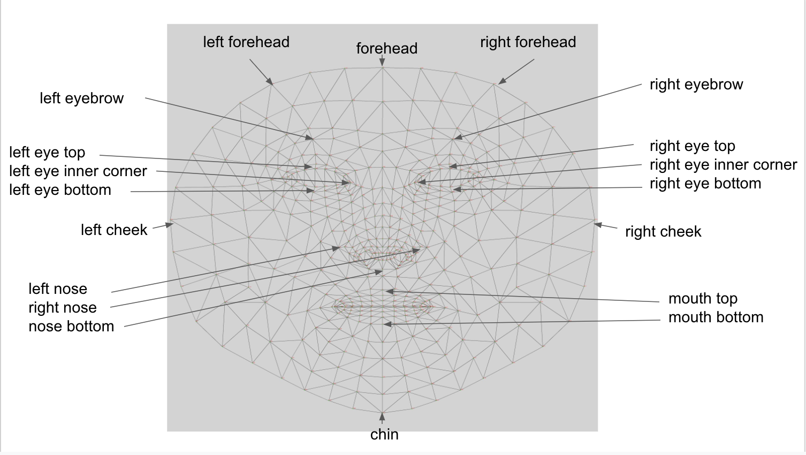{:.enlargeImage}

Each key point is returned as a list of two elements representing the x and y-coordinates. 

For example, the key point “forehead” will be a list of 2 elements: 

<strong>[forehead x-coord, forehead y-coord]</strong> 

When Facemesh is unable to track the entirety of a face, it will return an empty list so the filter will not work; make sure the face is within the camera frame!

## Choose a cat or a lion
Let's get right into our project! Right now, the canvas looks like it’s empty. This is because we haven’t set the “Picture” property for our <strong>leftEar</strong>, <strong>rightEar</strong>, and <strong>whiskers</strong> yet. 

First, decide if you would like to have a cat or a lion filter. Once you’ve decided, check out the Media, which has images for either option. 

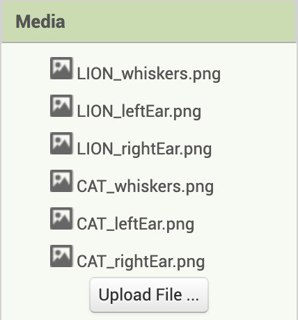{:.enlargeImage}

Now, click on “whiskers" in the components bar. You’ll notice that whiskers' properties will show up. If you’ve chosen a lion, set the Picture property for <strong>whiskers</strong> as LION_whiskers.png. If you’ve chosen a cat, you would want to set the Picture property for <strong>whiskers</strong> as CAT_whiskers.png. 

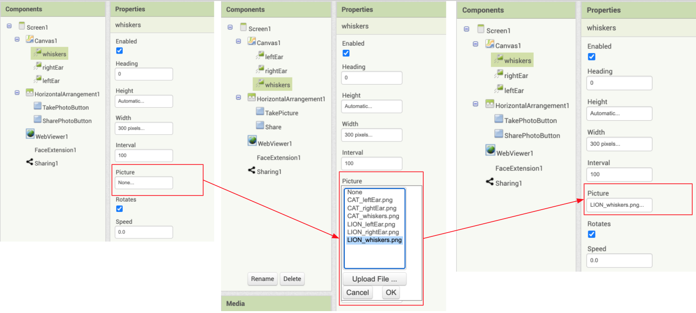{:.enlargeImage}

For example, if you’ve set the Picture property for <strong>whiskers</strong> as LION_whiskers.png, you should see the following change in the designer.

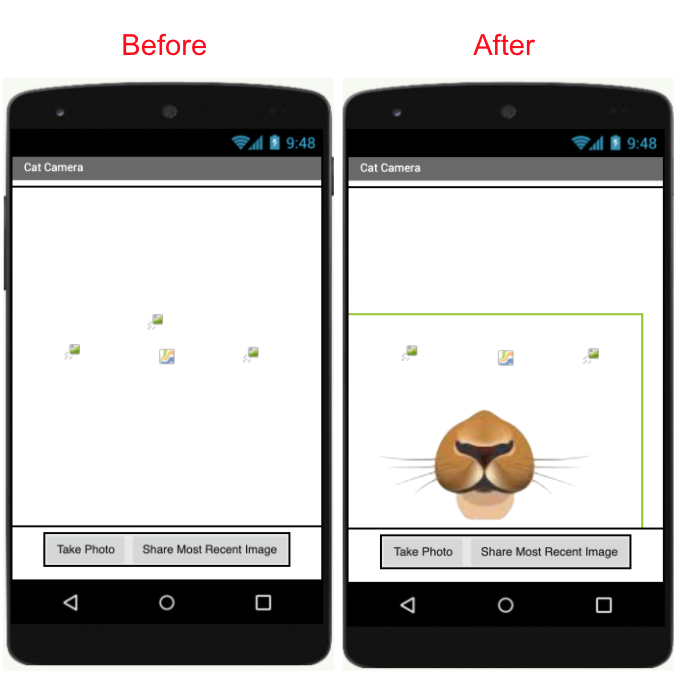{:.enlargeImage}

Repeat this process for the <strong>leftEar</strong> and <strong>rightEar</strong> images, selecting images for the animal of your choice. 

* If you’ve chosen a lion, set the Picture property for <strong>leftEar</strong> as LION_leftEar.png, and set the Picture property for <strong>rightEar</strong> as LION_rightEar.png. 
* If you’ve chosen a cat, set the Picture property for <strong>leftEar</strong> as CAT_leftEar.png, and set the Picture property for <strong>rightEar</strong> as CAT_rightEar.png.

Once you’ve finished setting the Picture property for all three of the <strong>leftEar</strong>, <strong>rightEar</strong>, and <strong>whiskers</strong>, your canvas should look something like one of the two following images.

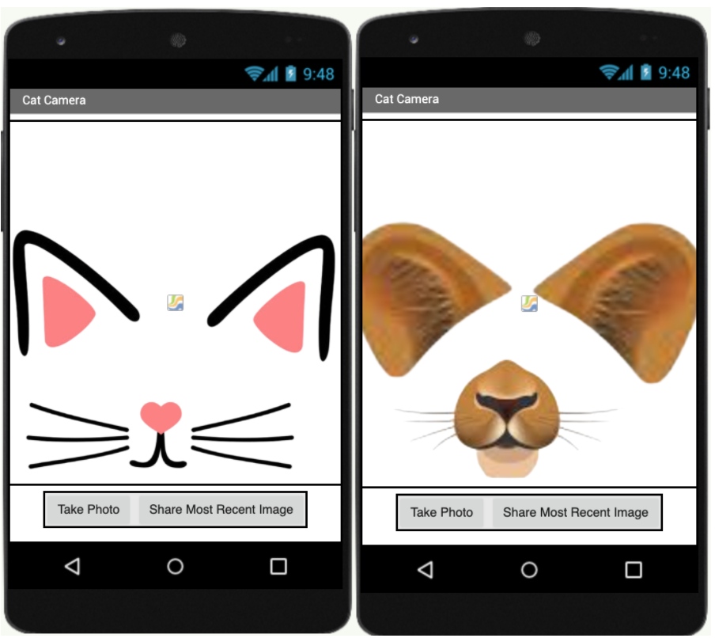{:.enlargeImage}

## Preliminary GUI Code
You are also given some code that makes the buttons work as expected. Check out the code blocks so you can have a general idea what they do.

{:.enlargeImage}
{:.enlargeImage}

Here we have two variables, <strong>photoCount</strong> and <strong>mostRecentPhoto</strong>. <strong>photoCount</strong> simply counts how many photos have been taken, and <strong>mostRecentPhoto</strong> stores the file name of the most recently taken photo. 

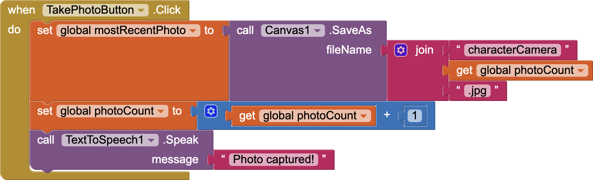{:.enlargeImage}

When you click the <strong>TakePhotoButton</strong>, the <strong>mostRecentPhoto</strong> file name is updated to be the current image, and the <strong>photoCount</strong> increases by 1. The first photo you take will be called ‘characterCamera1.jpg’ and the second photo will be called ‘characterCamera2.jpg’, etc. These files are all saved to your device. Depending on your device, you can find the photos wherever files are saved. For example, on a Google Pixel, the photos are saved to the “Files” app. 

The reason we keep track of <strong>photoCount</strong> and increment is by 1 is so that each picture file has a unique name. If we didn’t increment by 1, each photo you take would be writing to the same file over and over again. The reason we keep track of <strong>mostRecentPhoto</strong> is so that we can share this photo using the <strong>SharePhotoButton</strong>. 

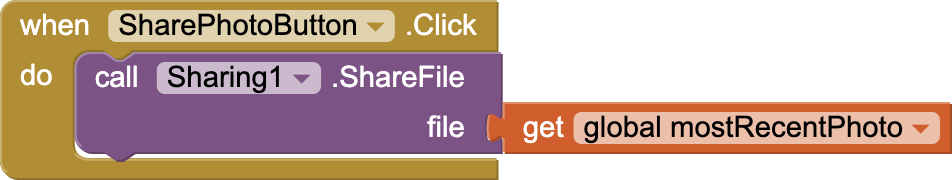{:.enlargeImage}

When you click the <strong>SharePhotoButton</strong>, you can share the most recent photo! You’ll be able to share it using any app installed on your device that shares images, such as Google Drive, Dropbox, etc.

## Helper function
Your first coding task is to fill in this helper function called placeImage. 

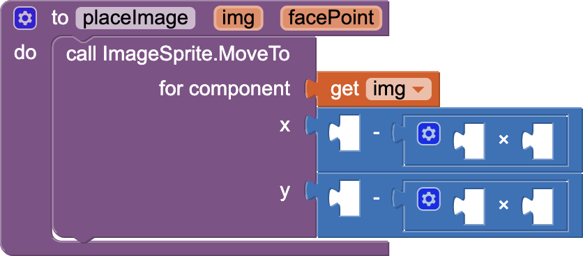{:.enlargeImage}

placeImage procedure takes in two arguments: img and facePoint. The result is that the center of img, the given image, will be placed on the facePoint, the key point tracked by Facemesh. You will fill in this procedure and use it to move the three images (<strong>leftEar</strong>, <strong>rightEar</strong>, and <strong>whiskers</strong>) to points on the face. 

<hint markdown="block" title="Why is this procedure necessary?">

In App Inventor, we can only move the ImageSprite by its top-left corner. By calling ImageSprite.MoveTo (x, y), we move the ImageSprite’s top-left corner to (x, y). 

If we want the <em>center</em> of <strong>img</strong> to be placed on the <strong>facePoint</strong> (x1, y1), we have to do some simple math to get the coordinates of its top-left corner, which we will call (x2, y2). The relationship between (x1, y1) and (x2, y2) is demonstrated in the diagram below. 

<strong>x2 = x1 - 0.5 * image width</strong>

<strong>y2 = y1 - 0.5 * image height</strong>

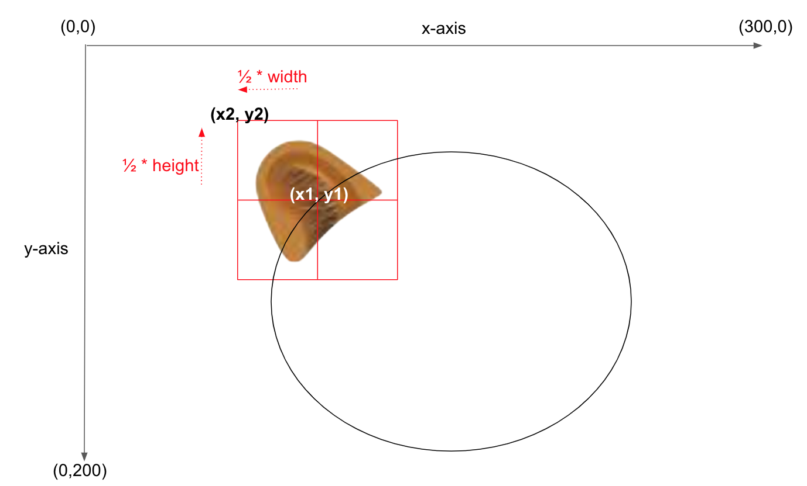{:.enlargeImage}

For example, as seen above, you want to place the left ear centered on the left forehead <strong>facePoint</strong> (x1, y1) returned by Facemesh. To get the correct horizontal placement, you need to subtract ½ of the width of the leftEar image from x1; to get the correct vertical placement, you need to subtract ½ of the height of the leftEar image from y1. The result is the new point (x2, y2) which represents the top-left corner of the image, so the image is centered on the left forehead <strong>facePoint</strong> (x1, y1). 
 
To summarize, the <strong>facePoint</strong> is at (x1, y1), so we need to place the top-left corner of the ImageSprite at (x2, y2), where x2 is (x1 -  ½ * width) and y2 is (y1 - ½ * height). To get the top-left corner, we need to subtract half of the image’s width from the <strong>facePoint’s</strong> x-coordinate and half of the image’s height from the <strong>facePoint’s</strong> y-coordinate. 
</hint>

In the placeImage procedure, your task is to
* Fill in the x argument of the ImageSprite.MoveTo block to be <strong>x1 - 0.5 * image width</strong>. This is the result of subtracting half of the ImageSprite’s width from the facePoint’s x-coordinate.
* Fill in the y argument of the ImageSprite.MoveTo block to be <strong>y1 - 0.5 * image height</strong>. This is the result of subtracting half of the ImageSprite’s height from the facePoint’s y-coordinate.

Don’t worry if this is a handful right now. Click on the questions below for more help on how to complete the procedure.
<hint markdown="block" title="How do I get the number 0.5?">
Click on the “Math” option in the Blocks, and you’ll find the number 0. You can drag this number onto the Viewer and double click on the 0 to erase the old value and insert your new value.
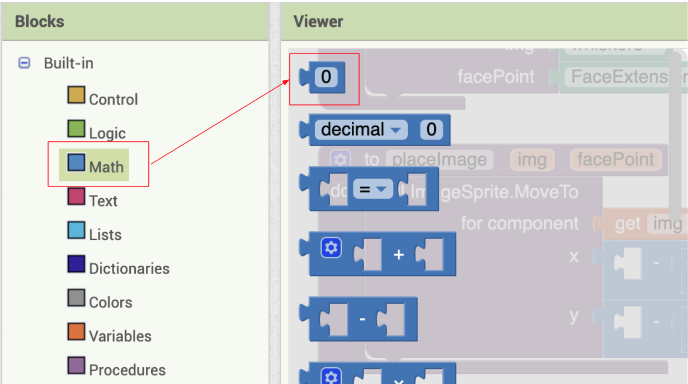{:.enlargeImage}
</hint>
<hint markdown="block" title="How do I get facePoint and img?">
Hover your mouse over “img” for about a second in the placeImage procedure, and the following will pop up. You can then drag “get img”.
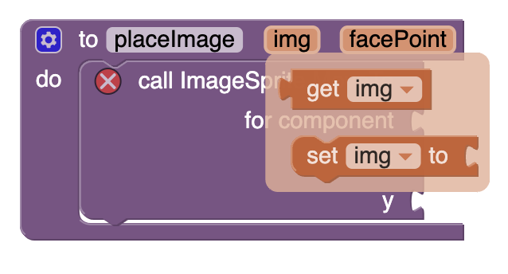{:.enlargeImage}
Hover your mouse over “facePoint” for about a second in the placeImage procedure, and the following will pop up. You can then drag “get facePoint”.
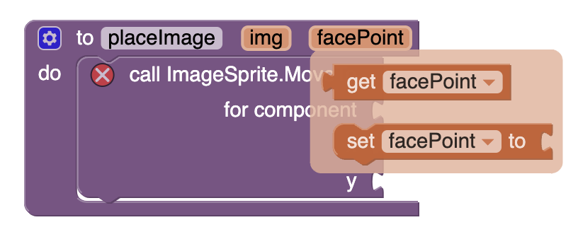{:.enlargeImage}
</hint>
<hint markdown="block" title="How do I get (x1, y1) of facePoint?">
As mentioned earlier, each <strong>facePoint</strong> is a list of 2 items. The x-coordinate is at index 1 and the y-coordinate is at index 2. 
* To get x1, use the following block that gets the item at index 1 from the facePoint list. 
{:.enlargeImage}
* To get y1, use the following block that gets the item at index 2 from the facePoint list. 
{:.enlargeImage}
</hint>
<hint markdown="block" title="How do I get the height/width of img?">
To get the height/width of the image, you use the following blocks..
{:.enlargeImage} 
{:.enlargeImage}
To access these ImageSprite blocks shown above, click “Any component” in the Blocks menu. This will open the drop-down menu to show the following. Then click “Any ImageSprite” and you’ll find the blocks there.
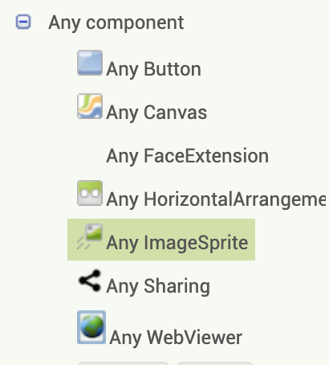{:.enlargeImage} 
</hint>

If you are stuck, feel free to see which blocks are needed 
<hint markdown="block" title="Show Hint">
{:.enlargeImage} 
{:.enlargeImage}
{:.enlargeImage}
{:.enlargeImage}
{:.enlargeImage}
</hint> 
<hint markdown="block" title="Check my solution">
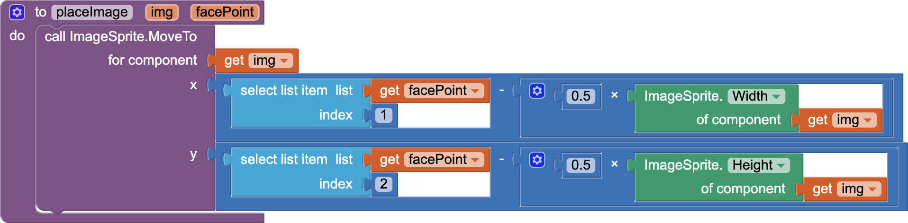{:.enlargeImage}
</hint>

## Face Updated
When the extension detects a face, it triggers the following FaceExtension1.FaceUpdated event. This event handler’s code has also been created for you. The code for the resizing procedure is given to you, but the code for the moving procedure is incomplete and will soon be created by you.
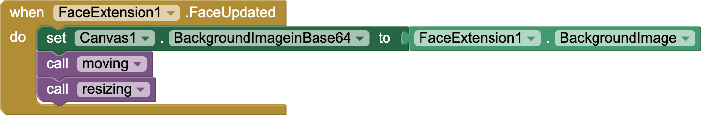{:.enlargeImage}

## Moving and Resizing
The way a basic filter works has two parts.
1. moving: when the face moves, the images move along with the face.
2. resizing: when the face becomes bigger or smaller, the images are resized accordingly.

You are given the following incomplete moving procedure: 
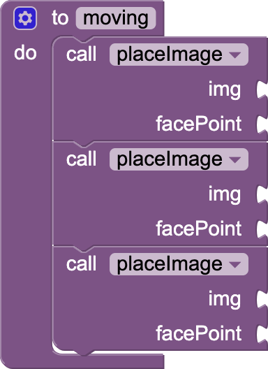

To complete the block, you should
* Call placeImage (the procedure you wrote earlier) to move the left ear to the left-side of the forehead  (which is the FaceExtension property LeftForehead). 
* Call placeImage to move the right ear to the right-side of the forehead (which is the FaceExtension property RightForehead). 
* Call placeImage to move the whiskers to the top of the mouth (which is the FaceExtension property MouthTop). 

Remember, placeImage takes in two arguments: 
1. the image (the imageSprite object)
2. the facePoint (a facial coordinate provided by FaceExtension). 

<hint markdown="block" title="Give me a hint">
{:.enlargeImage} 
{:.enlargeImage}
{:.enlargeImage}
{:.enlargeImage}
{:.enlargeImage}
{:.enlargeImage}
</hint>
<hint markdown="block" title="Check my solution">
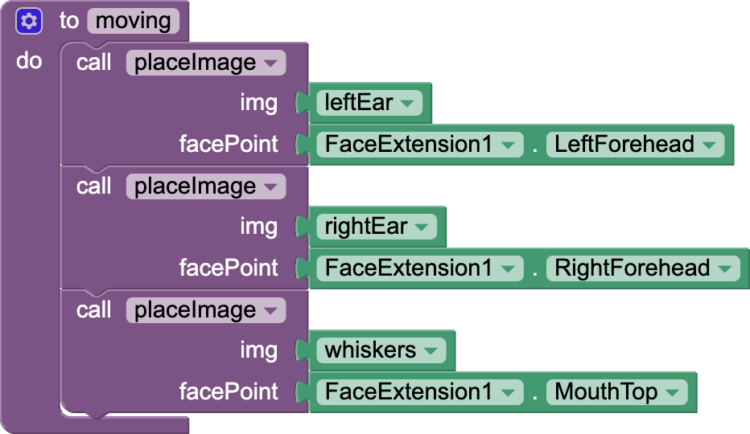{:.enlargeImage}
</hint>

 

Let’s explain other procedure which is given to you: resizing.
{:.enlargeImage}

The details of the procedure are explained below. Note these are all arbitrarily chosen to fit what we might expect, but you can change the procedure as you like. 

Whiskers:
* The width of the whiskers is set to the width of the face (which is the FaceExtension property FaceWidth).
* The height of the whiskers is the height between the eye and the mouth (which is the FaceExtension property EyeToMouthHeight). This makes sense because the distance between the eye and the mouth is what we would expect the whiskers’ height to be.

Left Ear:
* The width of the left ear is the distance between the cheek and the nose (which is the FaceExtension property CheekToNoseDistance). This is arbitrary but the distance between the cheek and nose is typically the same as what we would expect the ear width to be.
* The width of the right ear is the same as the width of the left ear.

Right Ear:
* Finally, set the height of the left ear and the height of the right ear to both be the same as the width of the left ear. This makes sense because the ears have the same height and width.

## Test your App
Now you will use the AI Companion to check that your app works. Please note that an Emulator cannot be used in the testing as it does not support MIT App Inventor Extensions like FaceExtension.

Check that your app can track a face and have the ears and whiskers correctly positioned on the face. For best results with FaceExtension, make sure that the face is well lit and directly facing the camera.

## Take a photo and send it to your friend!
Now, you can make a pose with your new cat or lion makeover, and click the “Take Photo” button. After, click the “Share Most Recent Image” to share the photo with your friends! 

In the demo below, a user takes a photo, clicks “Share the Most Recent Image”, and many options to share the photo, including “Share with Messages” on top, and other apps such as Maps, Allo, Bluetooth, Duo, Gmail, Hangouts, Notes, etc. These apps will vary depending on which apps are installed on your device. 

Good job! You’ve completed this character camera app! You’ve built an AI-based app that can track the movements of a face.

# Expand your app
* You can get your own images online for any character filter, go to the website remove.bg to get rid of the background, and upload them on your own ImageSprite components to make your own filters. Go wild and let the creative juices flow! 
* You can add a button to switch between a lion and a cat filter. You would need to add some code to change the Picture property of the ImageSprites when the button is clicked.
* Check out <a href="https://github.com/tensorflow/tfjs-models/blob/master/facemesh/mesh_map.jpg" target="_blank">this facemesh map</a> to see all the points you can access. If you want to put something in between your eyes, find the number on the map. In this case, the number is 6 so the facePoint can be accessed via this block: 
	{:.enlargeImage}
	And the x-coordinate is this nested block
	{:.enlargeImage}
	And the y-coordinate is this nested block
	{:.enlargeImage}
* Using these points, you can identify movement in the face by tracking the difference between two facePoints. For example, here is a demo where blush appears on the cheek when the mouth opens and disappears when the mouth closes. 
	
	To get this extra interactivity in your app, you need to:
	* Add new Imagesprites with a blush picture (you can find the image online)
	* Track the difference between the y-coordinates of your lips; change the visibility of the blush Imagesprites accordingly.

# About Youth Mobile Power 
A lot of us spend all day on our phones, hooked on our favorite apps. We keep typing and swiping, even when we know the risks phones can pose to our attention, privacy, and even our safety.  But the computers in our pockets also create untapped opportunities for young people to learn, connect and transform our communities.

That’s why MIT and YR Media teamed up to launch the Youth Mobile Power series. YR teens produce stories highlighting how young people use their phones in surprising and powerful ways. Meanwhile, the team at MIT is continually enhancing MIT App Inventor to make it possible for users like you to create apps like the ones featured in YR’s reporting.

Essentially: get inspired by the story, get busy making your own app!
 
 
 The YR + MIT collaboration is supported in part by the National Science Foundation. This material is based upon work supported by the National Science Foundation under Grant No. (1906895, 1906636).   Any opinions, findings and conclusions or recommendations expressed in this material are those of the author(s) and do not necessarily reflect the views of the National Science Foundation.

 Check out more apps and interactive news content created by YR <a href="https://yr.media/category/interactive/" target="_blank">here</a>.
