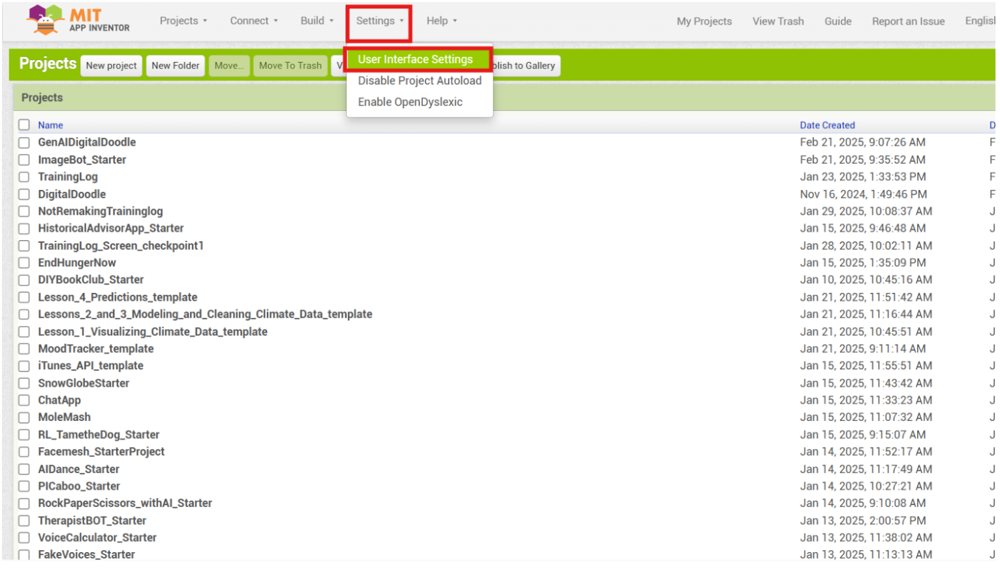
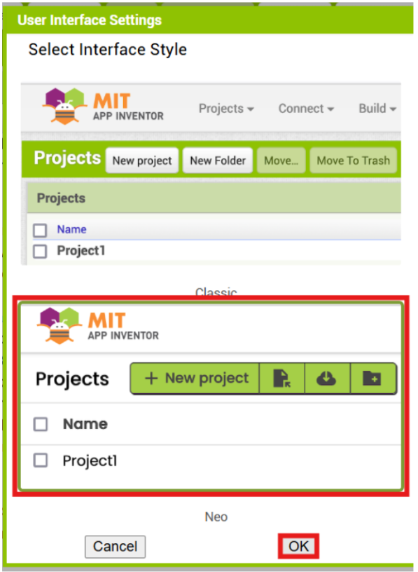
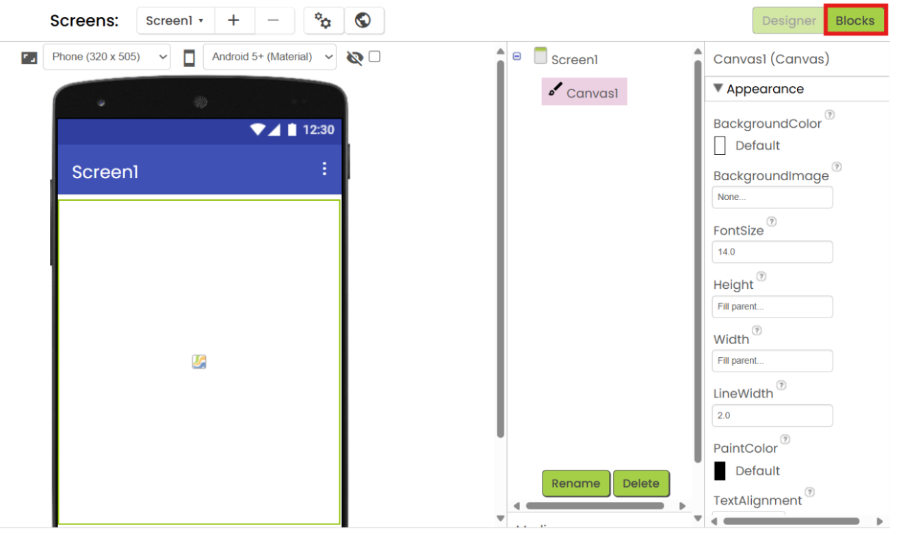
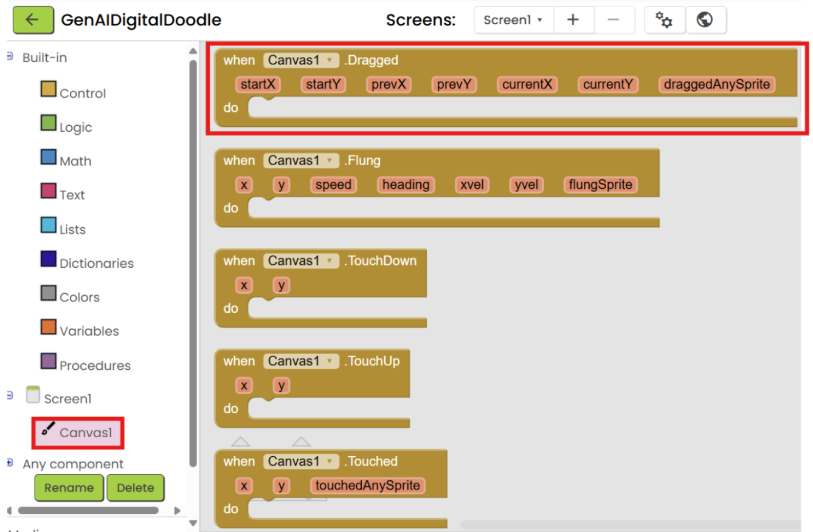
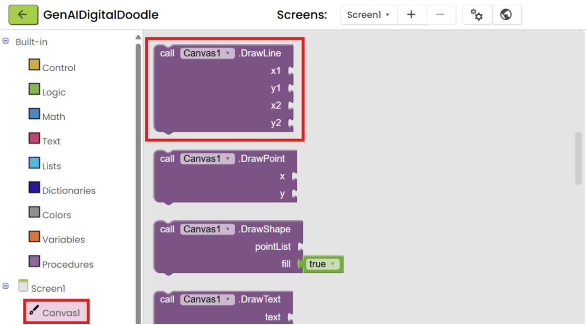
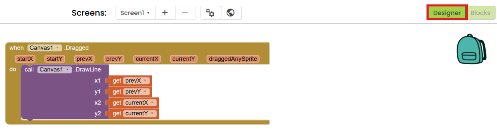
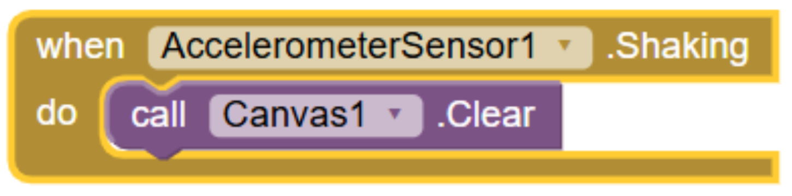

# Getting Started

The Digital Doodle App allows users to draw lines on their mobile device screens. With the addition of generative AI tools, users can ask an AI model to generate a background image for them to draw on.

# Setup

## Using the Neo Interface

For this tutorial, we will be using the App Inventor Neo Interface, which has a more modern look.

To switch to Neo Interface, go to your Projects space. On the top bar, click on "Settings", and select "User Interface Settings".

{:.enlargeImage}

Click on the "Neo" Interface, then click "OK".

## Familiarizing Yourself With App Inventor Layout

The screen you are currently looking at is the "Design" Screen. On the left hand side of your screen (outlined in red) is the Palette, where there are drawers with components you can add to your app. In the center of the screen (outlined in green) is the Viewer, which is an empty phone screen where you will build the User Interface (UI) of your app. On the right side of the screen (outlined in blue) is the Properties window, you can edit specific aspects of each component you add to your app. Take a few minutes to explore the components within the drawers.

# Building Your App - Digital Doodle

## Digital Doodle UI

To start your app, open the Drawing and Animation drawer on the left side of your screen. Drag a <strong> Canvas </strong> component onto the phone screen in the center.

In Properties, set the Height and the Width of your Canvas to Fill Parent.

In the top right corner of your screen, click the Blocks button. The Blocks screen is where you will code the functionality of your app.

## Digital Doodle Code

One the left hand side of your screen, you will see the drawers of the blocks you will use to code your app. The rest of the screen is your workspace.

On the left side of your screen, click <strong> Canvas1 </strong> and drag the When Canvas1.Dragged block into your workspace.

Also under <strong> Canvas1 </strong>, find the call Canvas1.DrawLine block, drag it into your workspace, and click it into the when Canvas1.Dragged block.

In the call Canvas1.DrawLine block, x1, y1, x2, and y2 all represent pixel coordinate locations. Our canvas is one big graph, where each pixel location is represented by a (x,y) coordinate. Every curve is a set of little lines added together. Set x1, y1, x2, and y2 to prevX, prevY, currX, and currY, respectively. Do this by hovering over these variables in the when Canvas1.Dragged block.

NOTE: startX and startY remember where the user touched the canvas for the very first time. While this will create a cool drawing, it will not allow a user to draw as they want.

Once you have finished this, your block of code should look like the example below.

Time to test your app out! You should now be able to draw on your companion screen. What issues are there with this version of the app? Can you clear your drawing? Can you change the colors of your ink?

# How to Test Your Code - AI Companion

## Pairing your Companion

Now it's time to test your code on a mobile device! Make sure you have App Inventor installed on your mobile device. To connect your mobile device, click the "Connect" button in the top center, then select "AI Companion".

A QR code should appear on your screen. Open the App Inventor app on your mobile device and click "scan QR code". Your app should appear on your mobile device.

# Building Your App - Adding an Accelerometer

## Accelerometer Adding

If you want to build more aspects of your app, you're in the perfect place! Let's keep adding elements!

Navigate back to the Designer screen by clicking the Designer button in the top right of your screen.

In the Designer screen, open the Sensors drawer. Drag and drop an <strong> AccelerometerSensor </strong> into the phone screen.

You will NOT see the component on your screen. Instead, look below the phone screen. You should see <strong> AccelerometerSensor </strong> underneath, labeled as a "Non-visible component".

Now return to the Blocks screen.

On the left side of you screen, under <strong> AccelerometerSensor1 </strong>, drag and drop the when AccelerometerSensor1.Shaking block into your workspace.

Under <strong>Canvas1</strong>, drag callCanvas1.Clear into your workspace and click it into the wehn AccelerometerSensor1.Shaking block.

Once you have this finished, your block of code should look like this.

Time to test your app using your AI companion again! When you shake your companion, does the screen clear?
