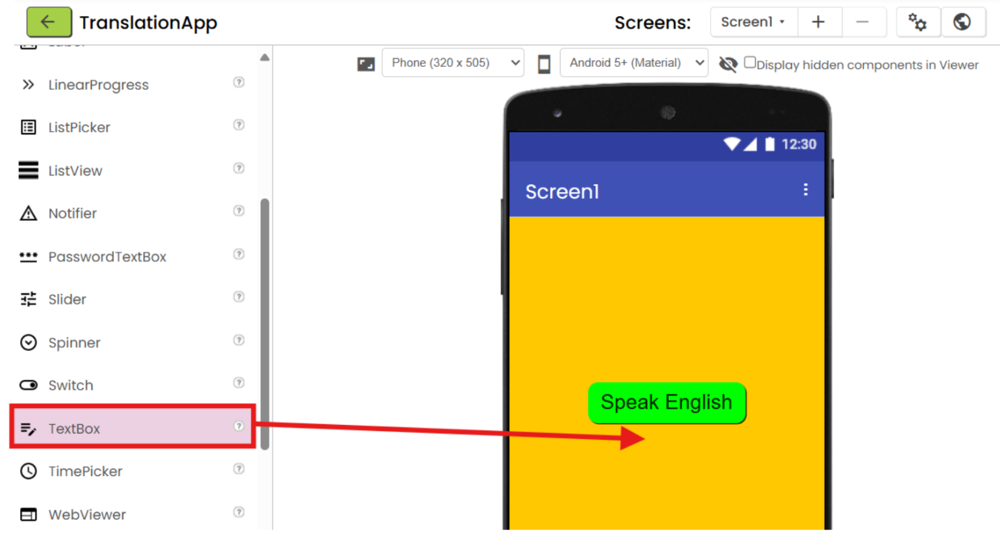

# App Inventor Tutorial Authoring

## Introduction

You can author App Inventor tutorials using Markdown. This document briefly describes how to create a tutorial using Markdown.

## Creating Headers

The accordion is composed of level 1 headings. You can indicate these in two different ways:

```markdown
# Header
```

or 

```markdown
Header
======
```

## Creating Tutorial Pages

Tutorial pages are added by creating a level 2 heading underneath a level 1 heading:

```markdown
# Heading

## Page 1 Title

Page 1 Content

## Page 2 Title

Page 2 Content
```

If you prefer the underlining method of headers, you can use `-`:

```markdown
Heading
=======

Page 1 Title
------------

Page 1 Content

Page 2 Title
------------

Page 2 Content
```

## Adding a How-To

For tutorials that include information about connecting the companion, you can add the how-to using this technique:

```markdown
# Connect to App

<howto id="connect_app"></howto>
```
## Adding Hints

You can add hints to the tutorial using the following technique:

```markdown
<hint markdown="block" title="Give me a hint">

Hint content

</hint>
```

You can also nest hints:

```markdown
<hint markdown="block" title="Give me a hint">

Hint content

<hint markdown="block" title="Check my solution">

Solution content

</hint>

</hint>
```

## Ordered Lists

Ordered lists are created by using numbers:

```markdown
1. Item 1
2. Item 2
3. Item 3
```

If you need more advanced functionality, such as a starting value, you can also make use of HTML:

```markdown
<ol start="4">
<li>Item 4</li>
<li>Item 5</li>
</ol>
```

## Unordered Lists

Unordered lists are used by using certain characters like bullets:

```markdown
* First
* Second
* Third
```

You can nest lists as well:

```markdown
* First
   * Subitem
   * Subitem
   * Subitem
* Second
```

## Links & Images

Links are created by placing the text for the link within square brackets `[]` and the link target in parentheses `()`:

```markdown
[Go to App Inventor](http://ai2.appinventor.mit.edu)
```

To create an image, use the link syntax and place an exclamation in front:

```markdown
![Alternative text for accessibility)(http://link/to/image.png)
```

If you want to make it so that the image can be enlarged, include `{:.enlargeImage}` at the end of the image inclusion text:

```markdown
{:.enlargeImage}
```
