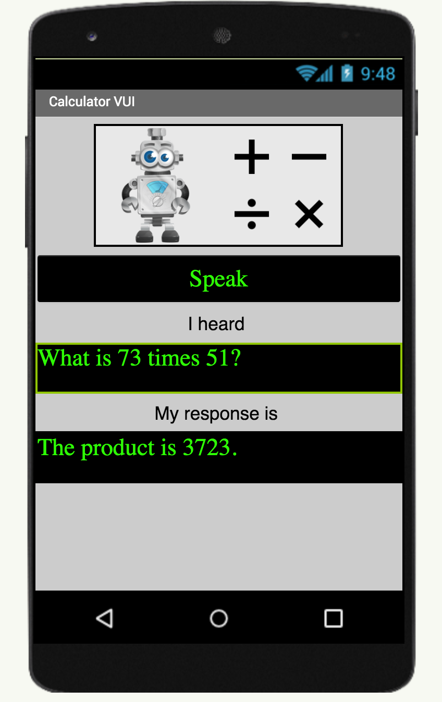

# Challenge

Challenge statement from YR Media

# Setup your computer

# Voice Calculator (Level: Intermediate)

## Introduction

Have you ever wondered how conversational AI agents such as Alexa and Siri work?  How do they interpret what you are saying to them and grasp your intent?  How do they then know how to appropriately and meaningfully respond to you?

The purpose of this elementary level AI project is to give you a sense of the basics of a Voice User Interface (VUI) and to teach you how to design a simple AI system that can understand the intent of the user in a verbally stated calculation question and respond appropriately.

{:.enlargeImage}

## Graphical User Interface (GUI)

The GUI has been created for you in the starter file.  Please change the properties of the components as you wish to get the look and feel you want.  However, please do not rename the components, as this tutorial will refer to the given names in the instructions.

{:.enlargeImage}

In the GUI you will notice that there is a Speak  Button which the user will press to verbally communicate the calculation they wish to be performed.  The interface will then display in writing what the Calculator heard and respond, both in writing and verbally, with the result of the calculation.  If the Calculator could not hear a meaningful calculation query or could not understand the intent of the user, it will say so.

## Initialize numberList

The first thing you'll tackle is to extract the numbers in the sentence spoken by the user. You'll use them later when you actually perform the mathematical operation.  To do this first you will initialize a global variable named numberList where the numbers in the calculation query will be stored.  As this variable will be a list of numbers,  it will be initialized  to an empty list.

{:.enlargeImage}

## procedure extractNumbers I

Then you  will create  a procedure  called extractNumbers which when given an input sentence will extract the numerical values in that sentence and store these in the global variable numberList.  To do this:
* choose a procedure and name it <var>extractNumbers</var>
* use the settings gear to add an input parameter and call it <var>sentence</var>

{:.enlargeImage}{:.enlargeImage}

(continues next page)

## procedure extractNumbers II

* set the global variable <var>numberList</var> to the empty list.  We need to reinitialize the variable every time we call this procedure as each calculation the user initiates will use a new pair of numbers.
* use  the “split at spaces” text utility to split the input sentence into a list of  its words and for each word in this list check to see if it is a number.

{:.enlargeImage}

* if any word is a number then add it to the global variable <var>numberList</var>

<hint markdown="block" title="Give me a hint">

{:.enlargeImage}

<hint markdown="block" title="Check my solution">

{:.enlargeImage}

</hint>

</hint>

 Try this on your own but if you get stuck you can click the Hint button.

## Multiplication Intent
As there are many ways for a user to indicate that they would like to perform a multiplication operation, it is essential to identify all these different approaches as a multiplication intent.  For example all of the following statements are different ways of expressing a multiplication intent: 
* what is 73\*51 ?
* how much is 73x51 ?
* what is the product of 73 and 51 ?
* what is the result when you multiply 73 with 51 ?
* what is 73 times 51 ?

Note that the key words/symbols/numbers in green define the multiplication intent while the words/symbols in red are redundant and can be disregarded.

## Arrange Buttons

Add more  Buttons so you have at least 4 instruments. Below are two examples of possible layouts.
{:.enlargeImage}
{:.enlargeImage}

You will have many  Buttons in this app, so make sure to rename them using descriptive names to make the coding of your app more manageable. You can see how to rename a component in the next step.

## Change Button Properties

Change the  Buttons' properties to fit your style. Match the instrument image, or change the color or shape.

For example, perhaps start with a drum. Select <strong>Button1</strong> in the template, change its <i>Image</i> to “drum1.png” and rename it to <strong>“Drum1Button”</strong>. 
{:.enlargeImage}

To make a Stop button for the drum, select <strong>Button2</strong> in the template, change its <i>BackgroundColor</i> to “Red”, <i>Text</i> to “STOP”, <i>Shape</i> to “oval” and rename it <strong>“StopDrum1Button”</strong>. 
{:.enlargeImage}

## Add Player Components

You need to add a separate  Player component for each instrument in your app. In the example below, two  Player components are added and renamed appropriately for playing the instruments, drums and piano.

{:.enlargeImage}

Then check the box for the <i>Loop</i> property for each  Player so the music loops continuously. And set the <i>Source</i> property to corresponding instrument sound files from the Media assets. In this example, the sources are set to the drums and piano wav files included in the template.

{:.enlargeImage}

## Code the Blocks

Click the Blocks button and go to the Blocks Editor.

{:.enlargeImage}

Code the your first  Button. Using the drums example, there could be a button named **Drum1Button**. Drag out a Button.Click event block for your drum button. For the matching  Player component, drag out a Player.Start block, and snap it into the Button.Click event block.

{:.enlargeImage}

The  Button to stop the instrument sound uses the same idea. Drag out a Button.Click event block for the matching Stop Button for this instrument. Again, we’ll use the Drums as an example.

Drag out a matching Player.Stop block and snap it into the (in this example) StopDrum1Button.Click event. This will make the  Player stop playing.

{:.enlargeImage}

## Testing!

Now test starting and stopping that instrument with your two Buttons!

Test with the AI Companion through the Connect menu, and then scan the displayed QR code with the AI Companion app on your mobile device.

{:.enlargeImage}

## Now do the rest

Now that you have one  Button set working, add code for your other instruments. Make sure you have a  Button to start the instrument, and one to stop it. Also, make sure you add a new  Player component for each instrument. Remember to name them appropriately!

# Expand your app

Here are some ideas to add to your MusicMaker app!

**Record and play back your music**
 Use the  SoundRecorder component to record music, and then add another  Player component to play the resulting sound.

**Add a Pause button for each instrument.**

**Instead of 2 Buttons, make one Button toggle play/stop.**
 For each instrument in your app, make one Button, and then have it toggle to either act as a "Start" button, or a "Stop" button, depending on whether or not the instrument is playing.

**Add more instruments**
 You've been given several instruments and images to get started, but you can either download or create your own instrument sounds to add to your music making app. Have fun!

